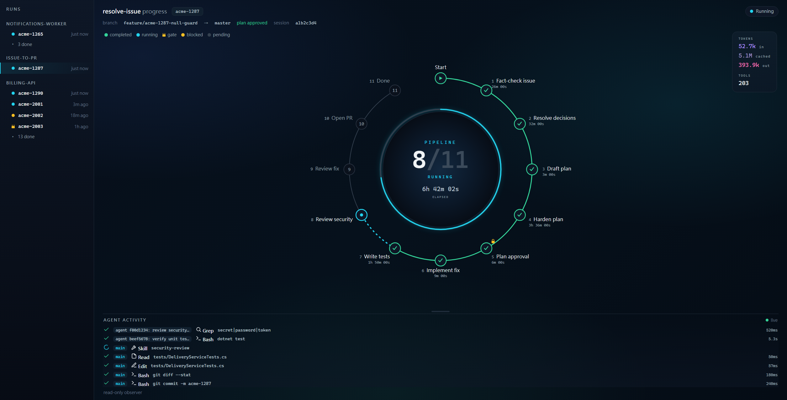

# issue-to-pr

A [Claude Code](https://claude.com/claude-code) **plugin marketplace** (`itpr`) for an engineering team — a set of skills and subagents that take a ticket from diagnosis to a reviewed pull request, plus the review, test-authoring, and housekeeping tools that support that flow.



<sub>The `resolve-issue-dashboard` (in `issue-to-pr-pipeline`) watching a run move through the pipeline — illustrative example data.</sub>

## Install

Requires Claude Code with plugin support (a recent version — dependency auto-install and enable-time dependency handling need v2.1.143 or later; on older versions use the explicit per-plugin list below).

Install `issue-to-pr-pipeline` — it declares the other three plugins as dependencies, so Claude Code resolves and installs them from this marketplace automatically and lists what was added at the end of the install output.

```
/plugin marketplace add https://github.com/softwareone-platform/issue-to-pr.git
/plugin install issue-to-pr-pipeline@itpr
```

Alternatively — on older Claude Code (before v2.1.143, where dependency auto-install is unavailable) or when you want only some of the plugins — install each explicitly:

```
/plugin marketplace add https://github.com/softwareone-platform/issue-to-pr.git
/plugin install adversarial-review@itpr
/plugin install pr-lifecycle@itpr
/plugin install test-authoring@itpr
/plugin install issue-to-pr-pipeline@itpr
```

Then run `/reload-plugins` to activate — it also re-resolves any missing dependencies. Install only the plugins you need — they work standalone, except `issue-to-pr-pipeline`, which builds on the other three.

## Plugins at a glance

| Plugin | What it gives you |
|---|---|
| [`adversarial-review`](#adversarial-review) | Adversarial review at the issue, plan, and code altitudes |
| [`pr-lifecycle`](#pr-lifecycle) | Pull-request lifecycle (Azure DevOps or GitHub) |
| [`test-authoring`](#test-authoring) | Test authoring — unit, integration, and component |
| [`issue-to-pr-pipeline`](#issue-to-pr-pipeline) | Issue-to-PR orchestration (chains the three above) |

Invoke any skill as `/<plugin>:<skill>`, or just describe the task — each skill auto-triggers from natural language.

## How they fit together

The review, test, and PR plugins are independently useful. `issue-to-pr-pipeline` composes them: `resolve-issue` drives one ticket through the pipeline below, gated on plan approval and pausing again wherever a decision is yours, delegating each stage to the skill that owns it — the review, test, and PR skills, plus Claude Code's built-in `security-review`.

```
  PLAN
   ●─  1  Fact-check issue    does the bug actually hold in the code? (may ask)
   │
   ●─  2  Resolve decisions   settle open design decisions before planning (may ask)
   │
   ●─  3  Draft plan          sketch how the fix will be made
   │
   ●─  4  Harden plan         pre-mortem the plan, fix its design risks (may ask)
   │
   ◆─  5  Plan approval       you approve the plan before any code changes (always waits)
  BUILD
   ●─  6  Implement fix       make the code change
   │
   ●─  7  Write tests         cover the change with tests, then commit them (may ask)
   │
   ●─  8  Review security     scan the diff for vulnerabilities (may ask)
   │
   ●─  9  Review fix          pressure-test that the fix resolves the issue (may ask)
   │
   ●─ 10  Open PR             raise the pull request (always waits)
  DONE
   ◉─ 11  Done                pipeline complete, PR awaiting review
```

**Drafting the plan and making the code change are the only steps that run without you.** Two stops are unconditional — plan approval and the open-PR confirmation — and every other step can pause to ask: a design decision it is barred from guessing, a risk to disposition, a test-type call, a quality flag. Each wait is unbounded — a paused run sits there until it is answered. It names what it is waiting for in `state.md`, and `resolve-issue-dashboard` shows it. Full breakdown, grouped by why each stop exists: [resolve-issue's README](plugins/issue-to-pr-pipeline/skills/resolve-issue/README.md#where-the-run-stops-for-you).

The whole run checkpoints to `.claude/resolve/<ticket>/`, so a fresh session can resume it. `resolve-issue-dashboard` visualises a run live; `resolve-issue-learnings` distils what the pipeline learned across runs.

## Skills

### adversarial-review

Three adversarial reviewers, one per altitude — each pressure-tests a different artifact before it moves downstream.

- **review-issue-fact** — Fact-checks an *issue* (bug report, story, incident) against the codebase before any fix is planned; produces a per-claim verdict and a HALT / PROCEED / RESOLVE recommendation.
- **review-plan-risk** — Pre-mortems a *plan / spec / SKILL.md*, auto-fixes the design risks it rates real, and independently verifies each fix before reporting.
- **review-code-risk** — Adversarially reviews an *implemented fix* against its issue and plan before the PR opens; auto-fixes real risks in the changed files and re-runs build and tests.

### pr-lifecycle

Team-agnostic PR lifecycle for Azure DevOps or GitHub — the platform is detected from the git remote at runtime. Both skills confirm before making any outward change.

- **open-pr** — Opens a PR whose title and description follow *your own* past-PR conventions, learned at runtime. Handles standard PRs and backports to `release/*`.
- **resolve-pr-comments** — Fetches a PR's review threads, triages each, drafts the code fixes and replies, and — after one confirmation — commits, pushes, replies, and updates thread status.

### test-authoring

Test authoring that delegates to writer and verifier subagents (12 in total). A one-time `setup-test-context` run profiles the repo and caches per-repo conventions for a faster path; without it, every workflow still runs cacheless by learning from the nearest sibling tests. See the [plugin README](plugins/test-authoring/README.md) for the full architecture.

- **setup-test-context** — One-time profile of the repo; writes per-repo conventions/rules to `.claude/…/tests/`. Also handles uninstall and schema-drift refreshes.
- **scan-test-gaps** — Finds untested code and stale tests, then iteratively delegates generation and updates.
- **add-{unit,integration,component}-test** — Generate tests for changed source or a named target.
- **update-{unit,integration,component}-test** — Two-phase audit → execute refresh of existing tests.

### issue-to-pr-pipeline

Issue-to-PR orchestration. Depends on `adversarial-review`, `test-authoring`, and `pr-lifecycle`.

- **resolve-issue** — Drives one ticket through the full pipeline (see [above](#how-they-fit-together)), gated on plan approval and pausing again wherever a decision is yours; resumable from `.claude/resolve/<ticket>/`.
- **resolve-issue-dashboard** — A live, read-only dashboard that visualises a run — pipeline step, per-subagent activity, metrics, and the gate it is paused at — by tailing the transcript and `state.md`. Observes only; never drives.
- **resolve-issue-learnings** — Harvests the cross-repo learnings a run captured, verifies each against the current skill as ground truth, and writes the survivors to a conventions file the pipeline reads next time.

## Prerequisites

The plugins themselves are just Markdown and JSON — nothing to build. A few skills reach external services; install what the plugins you actually use require:

- [Azure CLI](https://learn.microsoft.com/en-us/cli/azure/install-azure-cli) with the `azure-devops` extension (`az extension add --name azure-devops`) — required by `pr-lifecycle` on Azure DevOps remotes, which it drives through `az repos` / `az devops`.
- [GitHub CLI](https://cli.github.com/) (`gh`, authenticated) — required by `pr-lifecycle` on GitHub remotes, which it drives through `gh pr` / `gh api`.
- [Atlassian MCP Server](https://www.npmjs.com/package/@anthropic-ai/atlassian-mcp) in your Claude Code MCP settings — optional; enables Jira integration for `review-issue-fact`, `resolve-issue`, and the Jira link in `open-pr`. These skills fall back to a pasted link or plain text when it is absent.

## Repository layout

```
.claude-plugin/marketplace.json   the registry — lists every published plugin
plugins/<plugin>/
├── .claude-plugin/plugin.json     plugin metadata (name, version, dependencies)
├── skills/<skill>/SKILL.md        a user-invocable skill
├── agents/<agent>.md              a subagent (test-authoring only)
├── resources/                     bundled templates, static files, hook blocks
└── docs/                          deeper design docs
```
