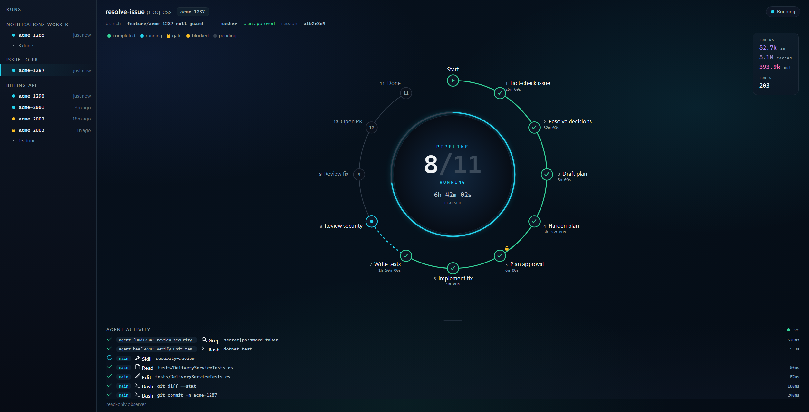

<!-- translated from README.md, source sha256 07c526e69f72e4c41e40eaad7d74a011557e7888003eb2c32427bc832a8ca93f; see CLAUDE.md "Translations of the root README" before editing -->
# issue-to-pr



<sub>`issue-to-pr-pipeline` 裡的 `resolve-issue-dashboard` 正在追蹤一次執行在 pipeline 中的進度（示意用的範例資料）。</sub>

<div align="center">

[](https://github.com/softwareone-platform/issue-to-pr/actions/workflows/checks.yml) [](#install) [](LICENSE)

[English](README.md) | [繁體中文](README.zh-TW.md) | [简体中文](README.zh-CN.md)

</div>

<a id="overview"></a>
## 🧭 概覽

一組 [Claude Code](https://claude.com/claude-code) plugin：由 skill 與 subagent 組成，把一張工單從診斷一路帶到經過審查的 pull request，並附上支撐這個流程的審查、測試撰寫與維護工具。

<a id="install"></a>
## 📦 安裝

需要支援 plugin 的 Claude Code。相依套件的自動安裝，以及啟用時對相依套件的處理，需要上方 Claude Code badge 標示的版本；較舊的版本請改用下方逐一安裝的清單。

這些 plugin 透過 [`tundra`](https://github.com/softwareone-platform/tundra) marketplace 發布；這個 repo 存放的是它們的原始碼，本身不是 marketplace。

安裝 `issue-to-pr-pipeline` 即可：它把另外三個 plugin 宣告為相依套件，Claude Code 會從同一個 marketplace 自動解析並安裝它們，並在安裝輸出的最後列出新增了哪些。

```
/plugin marketplace add https://github.com/softwareone-platform/tundra.git
/plugin install issue-to-pr-pipeline@tundra
```

另一種做法：如果你的 Claude Code 比 badge 標示的版本舊（這些版本無法自動安裝相依套件），或者你只想要其中幾個 plugin，就逐一安裝：

```
/plugin marketplace add https://github.com/softwareone-platform/tundra.git
/plugin install disconfirm-first@tundra
/plugin install pr-lifecycle@tundra
/plugin install test-authoring@tundra
/plugin install issue-to-pr-pipeline@tundra
```

接著執行 `/reload-plugins` 來啟用；它也會重新解析任何缺少的相依套件。只安裝你需要的 plugin 即可：除了建立在另外三個之上的 `issue-to-pr-pipeline`，其餘都能獨立使用。

第三方 marketplace 的自動更新預設是關閉的。要自動收到新版本，請開啟 `/plugin` → Marketplaces → `tundra` → Enable auto-update。

**從舊的 `itpr` marketplace 遷移。** 這個 repo 以前是一個名為 `itpr` 的 marketplace，現在已經不是了：更新 `itpr` 會失敗，從它安裝的 plugin 也會停止載入。請執行 `/plugin marketplace remove itpr`（這也會解除安裝從它裝的 plugin），然後加入 `tundra` 並照上面的方式安裝。每個 plugin 請只從一個 marketplace 安裝。

如果要從 clone 下來的 repo 開發這些 plugin，請用 `claude --plugin-dir ./plugins` 直接從 working tree 載入，而不是把 clone 加成 marketplace。

<a id="plugins-at-a-glance"></a>
## 🗂️ Plugin 一覽

| Plugin | 提供什麼 |
|---|---|
| [`disconfirm-first`](#disconfirm-first) | 在 issue、計畫與程式碼三個層級做對抗式審查 |
| [`pr-lifecycle`](#pr-lifecycle) | Pull request 的生命週期（Azure DevOps 或 GitHub） |
| [`test-authoring`](#test-authoring) | 測試撰寫：單元測試與整合測試 |
| [`issue-to-pr-pipeline`](#issue-to-pr-pipeline) | 從 issue 到 PR 的協調（串起上面三個） |

任何 skill 都可以用 `/<plugin>:<skill>` 叫用，或直接描述你要做的事：每個 skill 都會依自然語言自動觸發。

<a id="how-they-fit-together"></a>
## 🧩 它們如何搭配

審查、測試和 PR 這三個 plugin 各自都能單獨使用。`issue-to-pr-pipeline` 把它們組合起來：`resolve-issue` 帶著一張工單走過下方的 pipeline，以計畫核准作為關卡，並在每個該由你決定的地方再次暫停；每個階段都交給負責它的 skill 執行，包括審查、測試和 PR 的 skill，以及 Claude Code 內建的 `security-review`。

```
  PLAN
   ●─  1  Fact-check issue    does the bug actually hold in the code? (may ask)
   │
   ●─  2  Resolve decisions   settle open design decisions before planning (may ask)
   │
   ●─  3  Draft plan          sketch how the fix will be made
   │
   ●─  4  Harden plan         pre-mortem the plan, fix its design risks (may ask)
   │
   ◆─  5  Plan approval       you approve the plan before any code changes (always waits)
  BUILD
   ●─  6  Implement fix       make the code change
   │
   ●─  7  Write tests         cover the change with tests, then commit them (may ask)
   │
   ●─  8  Review security     scan the diff for vulnerabilities (may ask)
   │
   ●─  9  Review fix          pressure-test that the fix resolves the issue (may ask)
   │
   ●─ 10  Open PR             raise the pull request (always waits)
  DONE
   ◉─ 11  Done                pipeline complete, PR awaiting review
```

**只有「起草計畫」和「修改程式碼」這兩步不需要你參與。** 有兩個停止點是無條件的：計畫核准，以及開 PR 前的確認；其他每一步都可能暫停來問你，例如一個它不准自行猜測的設計決定、一個需要你處置的風險、一個測試類型的判斷，或一個品質警示。每次等待都沒有時限：暫停的執行會一直停在那裡，直到有人回答。它會在 `state.md` 寫明自己在等什麼，`resolve-issue-dashboard` 也會顯示出來。依每個停止點存在的理由分組的完整說明，見 [resolve-issue 的 README](plugins/issue-to-pr-pipeline/skills/resolve-issue/README.zh-TW.md#where-the-run-stops-for-you)。

**一次執行要花你多少。** 大部分步驟都交給 subagent 執行，而測試和審查步驟各自要付一個撰寫者加一個獨立驗證者的成本，所以即使是一行的修正也要付這一對的費用。pipeline 裡沒有任何環節能回報自己花了多少：協調者看不到自己的 token 用量，儀表板上的計數器是用量而不是價格。實際經過時間同樣無法引用：一次執行的經過時間，大部分是它在關卡前等 **你** 的時間，所以這裡不列任何時長。請觀察你第一次執行的用量，不要只相信估計值。

整個執行過程都會在 `.claude/resolve/<ticket>/` 建立檢查點，所以新的 session 可以接續執行。`resolve-issue-dashboard` 即時顯示一次執行的狀況；`resolve-issue-learnings` 則從多次執行中萃取 pipeline 學到的經驗。

**有一樣東西會寫到你叫用它的 repo 之外。** `resolve-issue` 會把候選經驗附加到 `~/.claude/resolve-learnings/candidates.md`，而 `resolve-issue-learnings` 會把通過驗證的那些升級到 `~/.claude/resolve-learnings/conventions.md`，供之後的執行遵循。兩者都是使用者全域、所有 repo 共用的純 Markdown 檔，你可以閱讀、編輯或刪除；它們也是這些 plugin 在 repo 之外寫入的唯一檔案。其他所有東西都留在那個 repo 的 `.claude/` 裡；儀表板會讀取 `~/.claude/projects/`，但從不寫入。

<a id="skills"></a>
## 🛠️ Skill

### disconfirm-first

三個對抗式審查者，每個層級一個：各自在不同的產出物流向下游之前，對它做壓力測試。

- **review-issue-fact**：在規劃任何修正之前，對照程式碼為一個 *issue*（bug 報告、story 或事故描述）做事實查核；針對每一項主張給出判定，並建議 HALT / PROCEED / RESOLVE。
- **review-plan-risk**：對一份 *計畫 / 規格 / SKILL.md* 做事前驗屍，自動修正它判定為真實的設計風險，並在回報前獨立驗證每一個修正。
- **review-code-risk**：在 PR 開出之前，對照 issue 和計畫，以對抗方式審查一個 *已實作的修正*；自動修正變更檔案中的真實風險，並重新執行建置和測試。

### pr-lifecycle

不綁定團隊的 PR 生命週期，支援 Azure DevOps 或 GitHub：平台在執行時從 git remote 偵測。兩個 skill 在做任何對外變更之前都會先確認。

- **open-pr**：開出一個 PR，標題和描述遵循 *你自己* 過去 PR 的慣例；這些慣例在執行時從你已合併的 PR 學來，你的 PR 太少、看不出模式時，再參考其他人的。
- **resolve-pr-comments**：取得一個 PR 的審查討論串，逐一判斷如何處理，起草程式碼修正和回覆，並在你確認一次之後 commit、push、回覆，以及更新討論串的狀態。

### test-authoring

把測試撰寫交給撰寫者和驗證者 subagent（共 8 個）。agent 遵守的規則隨 plugin 一起提供，並直接從 plugin 讀取，所以不會有任何東西被複製到你的 repo。若執行過一次 `setup-test-context`，它還會把這個 repo 的跨層對照表快取起來；沒有它，每個流程仍會從最接近的相鄰測試學習慣例，照常執行。完整架構見 [plugin README](plugins/test-authoring/README.zh-TW.md)。

- **setup-test-context**：為 repo 建立一次性的概況；把它的跨層對照表以慣例的形式快取在 `.claude/conventions/tests/` 下。可以重複執行，重新執行就是更新。
- **scan-test-gaps**：找出沒有測試的程式碼和過時的測試，然後反覆委派產生與更新。
- **add-{unit,integration}-test**：為變更過的原始碼或指定的目標產生測試。
- **update-{unit,integration}-test**：分兩階段（稽核 → 執行）更新既有的測試。

### issue-to-pr-pipeline

從 issue 到 PR 的協調。相依於 `disconfirm-first`、`test-authoring` 和 `pr-lifecycle`。

- **resolve-issue**：帶著一張工單走完整個 pipeline（見 [上方](#how-they-fit-together)），以計畫核准作為關卡，並在每個該由你決定的地方再次暫停；可以從 `.claude/resolve/<ticket>/` 接續執行。
- **resolve-issue-dashboard**：一個即時、唯讀的儀表板，透過追蹤 transcript 和 `state.md`，顯示一次執行的 pipeline 步驟、每個 subagent 的活動、各項指標，以及它停在哪個關卡。只觀察，從不驅動執行。
- **resolve-issue-learnings**：收集執行過程中記下的跨 repo 經驗，以目前的 skill 為依據逐一驗證，並把通過的寫入一個 pipeline 下次會讀取的慣例檔。

<a id="prerequisites"></a>
## 📋 前置需求

plugin 本身只是 Markdown 和 JSON，沒有任何東西需要建置。少數 skill 會連到外部服務，或需要本機的執行環境；只需安裝你實際使用的 plugin 所需要的：

- [Azure CLI](https://learn.microsoft.com/en-us/cli/azure/install-azure-cli) 加上 `azure-devops` 擴充功能（`az extension add --name azure-devops`）：`pr-lifecycle` 在 Azure DevOps remote 上需要它，透過 `az repos` / `az devops` 操作。
- [GitHub CLI](https://cli.github.com/)（`gh`，需已登入）：`pr-lifecycle` 在 GitHub remote 上需要它，透過 `gh pr` / `gh api` 操作。
- 在 Claude Code 的 MCP 設定中加入 [Atlassian MCP Server](https://www.npmjs.com/package/@anthropic-ai/atlassian-mcp)：選用；為 `review-issue-fact`、`resolve-issue` 啟用 Jira 整合，並讓 `open-pr` 加上 Jira 連結。沒有它時，這些 skill 會改用貼上的連結或純文字。
- PATH 上的 [Python](https://www.python.org/downloads/)：**選用**，而且只有 `resolve-issue-dashboard` 需要，它會在本機執行一個只用標準函式庫的伺服器（不需要 `pip install`，也不需要 virtualenv）。已在 Windows 和 Linux 上以 3.13 和 3.14 測試。在 Windows 上用 `winget install Python.Python.3.13` 安裝（使用者範圍，不需要系統管理員），macOS 用 `brew install python`，或用你的發行版的套件管理工具。沒有它時，儀表板會拒絕啟動並用一行說明原因；`resolve-issue` 和其他所有 skill 的執行完全不受影響，因為儀表板只負責觀察。

<a id="repository-layout"></a>
## 📁 Repo 結構

```
plugins/<plugin>/
├── .claude-plugin/plugin.json     plugin metadata (name, version, dependencies)
├── skills/<skill>/SKILL.md        a user-invocable skill
├── agents/<agent>.md              a subagent (test-authoring only)
├── resources/                     bundled templates, static files, hook blocks
└── docs/                          deeper design docs
```
