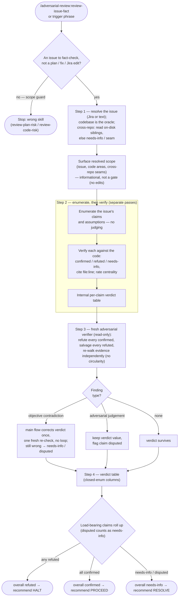

# review-issue-fact

Fact-check an issue — a bug report, story, or incident description, given as a Jira link / key or as plain / markdown text — against the codebase that is its ground truth, before any fix is planned. The issue-altitude sibling of `review-plan-risk` and `review-code-risk`: this guards the ISSUE (before planning), one guards the PLAN (before building), one guards the FIX (before review). Its premise is that the issue is *not* a source of truth — it may carry misleading assumptions, a misattributed root cause, or simply wrong information — so it treats the issue as a set of claims under test and the code as the oracle. It extracts the issue's claims and assumptions, verifies each against the code, then independently and bidirectionally falsifies the verdict, and reports `confirmed` / `refuted` / `needs-info` per claim with an overall `HALT` / `PROCEED` / `RESOLVE` recommendation.

This is the **verdict sibling** of the review family, and deliberately lighter than the two fix skills: an issue has nothing to auto-fix — its truth lives in the code, not in text we could rewrite to match it — so this skill produces a verdict, never an edit, and drops the auto-fix, opt-in-batch, and propagate machinery the fix siblings need. Its distinct question is **diagnosis alignment** — do the issue's factual claims hold in this code, or is the bug misdiagnosed before we spend the pipeline fixing it — which generic line-level review (`code-review` / `coderabbit`) and security scanning (`security-review`) do not ask.

## Process flow

Five rules that govern the flow above:

- **The issue is the claim under test; the codebase is the oracle** — the issue is *not* a source of truth, so when the issue and the code disagree on a structural fact, the code wins, and what the code cannot settle is `needs-info`, never a guess.
- **Enumeration is separate from calibration** — the issue's claims and assumptions are listed without judging them; verifying happens only afterward, as its own pass, so the issue's own framing cannot pre-filter which claims get written down (a misframed issue states its most load-bearing claim most confidently).
- **Verdict-only, never rewrite the issue** — the product is a verdict (`confirmed` / `refuted` / `needs-info`) plus evidence; the issue is an external, human-owned artifact, so this skill never edits it and drops the auto-fix / opt-in / propagate machinery its fix siblings carry.
- **The verdict is independently and bidirectionally falsified** — a fresh adversarial agent that did not reach the verdicts tries to *refute* every confirmed claim and *salvage* every refuted one, re-walking evidence from the claim and the code rather than re-reading the cited line (which would be circular). An objective contradiction is corrected once by the main flow then re-checked by one fresh spawn (no loop); a judgement-level dispute keeps the verdict value and is flagged.
- **Honest limits over silent guesses** — `Jira anchor not available`, `seam with <repo> not assessed` (no clone, no decompile), `static-only` for runtime-only claims, and `not-verified` when no fresh agent can be spawned are all voiced in the result, never silent. The overall `HALT` / `PROCEED` / `RESOLVE` recommendation is advisory, not a hard gate — the human still decides at the existing plan-approval gate.

## Relationship to siblings

The three are a graduated set, shipped together in `adversarial-review`, guarding the issue→PR pipeline at rising altitude:

- **`review-issue-fact`** (this skill) runs **first**, at the issue, before anything is planned. It reads the issue against the code, produces a *verdict*, and edits nothing — its oracle is the current code, and a `refuted` diagnosis stops the pipeline before it spends anything.
- **`review-plan-risk`** runs **next**, at the plan-approval gate, and edits **design text** (no execution side-effects — `git restore` reverts prose).
- **`review-code-risk`** runs **last**, at the pre-PR gate, and edits **code** — it requires a committed fix as its baseline and runs build and tests as part of verification.

They share one spine — enumeration separated from calibration, an independent adversarial verifier, honest voiced limits — but only the latter two auto-fix their artifact; this one stays a verdict, because an issue's truth is in the code, not in text to rewrite.
