# review-plan-risk

Adversarially review a design artifact (plan / spec / RFC / skill / command / agent definition) before implementation begins. Packages pre-mortem, red-teaming, and falsification techniques into a repeatable process: scan the artifact, find possible risks rated by plausibility and severity, then automatically fix the risks rated *real* — in the plan itself, never its execution — and independently verify each fix before reporting a result table. Edge-case risks that survive calibration are offered to the human in a single opt-in batch; theoretical risks are left proposed in that same table. When a fixed risk's pattern recurs in sibling artifacts, an optional gated pass propagates the fix — verified per target, approved per batch.

Calibration includes a ground-truth pass: the plan's load-bearing factual premises about the current codebase are verified against the code, and a premise the code refutes becomes a *real* risk — a design resting on a false fact fails before it is built. When the run already has a `review-issue-fact` verdict on disk, premises it confirmed are trusted rather than re-checked, so the two skills compose in the `resolve-issue` pipeline instead of double-checking the same ground; run standalone, every load-bearing premise is verified directly.

## Process flow

```mermaid
flowchart TD
    T(["/adversarial-review:review-plan-risk<br>or trigger phrase"]) --> G{"Design artifact,<br>not code / diff?"}
    G -- "no — scope guard" --> STOP(["Stop: design review only"])
    G -- "yes" --> S1["Step 1 — scan the artifact in full,<br>pull contract partners one hop deep,<br>co-anchor any spawned subagents"]

    subgraph S2["Step 2 — find, then calibrate (separate passes)"]
        EN["Sweep with adversarial lenses:<br>backward-from-failure, assumption surfacing,<br>invariant violation, silent failure / boundary,<br>second-order, cross-artifact contract,<br>executability, necessity<br>(weighted by artifact type)"]
        EN --> FO["Sweep via independent fan-out —<br>fresh blind finder agents, each sweeps<br>ALL lenses, enumerate only; merge + dedup<br>(keep every cited location); degrade to<br>one sweep for a tiny artifact / no-spawn"]
        FO --> CAL["Calibrate on its own pass:<br>plausibility (real / edge-case / theoretical)<br>× severity, verify load-bearing premises<br>(refuted premise → real risk),<br>drop what the evidence contradicts"]
        CAL --> RANK["Single ranked risk table<br>(one failure scenario per row)"]
    end
    S1 --> SC["Surface the resolved scope<br>(partners pulled in vs incidental)<br>— human may promote or drop;<br>the only gate before editing begins"]
    SC --> EN

    RANK --> TIER{"Plausibility<br>tier?"}
    TIER -- "real" --> EL1{"Recoverable file<br>(clean, or caller baseline-copy)<br>& fix derivable from intent?"}
    TIER -- "edge-case" --> EL2{"Same two<br>preconditions met?"}
    TIER -- "theoretical" --> PROP["Left proposed<br>in the result table"]

    EL1 -- "no" --> PROP
    EL1 -- "yes" --> FX["Step 3 — plan the whole fix set,<br>apply the smallest revision each"]
    FX --> VER["Step 3.5 — fresh adversarial verifier<br>objective violation → re-fix once / revert<br>judgement → flag for the human"]

    EL2 -- "no — needs decision<br>or unrecoverable" --> PROP
    EL2 -- "yes" --> HOLD["Eligible — held until<br>the real fixes are verified"]

    VER --> OPT{"Any eligible<br>edge-case risks?"}
    HOLD --> OPT
    OPT -- "no" --> TBL
    OPT -- "yes" --> BATCH["Step 3.6 — one multi-select opt-in gate<br>human accepts any subset (zero is valid)"]
    BATCH --> FX2["Apply the selected set with Step 3 discipline,<br>then re-verify the combined diff (Step 3.5)"]
    FX2 --> TBL

    PROP --> TBL["Step 4 — result table<br>(disposition + revision + verifier)"]
    TBL --> PG{"Fixed pattern recurs<br>in sibling artifacts?<br>(optional)"}
    PG -- "no" --> OUT(["Reviewed and risk-hardened plan"])
    PG -- "yes — Step 5" --> PV["Verify per target (mini Step 2 calibration),<br>present the batch, human prunes"]
    PV --> PF["Fix each approved target<br>with Step 3 discipline"]
    PF --> OUT
```

Five rules that govern the flow above:

- **Enumeration is separate from calibration** — risks are generated without judging plausibility; rating happens only afterward, as its own pass, so confirmation bias cannot pre-filter, and manufactured edge-cases cannot pass unflagged. Enumeration itself runs as an independent fan-out of blind finder agents whose returns are merged and deduped, so no single reading's anchoring narrows the set before calibration begins — degrading to one sweep, declared as a limit, when the skill cannot spawn fresh agents or the artifact is too small to warrant a second reader.
- **Fix the design, not the implementation** — Step 3 revises the plan text; it never starts building the plan, and a fix that would itself introduce a new risk is called out as it is applied.
- **Three tiers, each routed differently, all verified** — only risks rated *real* — in a recoverable file (editable, and either git-tracked-and-clean or backed by a caller-supplied baseline copy for a deliberately-untracked owned artifact), with a fix derivable from the artifact's own intent — are fixed automatically, with no per-risk pick gate. Eligible *edge-case* risks are not auto-fixed; once the real fixes land and pass verification, they are offered in a single multi-select opt-in batch (one confirmation for the whole set, zero is a valid answer), because whether an edge-case is worth closing is a judgement only the human can make. *Theoretical* risks, edge-cases that need a decision no one has made yet, and unrecoverable artifacts stay *proposed* in the result table. Every applied batch — the real fixes, then any opted-in edge-case fixes — is checked by a fresh adversarial agent that did not write it: objective violations (over-scope edit, fabricated change, out-of-scope file) are re-fixed once or reverted, judgement findings are flagged for the human. A verifier pass means "survived an adversarial read", not "proven correct" — whether a risk was genuinely real stays the human's call, made against the result table.
- **Partners are evidence, not targets** — contract-bearing files the artifact references are read one hop deep, never recursively, to judge the main artifact's seams; the review's anchor stays on the main artifact, and any unread partner is declared "seam not assessed" rather than silently skipped. One default exception: subagent definitions the anchor spawns are **co-anchors** — swept with the same lenses, droppable at the scope gate — because an orchestrator and its agents are one workflow split across files.
- **Propagation is gated, never automatic** — a fixed risk's pattern recurring elsewhere is verified per target, not applied per pattern, because the same pattern can be deliberate design in another context; the batch is presented for pruning before any edit, even (especially) when the human asked for the propagation in one line — and a pattern that recurs across reviews is flagged as a candidate anti-pattern convention rather than re-propagated forever.

## Plugin-wide audit

To review every skill in a plugin, invoke this skill once per artifact — there is deliberately no iterating wrapper: the human gates (scope, edge-case opt-in batch, propagation pruning) plus the per-artifact verifier are the skill's core semantics, and an orchestrator would either drown the human in gates or silently drop them. A skill review co-anchors the subagents it spawns, so an agent definition needs its own invocation only when no reviewed skill spawns it.

Four heuristics make the manual sweep cheap and traceable:

1. **Most-referenced first, not alphabetical** — order the sweep by inbound references and review the hubs (shared rule files: orchestrator flow, verifier checks, fix protocol) as their own anchors before any per-skill run. A hub's risks have the widest propagation reach, so each later review runs on a patched base and findings decrease monotonically — leaf-first rediscovers the same hub seam once per leaf.
2. **One artifact per session** — an anchored review is context-hungry; stacking several in one session degrades quietly.
3. **Structurally distinct skills first** — siblings that share a template are largely covered by one review plus Step 5 propagation; the marginal value concentrates in the skills with unique structure (two-phase flows, pre-flight checks, iteration loops).
4. **Commit per pattern, not per session** — one pattern's anchor fix plus all its propagated fixes form one commit, so git history reads "this class of problem was fixed here". Finish one pattern, commit, then start the next — that working order avoids same-file interleaving; when patterns do interleave in one file, fall back to a grouped commit naming the patterns covered.

If plugin-wide audits become routine (e.g. before every release), promote this recipe to a command — not a skill, to avoid trigger overlap with this one.
