# review-code-risk

Adversarially review an implemented fix — a committed diff on a branch — against the issue it claims to resolve and the plan it was built from, before the PR is opened. The sibling of `review-plan-risk` at implementation altitude: one guards the PLAN (before building), this guards the FIX (before review). Packages pre-mortem, red-teaming, and falsification into a repeatable process: scan the diff against its issue and approved plan, find possible risks rated by plausibility and severity, then automatically fix the risks rated *real* — in the diff itself, within the changed files — and independently verify each fix by re-running build and the affected tests before reporting a result table. Edge-case risks that survive calibration are offered to the human in a single opt-in batch; theoretical risks are left proposed. When a fixed risk's pattern recurs at sibling locations inside the change's blast radius, an optional gated pass propagates the fix — verified per target, approved per batch.

Its distinct question is **intent alignment** — did this change resolve that issue, per that plan, without opening a new failure path — which generic line-level review (`code-review` / `coderabbit`) and security scanning (`security-review`) do not ask.

## Process flow

```mermaid
flowchart TD
    T(["/disconfirm-first:review-code-risk<br>or trigger phrase"]) --> G{"A committed fix,<br>not a plan / generic review?"}
    G -- "no — scope guard" --> STOP(["Stop: wrong skill<br>(review-plan-risk / code-review)"])
    G -- "yes" --> S1["Step 1 — scan the anchor triple:<br>diff + issue + approved plan;<br>pull caller partners one hop;<br>require fix + tests committed"]

    subgraph S2["Step 2 — find, then calibrate (separate passes)"]
        EN["Sweep with fix lenses:<br>closes-failure-path, plan divergence,<br>regression / contract, edge / boundary,<br>second-order, band-aid vs root cause,<br>test adequacy"]
        EN --> CAL["Calibrate on its own pass:<br>plausibility × severity,<br>ground-truth by RUNNING build + tests,<br>drop what the evidence contradicts"]
        CAL --> RANK["Single ranked risk table"]
    end
    S1 --> SC["Surface resolved scope<br>(anchor files vs caller partners)<br>— human may promote or drop;<br>the only gate before editing begins"]
    SC --> EN

    RANK --> TIER{"Plausibility<br>tier?"}
    TIER -- "real" --> EL1{"Recoverable clean file<br>& fix derivable from intent<br>& inside the anchor?"}
    TIER -- "edge-case" --> EL2{"Same preconditions met?"}
    TIER -- "theoretical" --> PROP["Left proposed<br>in the result table"]

    EL1 -- "no — dirty / needs decision /<br>out-of-anchor" --> PROP
    EL1 -- "yes" --> FX["Step 3 — plan the whole fix set,<br>smallest revision each,<br>inside changed files only"]
    FX --> VER["Step 3.5 — fresh adversarial verifier<br>RUNS build + affected tests<br>objective → re-fix once / revert<br>judgement → flag<br>failing test → triage (a) revert / (b) hand off"]

    EL2 -- "no — needs decision<br>or unrecoverable" --> PROP
    EL2 -- "yes" --> HOLD["Eligible — held until<br>the real fixes are verified"]

    VER --> OPT{"Any eligible<br>edge-case risks?"}
    HOLD --> OPT
    OPT -- "no" --> TBL
    OPT -- "yes" --> BATCH["Step 3.6 — one multi-select opt-in gate<br>human accepts any subset (zero is valid)"]
    BATCH --> FX2["Apply the selected set with Step 3 discipline,<br>then re-verify the combined diff (Step 3.5)"]
    FX2 --> TBL

    PROP --> TBL["Step 4 — result table<br>(disposition + revision + verifier)"]
    TBL --> PG{"Fixed pattern recurs in<br>the change's blast radius?<br>(optional)"}
    PG -- "no" --> OUT(["Reviewed and risk-hardened fix"])
    PG -- "yes — Step 5" --> PV["Verify per target (mini Step 2 calibration),<br>present the batch, human prunes"]
    PV --> PF["Fix each approved target<br>with Step 3 discipline + re-verify"]
    PF --> OUT
```

Six rules that govern the flow above:

- **Enumeration is separate from calibration** — risks are generated without judging plausibility; rating happens only afterward, as its own pass, so confirmation bias cannot pre-filter and manufactured edge-cases cannot pass unflagged.
- **Fix inside the anchor, never the callers** — Step 3 edits only the changed files of the diff under review. If closing a risk needs an edit to a caller or any file outside the anchor, that fix is left *proposed* with the file named — this keeps an aggressive auto-fix policy from rippling into the rest of the codebase. Auto-fix also requires an editable, git-tracked, clean file (so `git show HEAD:<file>` is a baseline and `git restore` is the undo) and a revision derivable from the issue/plan intent; otherwise the risk stays proposed.
- **Three tiers, each routed differently, all verified by running** — only *real* risks are auto-fixed, with no per-risk pick gate; eligible *edge-case* risks are offered as one multi-select opt-in batch once the real fixes are verified; *theoretical* risks and anything needing a decision stay *proposed*. Every applied batch is checked by a fresh adversarial agent that did not write it and that **executes build and the affected tests**: objective violations (build break, over-scope edit, out-of-anchor edit, fabricated change) are re-fixed once or reverted; judgement findings are flagged. A verifier pass means "survived an adversarial read", not "proven correct".
- **Intent is the oracle for a failing test** — a red test is not automatically "the fix is wrong". Triage it against the issue/plan: a fix that broke *still-valid* behaviour is an objective regression (re-fix once, else revert); a fix that *correctly* changed intended behaviour and left a **pre-existing** suite test stale is flagged and handed off to `test-authoring` (`update-*-test`), never reverted. A test newly written in the change cannot be "stale". Test-adequacy gaps (vacuous or missing tests) are likewise handed off — this skill never edits tests itself and never auto-invokes another orchestrator mid-review.
- **Partners are evidence, not targets** — the callers and consumers a changed signature touches are read one hop deep, never recursively, to judge the change's seams; the anchor stays on the diff, and any unread partner is declared "seam not assessed".
- **Propagation is gated and blast-radius-scoped, never a refactor** — a fixed risk's pattern recurring at sibling locations inside the same change's reach is verified per target, not applied per pattern, and the batch is presented for pruning before any edit, even (especially) when the human asked. A repo-wide cleanup is a separate, deliberate change with its own review; a pattern that recurs across reviews is flagged as a candidate anti-pattern convention rather than re-propagated forever.

## Relationship to review-plan-risk

The two are a matched pair, shipped together in `disconfirm-first`. `review-plan-risk` runs **before** implementation and edits **design text** (no execution side-effects — `git restore` reverts prose). `review-code-risk` runs **after** implementation and edits **code** — so it requires a committed fix as its baseline, runs build and tests as part of verification, and confines its auto-fixes to the changed files to contain blast radius. Use `review-plan-risk` to harden the plan at the plan-approval gate; use `review-code-risk` to harden the fix at the pre-PR gate.
