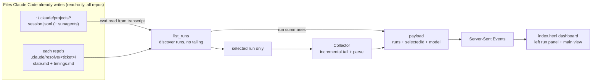

# resolve-issue-dashboard

A live, read-only dashboard for `resolve-issue` runs. **One global server** discovers every run across your repos — by reading the files Claude Code already writes (the session transcripts and each repo's `.claude/resolve/<ticket>/state.md`, plus the run's append-only `timings.md`) — lists them in a left panel, and renders the selected run's pipeline step, what each subagent is doing, the running metrics, and any gate it is paused at. It is a pure observer: it never writes to a transcript or to `.claude/resolve/`, never answers a gate, and never edits code.

It is built lightweight on purpose — a stdlib-only Python server plus one self-contained HTML page — rather than adopting a full agent GUI. The design language (dark layered surfaces, a left run/project panel, status-coloured pipeline nodes, an activity timeline, stat cards) is borrowed from the `claude-code-agents-ui` project; the mechanism is our own and understands `resolve-issue`'s phases and `state.md`. Running it once serves every repo, so multiple concurrent runs need only one dashboard (and one port).

## Prerequisite

Python 3.8+ on PATH — standard library only, no `pip install`. It is the single prerequisite; the skill checks for it (`python`, falling back to `py -3`) before launching and tells you to install it if it is missing. The browser only needs `EventSource` (every modern browser has it).

## Data flow

`parse_session.py` discovers runs across every repo: it enumerates the projects root, reads each session's recorded `cwd` from inside the transcript (the project-dir-name encoding is lossy, so the cwd cannot be reversed from it), and lists the `.claude/resolve/<ticket>/` runs it finds — all without tailing. `serve_progress.py` holds one selected run, tails only that one (pairing each `tool_use` with its `tool_result` for status and duration), and about once a second publishes `{runs, selectedId, model}` over SSE — the run list for the left panel plus the selected run's full model for the main view. Clicking a run calls `/select`, which switches what is tailed.

## What it renders

- **Run panel (left)** — every run discovered across your repos (repo, ticket, a coarse next-step status dot — done / paused / active / idle — and last activity); click to switch the main view, with the launch repo selected by default. The precise running / paused / blocked state lives in the selected run's header, since the list does not tail each repo.
- **Header + status pill** — the selected run's ticket, work and base branch, PR link once present, and a coloured run status (running / paused / blocked / done).
- **Pipeline** — the steps (loaded from the shared `resources/resolve-issue-steps.json` registry, e.g. `a-fact-check` … `done`) as nodes; status comes from `state.md`'s `next-step` — earlier completed, current running or paused, later pending — with the running node pulsing and completed nodes ticked. Each completed node also shows its wall-clock, and a step re-entered by a gate revise shows a `×N` count, read from the run's append-only `timings.md`. A completed node's tooltip also shows its output-token total — a compute-vs-waiting signal (a slow step with few output tokens was mostly waiting, not computing).
- **Agent activity** — the merged tool-call stream from the main session and its subagents (each component's writer / verifier), showing tool, target, status, and duration.
- **Stat cards** — pipeline step `N` of the registry's total, elapsed (wall-clock) duration, tool-call count, and tokens in / cached / out. The three token figures are what the API reported, counted once per response: `in` is the cache-**miss** input only, `cached` is the cache reads plus cache writes, `out` is the model's output. They are kept apart rather than blended into one input number, because a cached read costs a fraction of a fresh one — so read them as volume, not as a price.
- **Attention cue** — a breathing full-frame highlight plus a core-readout takeover pointing back to the terminal: amber when the run is paused at the plan-approval gate, red when it is blocked awaiting a disposition. It fires only once the session has actually parked at the gate and yielded control — not the moment the step is entered, since the run can still be working toward it (e.g. drafting the PR before the open-PR confirmation), which the dashboard reads from the tailed session's liveness.
- **Test-contention banner** — a global warning when two or more runs (across all repos) sit on a test-executing step at once; those steps usually need shared local infrastructure (containers, databases, emulators), so running them together can conflict. It names the colliding runs to stagger and is read-only, like the rest of the dashboard. Which steps count is marked with `runsTests` in the shared registry, so it stays in sync with the pipeline.

## Relationship to `resolve-issue`

`resolve-issue-dashboard` only observes; it does not drive the pipeline. `resolve-issue` runs in the Claude Code terminal, advances the steps, and holds the human gates; this dashboard reflects those runs and reminds you when a gate is waiting, but every decision is still made in the terminal. Launch it once from any repo; runs from every repo appear in the panel, so concurrent `resolve-issue` runs share one dashboard. For a single stage, run the component skill directly — this dashboard is only for visualising the end-to-end run.
