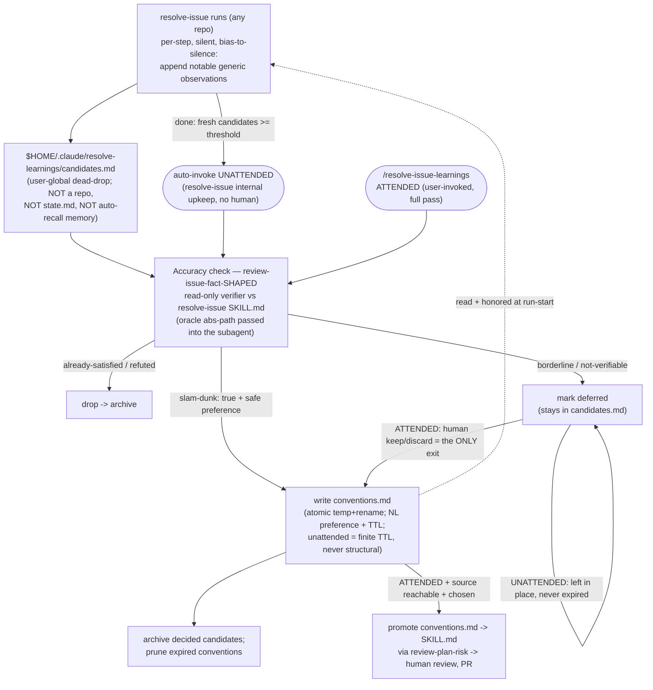

# resolve-issue-learnings

The **harvest** half of `resolve-issue`'s self-improvement loop. `resolve-issue` captures cheap, unverified observations about its own pipeline (gate flow, step sequencing, state handling, how it chains components) into a user-global "dead-drop" while it runs; this user-invoked skill verifies those candidates against the current `resolve-issue` skill as ground truth and applies only the ones that survive. The capture-then-harvest split is deliberate: mid-run, sample-of-one, with no skill source on hand is the worst moment to decide a learning is true, so nothing is trusted until it is verified here.

Two modes, chosen by **what is reachable** — never by a folder or repo name (a checkout's folder and its remote name routinely differ):

- **Mode X (default, any user, any repo)** — write verified learnings to a **user-global conventions file** that `resolve-issue` reads and honors on its next run. Local, self-contained, no outward action. This is what makes "the more I use resolve-issue, the better my runs get" true for an individual.
- **Mode Y (maintainer, only when the editable plugin source is in the working tree)** — promote the verified, high-value entries already in `conventions.md` into `resolve-issue`'s own source `SKILL.md` via `review-plan-risk`, so a release carries the improvement to everyone. Always explicit, confirmed, and **attended-only**; stops at the working-tree diff for the human to review, version-bump (own commit), and PR.

And it runs in **two invocation contexts**: **unattended** — `resolve-issue` auto-invokes it at `done` once enough fresh candidates have accumulated, doing only the safe machine subset (verify, auto-apply only *slam-dunk* confirmed-X — **true *and* the implied preference self-evidently safe** — with a finite TTL, mark the rest `deferred`, never Y, no human); and **attended** — a person runs `/resolve-issue-learnings` by hand for the full pass, which is the **only exit** for the deferred / low-confidence backlog (human worth-it judgement) and the only path that promotes to `SKILL.md` (Y). Attended is the superset; unattended is its machine-only subset.

## The loop

## Rules that govern it

- **Verify is a fact-check, not a risk hunt.** The accuracy check ("does this still hold against the current SKILL.md?") is the shape of `review-issue-fact` (claim-vs-oracle, confirmed/refuted) — `review-plan-risk` is used **only** for the mode-Y edit derivation (hardening the source SKILL.md in place).
- **Subagents can't self-locate.** The oracle path is resolved in the main loop and passed as an **absolute path** into the read-only accuracy verifier; a subagent given a token or relative path reads nothing.
- **Mode by capability, not name.** Y is offered only when `marketplace.json` declares `issue-to-pr-pipeline` and the resolve-issue source SKILL.md is git-tracked in the working tree — independent of folder/repo name, fork-friendly. A mis-detection only *offers* Y; it never edits source unprompted.
- **Atomic writes; one deleter.** `conventions.md` is written atomically (temp + `mv`) so a concurrent run never reads a half-written file. This skill is the only place that physically deletes expired conventions; `resolve-issue`'s run-start read only skips stale entries in memory and never writes.
- **No migration engine.** Conventions are loose-coupled natural-language preferences honored when consistent and carrying a TTL. Every harvest re-verifies each *candidate* against the current SKILL.md, so a learning the skill has outgrown is dropped before it is ever written — but note an already-written convention is not re-sent to the oracle, and its `ttl` is the only thing that retires it. A `schema_version` marker is for cheap detect-and-re-derive, not structured migration.
- **Unattended is the machine subset; attended is the exit.** The auto-run (invoked by `resolve-issue` when fresh candidates pass a threshold) applies only *slam-dunk* confirmed learnings — **true *and* implying a self-evidently safe preference**, a two-part bar since no human backs it, and always with a finite TTL — and `deferred`-marks the rest; the manual attended run is the **only** place the deferred / low-confidence backlog gets human judgement, and the only path to mode Y. A `deferred` item has no expiry and is never aged out: it is inert (never honored, never counted toward the trigger), so it waits for the attended pass rather than being destroyed on a timer. The cost of a growing backlog is bounded where it is actually spent — the attended re-verification takes the oldest first and says what it could not reach.
- **Auto-apply is not self-healing — know its one residual.** A convention that is structurally *consistent* with the skill but whose *preference* is an unwise judgement call is not caught by re-verify (which checks fact, not wisdom) or by honor-if-consistent (which honors it *because* it is consistent). Its guards are: the two-part apply-time bar (which defers anything needing a wisdom call), the **finite TTL** on every auto-applied entry (so it self-expires rather than persisting forever), and the attended pass as the periodic human backstop that can prune it. Reversible and advisory (per-run honored-if-consistent), so the blast radius is a nudge, not a broken run — but a human pass is what truly clears a bad one.
- **An empty harvest is healthy.** Most runs capture nothing notable; zero candidates is a normal outcome, not a failure.

## Relationship to the siblings

`resolve-issue-learnings` neither runs the pipeline (`resolve-issue`) nor watches it (`resolve-issue-dashboard`) — it processes the accumulated learning store between runs. It reuses `review-issue-fact`'s *shape* for accuracy and `review-plan-risk` itself for the mode-Y source edit, and keeps capturing candidates separate from consolidating them into conventions (with an archive of decided candidates) — all at user-global scope, because the learnings are generic to the pipeline, not specific to any one repo.
