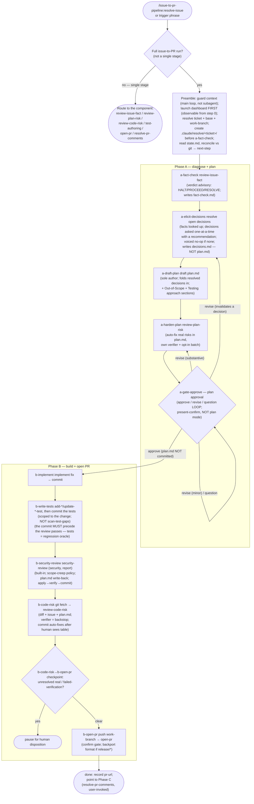

# resolve-issue

Drive one ticket through the full issue-to-PR pipeline — fact-check the issue, draft a plan, harden it, implement the fix, write tests, review the fix, open the PR — by invoking the already-built `adversarial-review`, `test-authoring`, and `pr-lifecycle` component skills in order, gated on plan approval and pausing again wherever a decision is yours. It is a **sequencer, not a re-implementation**: each component reads its own input and runs behind its own gates; the orchestrator only owns ordering, the human gates it holds, and the durable handoff artifacts that make the run resumable.

The entry point of `issue-to-pr-pipeline`. It depends on `adversarial-review`, `test-authoring`, and `pr-lifecycle` (declared in `plugin.json`, auto-installed with this plugin). It runs in the **main conversation loop** — never as a subagent — because the components spawn their own verifier subagents and the gates here are interactive.

## Process flow

## Rules that govern the flow

- **Sequencer, not re-implementation** — the orchestrator invokes each component by its slash form and confirms it ran; it never re-derives a component's behaviour and never threads a verdict / risk table / test selection between components as an argument. Each reads its own input (issue text, `plan.md`, the git diff).
- **Plan approval is the pivot, not the last stop** — a-gate-approve is an approve / revise / question loop over `.claude/resolve/<ticket>/plan.md`, and it is what splits Phase A from Phase B. It is a bespoke present-and-confirm, not the built-in plan mode (which writes elsewhere, where `review-code-risk` could not read it). Approving it does not make the rest unattended — see [Where the run stops for you](#where-the-run-stops-for-you).
- **Resumable, same working tree** — every invocation rebuilds the cursor from `state.md` reconciled against git, so staying in-session and resuming in a fresh session at a different effort are one code path. The handoff artifacts are gitignored local files; a fresh clone on another machine starts fresh rather than resuming an in-flight run (a deliberate trade-off, not a bug).
- **Pick model and effort before you invoke; the pipeline never switches or downgrades them** — effort is chosen at invocation and never changes mid-run, and Phase A (diagnose and plan) is the reasoning-critical part it drives, so bias toward a stronger model and higher effort for a complex, ambiguous, or high-risk issue. The a-gate-approve pause is the natural moment to change model/effort for Phase B. The pipeline and its subagents follow the session's model and effort and never pin, cap, or silently downgrade them — lower the session model yourself if you want a run to be cheaper.
- **`plan.md` is not committed** — `review-code-risk` reads it from the working-tree disk; committing it would pollute the code diff and the PR. Recommend gitignoring `.claude/resolve/` in the consumer repo.
- **Tests are committed before the review passes** — Phase B runs implement → test → commit → `security-review` (security) → `review-code-risk` → PR. Committing the tests first makes them an **independent regression oracle** for the security and fix-review edits; each pass reads the committed diff, applies its fixes uncommitted, and — when it changed code — a build+test gate verifies them before that pass commits.
- **Never commit onto the base branch** — a work-branch guard stops any Phase B commit unless the current branch is a feature branch distinct from the base (`master` / `main`, or the targeted `release/*` for a backport).
- **Ends at PR-created** — addressing review comments is Phase C (`resolve-pr-comments`), invoked by the human later; there is no polling loop.

## Where the run stops for you

**Approving the plan does not hand the rest off.** An interactive run waits on you at least three times, and the wait is unbounded — a run left unattended simply sits there until someone comes back. Plan to stay available rather than walking away after approval.

The stops fall into two groups, for different reasons.

**Decisions only you can make.** These exist because the alternative is the pipeline guessing, and a guessed decision is what produces a plan that has to be thrown away later.

- **a-elicit-decisions** — settles the open design decisions before anything is planned. Always asks on an interactive run (non-interactively it records `skipped` and continues).
- **a-gate-approve** — plan approval. Always asks, and no code is touched before it.
- **b-security-review** — only when the security pass surfaces findings, or its verification comes back red.
- **b-code-risk** — only when a risk is left unresolved, or `review-code-risk`'s auto-fixes need accepting before they are committed.
- **a-fact-check** — advisory only: it surfaces its HALT / RESOLVE verdict and asks whether to continue. It never hard-stops.

**Confirmation before something irreversible or outward-facing.** A different reason — this is blast-radius control, not plan quality.

- **b-open-pr** — publishes the branch and creates the PR only after you confirm. Always asks, and the run is waiting for the whole time the draft sits on screen.

So after approval there is one guaranteed stop — the open-PR confirmation — plus whatever the review passes surface. When a run is paused, `state.md`'s `attention` field names what it is waiting for, and `resolve-issue-dashboard` shows it.

## Prerequisites

- **MCP / CLI** — whatever the component skills require: the Atlassian MCP for the Jira anchor (a-fact-check), and `az` with the azure-devops extension for `open-pr` (b-open-pr). Each degrades with a voiced note if absent.
- **Keep the built-in `security-review` unshadowed (b-security-review).** b-security-review invokes the harness built-in `/security-review` (report-only). Built-in skills have no plugin namespace, so a third-party plugin that claims that bare name — e.g. CodeRabbit — shadows it and wins the bare-name resolution; if that plugin's CLI is not installed, the bare name fails outright. Disable any such plugin so the built-in resolves: set `enabledPlugins: { "coderabbit@…": false }` in `settings.json`, or run `/plugin disable coderabbit`. Because `security-review` is the pipeline's only built-in review pass, a shadowed *or* absent `security-review` is treated as the pass **not having run** — b-security-review surfaces a loud `SECURITY REVIEW DID NOT RUN` rather than silently trusting the wrong tool.

## Relationship to the component skills

`resolve-issue` does not replace any component — it orchestrates them, and each remains independently invocable for its single-stage use:

- **`adversarial-review`** — `review-issue-fact` (a-fact-check, issue verdict), `review-plan-risk` (a-harden-plan, hardens the plan), `review-code-risk` (b-code-risk, reviews the committed fix).
- **`test-authoring`** — `add-*-test` / `update-*-test` (b-write-tests, scoped to the change; `update-*-test` is also invoked at b-security-review to refresh a test that a security fix legitimately made stale). `scan-test-gaps` stays a standalone broad-scan tool, outside this automated flow.
- **`pr-lifecycle`** — `open-pr` (b-open-pr, opens the PR). `resolve-pr-comments` is Phase C, user-invoked after review.
- **Built-in Claude Code skills** — `security-review` (b-security-review, security; report-only). This is a harness **built-in** invoked by bare name, not a plugin component — see the prerequisite above on keeping the `security-review` name unshadowed.

If the user wants only one of these stages, prefer the component skill directly; `resolve-issue` is for the end-to-end run.
