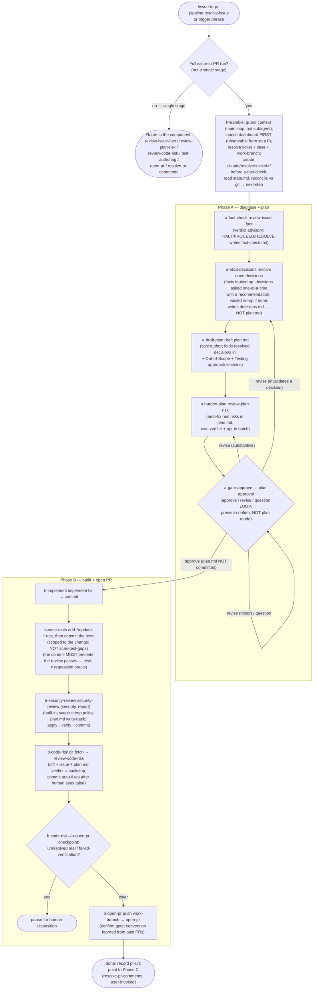

<!-- translated from README.md, source sha256 8feb19c242f03a101396c65e09c9313b1d9f083590bf2ad6369c9e6fa6c62e8e; see CLAUDE.md "Translations of the root README" before editing -->
# resolve-issue

[English](README.md) | [繁體中文](README.zh-TW.md) | [简体中文](README.zh-CN.md)

带着一个工单走完整个从 issue 到 PR 的 pipeline：事实核查 issue、起草计划、强化计划、实现修复、编写测试、审查修复、创建 PR。做法是按顺序调用已经构建好的 `disconfirm-first`、`test-authoring` 和 `pr-lifecycle` 这几个组件 skill，以计划批准作为关卡，并在每个该由你决定的地方再次暂停。它 **只负责排序，而不是重新实现**：每个组件读取自己的输入、在自己的关卡之后运行；编排器只负责顺序、它所掌握的人工关卡，以及让这次运行能够接着进行的持久交接文件。

这是 `issue-to-pr-pipeline` 的入口。它依赖于 `disconfirm-first`、`test-authoring` 和 `pr-lifecycle`（在 `plugin.json` 中声明，会随这个 plugin 自动安装）。它在 **主对话循环** 中运行，绝不以 subagent 的身份运行，因为各组件会启动自己的验证者 subagent，而这里的关卡是交互式的。

## 流程

## 流程遵循的规则

- **只负责排序，而不是重新实现**：编排器以 slash 形式调用每个组件，并确认它确实运行了；它从不自行推导组件的行为，也从不把判定、风险表或测试选择当作参数在组件之间传递。每个组件都读取自己的输入（issue 文本、`plan.md`、git diff）。
- **计划批准是转折点，不是最后一站**：a-gate-approve 是一个针对 `.claude/resolve/<ticket>/plan.md` 的“批准 / 修改 / 提问”循环，它也是 Phase A 和 Phase B 的分界。它是专门设计的“展示并确认”，不是内置的 plan mode（plan mode 会写到别的地方，`review-code-risk` 读不到）。批准之后，其余部分并不会变成无人值守，见 [运行在哪里停下来等你](#where-the-run-stops-for-you)。
- **可以接着运行，前提是同一个 working tree**：每次调用都会从 `state.md` 重建游标，并与 git 比对校正，所以“留在同一个 session”和“在新的 session 以不同的 effort 接着运行”走的是同一条代码路径。交接文件是被 gitignore 的本地文件；在另一台机器上的全新克隆会从头开始，而不是接着一个进行中的运行（这是有意的取舍，不是 bug）。
- **调用之前先选好模型和 effort；pipeline 从不切换或降级它们**：effort 在调用时确定，运行中不会改变。Phase A（诊断与规划）是这个选择所驱动、依赖推理的关键部分，所以当难度属于 *推理型*（错一步就会层层放大的推理链），就偏向更强的模型和更高的 effort；如果难度属于 *事实型*（问题在于某个关于代码的说法是否成立），深度带来的好处就少得多，不如坚守先核实再下结论的纪律。a-gate-approve 的暂停是为 Phase B 更换模型或 effort 的自然时机。pipeline 和它的 subagent 都跟随 session 的模型与 effort，从不固定、设上限或悄悄降级；想让一次运行便宜一些，请自己调低 session 的模型。
- **`plan.md` 不会被 commit**：`review-code-risk` 从 working tree 的磁盘读取它；commit 进去会污染代码 diff 和 PR。P3 会自行写入 `.claude/resolve/.gitignore`（内容为 `*`），所以不需要修改 repo 根目录的 `.gitignore`。
- **测试在审查之前就 commit**：Phase B 的顺序是 实现 → 测试 → commit → `security-review`（安全）→ `review-code-risk` → PR。先 commit 测试，让它成为安全审查与修复审查所做修改的 **独立的回归判定依据**；每一轮审查都读取已 commit 的 diff，应用修复但不 commit，而当它改动了代码时，会先经过构建加测试的关卡验证，才由那一轮 commit。
- **绝不 commit 到 base branch**：work-branch 防护让 Phase B 的每个 commit 都落在一个与 P2 记录的 base（默认 branch 或某条维护线）不同的 feature branch 上；如果运行时还在 base 上，它会先创建一个。
- **在 PR 创建时结束**：处理审查意见是 Phase C（`resolve-pr-comments`），由人之后再调用；没有轮询循环。

## 运行在哪里停下来等你

**批准计划并不意味着把剩下的交出去了。** 每次运行至少会等你两次，而且每次等待都没有时限：一次无人照看的运行，就只会停在那里，直到有人回来。

这些停止点分成两组，理由不同。

**只有你能做的决定。** 它们之所以存在，是因为另一个选项是让 pipeline 去猜，而猜出来的决定，正是之后不得不整份丢掉的计划的来源。

- **a-gate-approve**：计划批准。**一定会问**，在它之前不会改动任何代码。
- **a-elicit-decisions**：**只有在工单确实留下一个关键决定没有定下时**才会问；没有的话，它会明确说明“无事可做”并继续运行。它被禁止自行制造决定，而且必须记录是什么让这个工单信息充分，所以一个内容单薄的工单无法靠自我声明而悄悄过关。它查得到的 *事实* 从不拿来问你。（在非交互模式下，它会记录 `skipped`，由 `a-draft-plan` 按最佳推断起草。）
- **a-harden-plan**：`review-plan-risk` 在这里有两个属于它自己的停止点：开始修改之前，它会确认确定下来的范围；它也会把所有符合条件的边缘情况风险，整理成单独一批让你选择是否加入。编排器不会重新实现这两者，它只会保存一份基线副本。
- **b-write-tests**：当正确的测试类型或范围确实不明确时会问你，而不是自己猜；它也会把测试验证者提出的质量警示交给你处置。（当它判断需要时，也会把 Gherkin 场景的覆盖情况列为人工后续事项，这是一份报告，不是问题：没有任何东西在等它。）
- **b-security-review**：只有在安全审查发现问题，或它的验证结果失败时。
- **b-code-risk**：只有在某个风险没有解决，或 `review-code-risk` 的自动修复需要你接受之后才能 commit 时，或安全审查实际上没有运行（`plan.md` 中有 `SECURITY REVIEW DID NOT RUN`），需要你明确选择是否在没有安全审查的情况下创建 PR 时。
- **a-fact-check**：只是建议性质：它会展示 HALT / RESOLVE 的判定，并问你是否继续。它从不强制停止。

注意其中哪些是编排器自己掌握的：计划批准、a-elicit-decisions、a-fact-check 之后“停止还是继续”的询问，以及两次审查处置。a-harden-plan 和 b-write-tests 的停止点则属于组件 skill，在组件内部触发。这个区别在你修改这条 pipeline 时很重要，在你等它的时候则完全无关。

**在不可逆或对外的操作之前确认。** 理由不同：这是为了控制影响范围，而不是为了计划质量。

- **work-branch 防护**：在任何 Phase B 的 commit 之前，如果你还在 base branch 上，它会按照 repo 现有 branch 的命名方式自行创建 feature branch，并告诉你。它只有在 working tree 有未 commit 的变更（这些变更会被一起带进修复的 commit）或同名的 branch 已经存在时，才会停下来问你。它从不把修复或测试 commit 到 base 上。如果你一开始所在的是另一个 branch，而且名称里不带这个工单号，前置步骤会在任何事开始之前问你这是不是这个 issue 的 branch，否则那个 branch 上已有的 commit 会被当成这次运行的修复，而 Phase A 会被跳过。
- **b-open-pr**：只有在你确认之后才会推送 branch 并创建 PR。一定会问，而草稿显示在屏幕上的整段时间，运行都在等你。

所以批准之后，有一个一定会出现的停止点，也就是创建 PR 前的确认；再加上审查过程中浮现的问题，以及在 working tree 有未 commit 变更或 branch 名称已被占用时的 work-branch 防护。一次运行暂停时，`state.md` 的 `attention` 字段会写明它在等什么，`resolve-issue-dashboard` 也会显示出来。

## 前提条件

- **MCP / CLI**：组件 skill 需要什么就准备什么：Jira 锚点需要 Atlassian MCP（a-fact-check），`open-pr` 需要加上 azure-devops 扩展的 `az`，或在 GitHub 上需要 `gh`（b-open-pr）。缺少时，各自都会说明并降级运行。
- **PATH 上的 Python：可选，而且不是这个 skill 的前提条件。** 每次交互式运行开始时，前置步骤都一定会尝试启动 `resolve-issue-dashboard`，而那个仪表盘是一个只用标准库的本地 Python 服务器（不需要 `pip install`，也不需要 virtualenv）。它是一次运行唯一会明显接触到的前提条件，所以才在这里列出；但没有它时，启动步骤只会用一行说明不启动，pipeline 完全不受影响，因为仪表盘只负责观察。安装命令见 [plugin README](../../README.md#prerequisites)。
- **别让内置的 `security-review` 被遮蔽（b-security-review）。** b-security-review 会调用 harness 内置的 `/security-review`（只生成报告）。内置 skill 没有 plugin 命名空间，所以一个占用了同样裸名称的第三方 plugin（例如 CodeRabbit）会遮蔽它，在裸名称解析中胜出；如果那个 plugin 的 CLI 没有安装，裸名称就会直接失败。请停用这类 plugin，让内置的版本能被解析：在 `settings.json` 中设置 `enabledPlugins: { "coderabbit@…": false }`，或运行 `/plugin disable coderabbit`。因为 `security-review` 是 pipeline 唯一的内置审查，被遮蔽 *或* 不存在的 `security-review` 都会被视为 **没有运行**：b-security-review 会醒目地显示 `SECURITY REVIEW DID NOT RUN`，而不是悄悄信任一个错误的工具。

## 与组件 skill 的关系

`resolve-issue` 不取代任何组件，它只是编排它们，而每个组件仍然可以为了单一阶段的用途独立调用：

- **`disconfirm-first`**：`review-issue-fact`（a-fact-check，issue 判定）、`review-plan-risk`（a-harden-plan，强化计划）、`review-code-risk`（b-code-risk，审查已 commit 的修复）。
- **`test-authoring`**：`add-*-test` / `update-*-test`（b-write-tests，范围限于这次的变更；在 b-security-review 时也会调用 `update-*-test`，来刷新一个因为安全修复而合理过时的测试）。`scan-test-gaps` 保持为一个可独立使用的大范围扫描工具，不在这个自动化流程之内。
- **`pr-lifecycle`**：`open-pr`（b-open-pr，创建 PR）。`resolve-pr-comments` 是 Phase C，在审查之后由用户调用。
- **Claude Code 内置的 skill**：`security-review`（b-security-review，安全；只生成报告）。这是以裸名称调用的 harness **内置** skill，不是 plugin 组件；关于如何让 `security-review` 的名称不被遮蔽，见上方的前提条件。

如果用户只想要其中一个阶段，请直接使用组件 skill；`resolve-issue` 用于端到端的运行。
