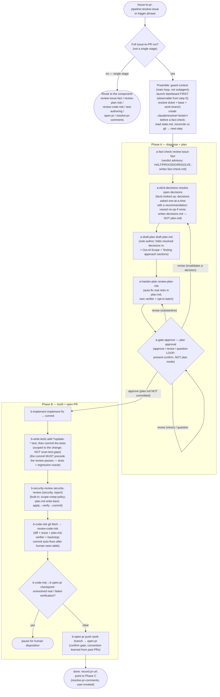

<!-- translated from README.md, source sha256 8feb19c242f03a101396c65e09c9313b1d9f083590bf2ad6369c9e6fa6c62e8e; see CLAUDE.md "Translations of the root README" before editing -->
# resolve-issue

[English](README.md) | [繁體中文](README.zh-TW.md) | [简体中文](README.zh-CN.md)

帶著一張工單走完整個從 issue 到 PR 的 pipeline：事實查核 issue、起草計畫、強化計畫、實作修正、撰寫測試、審查修正、開出 PR。做法是依序叫用已經建好的 `disconfirm-first`、`test-authoring` 和 `pr-lifecycle` 這幾個元件 skill，以計畫核准作為關卡，並在每個該由你決定的地方再次暫停。它 **只負責串接順序，不重新實作**：每個元件讀取自己的輸入、在自己的關卡後面執行；協調者只負責順序、它所掌握的人工關卡，以及讓這次執行能夠接續的持久交接檔案。

這是 `issue-to-pr-pipeline` 的入口。它相依於 `disconfirm-first`、`test-authoring` 和 `pr-lifecycle`（宣告在 `plugin.json` 中，會隨這個 plugin 自動安裝）。它在 **主對話迴圈** 中執行，絕不以 subagent 的身分執行，因為各元件會啟動自己的驗證者 subagent，而這裡的關卡是互動式的。

## 流程

## 支配流程的規則

- **只負責串接順序，不重新實作**：協調者以 slash 形式叫用每個元件，並確認它確實執行了；它從不自行推導元件的行為，也從不把判定、風險表或測試選擇當成參數在元件之間傳遞。每個元件都讀取自己的輸入（issue 文字、`plan.md`、git diff）。
- **計畫核准是轉折點，不是最後一站**：a-gate-approve 是一個針對 `.claude/resolve/<ticket>/plan.md` 的「核准 / 修改 / 提問」迴圈，它也是 Phase A 和 Phase B 的分界。它是專門設計的「呈現並確認」，不是內建的 plan mode（plan mode 會寫到別的地方，`review-code-risk` 讀不到）。核准之後，其餘的部分並不會變成無人值守，見 [執行在哪裡停下來等你](#where-the-run-stops-for-you)。
- **可以接續，前提是同一個 working tree**：每次叫用都會從 `state.md` 重建游標，並和 git 比對校正，所以「留在同一個 session」和「在新的 session 以不同的 effort 接續」走的是同一條程式路徑。交接檔案是被 gitignore 的本機檔案；在另一台機器上的全新 clone 會從頭開始，而不是接續一個進行中的執行（這是刻意的取捨，不是 bug）。
- **叫用之前先選好模型和 effort；pipeline 從不切換或降級它們**：effort 在叫用時決定，執行中不會改變。Phase A（診斷與規劃）是這個選擇所驅動、依賴推理的關鍵部分，所以當難度屬於 *推理型*（一條錯一步就會累積錯誤的推理鏈），就偏向更強的模型和更高的 effort；如果難度屬於 *事實型*（問題在於某個關於程式碼的說法是否成立），深度帶來的好處就少得多，不如守住先查證再下結論的紀律。a-gate-approve 的暫停是為 Phase B 更換模型或 effort 的自然時機。pipeline 和它的 subagent 都跟隨 session 的模型與 effort，從不固定、設上限或默默降級；想讓一次執行便宜一些，請自己調低 session 的模型。
- **`plan.md` 不會被 commit**：`review-code-risk` 從 working tree 的磁碟讀取它；commit 進去會污染程式碼 diff 和 PR。P3 會自行寫入 `.claude/resolve/.gitignore`（內容為 `*`），所以不需要修改 repo 根目錄的 `.gitignore`。
- **測試在審查之前就 commit**：Phase B 的順序是 實作 → 測試 → commit → `security-review`（安全）→ `review-code-risk` → PR。先 commit 測試，讓它成為安全審查與修正審查所做修改的 **獨立的回歸判準**；每一輪審查都讀取已 commit 的 diff，套用修正但不 commit，而當它改動了程式碼時，會先經過建置加測試的關卡驗證，才由那一輪 commit。
- **絕不 commit 到 base branch**：work-branch 防護讓 Phase B 的每個 commit 都落在一個和 P2 記錄的 base（預設 branch 或某條維護線）不同的 feature branch 上；如果執行時還在 base 上，它會先建立一個。
- **在 PR 建立時結束**：處理審查意見是 Phase C（`resolve-pr-comments`），由人之後再叫用；沒有輪詢迴圈。

## 執行在哪裡停下來等你

**核准計畫並不代表把剩下的交出去了。** 每次執行至少會等你兩次，而且每次等待都沒有時限：一次沒人看著的執行，就只會停在那裡，直到有人回來。

這些停止點分成兩組，理由不同。

**只有你能做的決定。** 它們存在，是因為另一個選項是讓 pipeline 去猜，而猜出來的決定，正是之後得整份丟掉的計畫的來源。

- **a-gate-approve**：計畫核准。**一定會問**，在它之前不會動到任何程式碼。
- **a-elicit-decisions**：**只有在工單真的留下一個關鍵決定沒有定案時**才會問；沒有的話，它會明說「無事可做」並繼續執行。它被禁止自行製造決定，而且必須記錄是什麼讓這張工單資訊足夠，所以一張內容單薄的工單無法靠自我宣告而默默過關。它查得到的 *事實* 從不拿來問你。（在非互動模式下，它會記錄 `skipped`，由 `a-draft-plan` 依最佳推斷起草。）
- **a-harden-plan**：`review-plan-risk` 在這裡有兩個屬於它自己的停止點：開始修改之前，它會確認它判定的範圍；它也會把所有符合條件的邊緣情況風險，整理成單一一批讓你選擇是否加入。協調者不會重新實作這兩者，它只會保存一份基準副本。
- **b-write-tests**：當正確的測試類型或範圍確實不明確時會問你，而不是自己猜；它也會把測試驗證者提出的品質警示交給你處置。（當它判斷需要時，也會把 Gherkin 情境的覆蓋情況列為人工後續事項，這是一份報告，不是問題：沒有任何東西在等它。）
- **b-security-review**：只有在安全審查發現問題，或它的驗證結果失敗時。
- **b-code-risk**：只有在某個風險沒有解決，或 `review-code-risk` 的自動修正需要你接受之後才能 commit 時，或安全審查實際上沒有執行（`plan.md` 中有 `SECURITY REVIEW DID NOT RUN`），需要你決定是否在沒有安全審查的情況下開出 PR 時。
- **a-fact-check**：只是建議性質：它會呈現 HALT / RESOLVE 的判定，並問你是否繼續。它從不強制停止。

注意其中哪些是協調者自己掌握的：計畫核准、a-elicit-decisions、a-fact-check 之後的「停止或繼續」，以及兩次審查處置。a-harden-plan 和 b-write-tests 的停止點則屬於元件 skill，在元件內部觸發。這個區別在你修改這條 pipeline 時很重要，在你等它的時候則完全無關。

**在不可逆或對外的動作之前確認。** 這是另一個理由：這是控制影響範圍，不是計畫品質。

- **work-branch 防護**：在任何 Phase B 的 commit 之前，如果你還在 base branch 上，它會依照 repo 現有 branch 的命名方式自行建立 feature branch，並告訴你。它只有在 working tree 有未 commit 的變更（那些變更會被一起帶進修正的 commit）或同名的 branch 已經存在時，才會停下來問你。它從不把修正或測試 commit 到 base 上。如果你一開始所在的是另一個 branch，而它的名稱沒有帶這張工單的編號，前置步驟會在任何事開始之前問你這是不是這個 issue 的 branch，否則那個 branch 上已有的 commit 會被當成這次執行的修正，而 Phase A 會被跳過。
- **b-open-pr**：只有在你確認之後才會 push branch 並建立 PR。一定會問，而草稿顯示在畫面上的整段時間，執行都在等你。

所以核准之後，有一個一定會出現的停止點，也就是開 PR 前的確認；再加上審查過程中浮現的問題，以及在 working tree 有未 commit 變更或 branch 名稱已被使用時的 work-branch 防護。一次執行暫停時，`state.md` 的 `attention` 欄位會寫明它在等什麼，`resolve-issue-dashboard` 也會顯示出來。

## 前置需求

- **MCP / CLI**：元件 skill 需要什麼就準備什麼：Jira 錨點需要 Atlassian MCP（a-fact-check），`open-pr` 需要加上 azure-devops 擴充功能的 `az`，或在 GitHub 上需要 `gh`（b-open-pr）。缺少時，各自都會說明並降級運作。
- **PATH 上的 Python：選用，而且不是這個 skill 的前置需求。** 每次互動式執行開始時，前置步驟都一定會嘗試啟動 `resolve-issue-dashboard`，而那個儀表板是一個只用標準函式庫的本機 Python 伺服器（不需要 `pip install`，也不需要 virtualenv）。它是一次執行唯一會明顯碰到的前置需求，所以才在這裡列出；但沒有它時，啟動會以一行訊息說明無法啟動，pipeline 完全不受影響，因為儀表板只負責觀察。安裝指令見 [plugin README](../../README.md#prerequisites)。
- **別讓內建的 `security-review` 被遮蔽（b-security-review）。** b-security-review 會叫用 harness 內建的 `/security-review`（只產生報告）。內建 skill 沒有 plugin 命名空間，所以一個佔用了同樣裸名稱的第三方 plugin（例如 CodeRabbit）會遮蔽它，在裸名稱解析中勝出；如果那個 plugin 的 CLI 沒有安裝，裸名稱就會直接失敗。請停用這類 plugin，讓內建的版本能被解析：在 `settings.json` 中設定 `enabledPlugins: { "coderabbit@…": false }`，或執行 `/plugin disable coderabbit`。因為 `security-review` 是 pipeline 唯一的內建審查，被遮蔽 *或* 不存在的 `security-review` 都會被視為 **沒有執行**：b-security-review 會醒目地顯示 `SECURITY REVIEW DID NOT RUN`，而不是默默相信一個錯的工具。

## 與元件 skill 的關係

`resolve-issue` 不取代任何元件，它只是協調它們，而每個元件仍然可以為了單一階段的用途獨立叫用：

- **`disconfirm-first`**：`review-issue-fact`（a-fact-check，issue 判定）、`review-plan-risk`（a-harden-plan，強化計畫）、`review-code-risk`（b-code-risk，審查已 commit 的修正）。
- **`test-authoring`**：`add-*-test` / `update-*-test`（b-write-tests，範圍限於這次的變更；在 b-security-review 時也會叫用 `update-*-test`，來更新一個因為安全修正而合理過時的測試）。`scan-test-gaps` 維持為一個獨立使用的大範圍掃描工具，不在這個自動化流程之內。
- **`pr-lifecycle`**：`open-pr`（b-open-pr，開出 PR）。`resolve-pr-comments` 是 Phase C，在審查之後由使用者叫用。
- **Claude Code 內建的 skill**：`security-review`（b-security-review，安全；只產生報告）。這是以裸名稱叫用的 harness **內建** skill，不是 plugin 元件；關於如何讓 `security-review` 的名稱不被遮蔽，見上方的前置需求。

如果使用者只想要其中一個階段，請直接使用元件 skill；`resolve-issue` 是用於端到端的執行。
