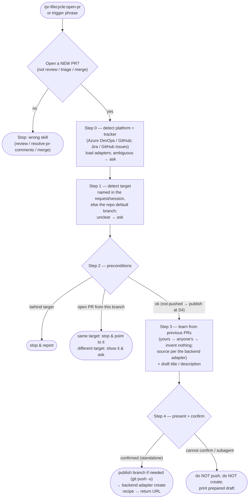

# open-pr

Open a pull request (Azure DevOps or GitHub) for the current branch, with a title and description that follow **the caller's own previous PRs** (learned at runtime from the repo's history, falling back to everyone's and then to no convention at all) instead of a fixed house style. Presentation is learned; substance is learned only where the sample has some, so a repo whose PRs say nothing still gets one that does. The draft is always presented for confirmation, and the PR is never created without explicit approval.

Part of `pr-lifecycle`, the team-agnostic PR-lifecycle plugin. Sibling: `resolve-pr-comments` (triage and act on an existing PR's review comments behind a single confirmation gate).

## Multi-backend

The skill is backend-agnostic across two orthogonal axes, detected in Step 0:

- **PR platform** — **Azure DevOps** (a `dev.azure.com` or `visualstudio.com` host, SSH forms included) or **GitHub** (a `github.com` host, or a GitHub Enterprise host that `gh` is configured for). Determines the create / dup-check / label / PR-cross-reference-link mechanics, and where the convention sample comes from — git on Azure DevOps, the PR list API on GitHub.
- **Issue tracker** — **Jira** (`ACME-123` keys, `https://<base>/browse/KEY` links) or **GitHub Issues** (`#123` refs, auto-linked). GitHub Issues is the zero-config default on a GitHub remote when there is no Jira configuration; a Jira base URL comes from `.claude/pr-lifecycle.json`, the Atlassian MCP, or a one-time prompt.

Platform-specific recipes live in `resources/backends/{azure-devops,github}.md`; tracker-specific id/link rules live in `resources/trackers/{jira,github-issues}.md`. The skill body holds no `az`/`gh` field parsing and no tracker id/URL parsing — it detects, loads the matching adapters, and follows their recipes. (The backend files cover both siblings — the open-pr operations and `resolve-pr-comments`'s thread operations.)

## Process flow

## Format — learned, not shipped

- **Nothing here is a default title or description shape.** Presentation comes from previous PRs — yours first, then anyone's — and that includes the ticket-reference shape: bracketed, bare with a colon, prefixed by a Conventional Commits type, or absent altogether, whichever the sample uses. A bracketed word is more often a component tag than a ticket reference, and where a repo's PRs carry no ticket reference none is added.

- **Substance is learned only where the sample has some.** The test is whether a sampled body, on its own, tells a reviewer what changed without following a link. Where it does, it is matched — length included. Where it does not, the draft says what changed anyway, in the presentation the sample taught, and announces that it overrode the sample.

- **AI-provenance markers are off by default**: neither the `🤖 Drafted with Claude Code` footer nor the `ai-assisted` label is added unless the invoking request explicitly asks to mark the PR as AI-assisted. When opted in, the footer is the last line and the label is best-effort. The description is sent via a temp body-file, not an inline string — see the backend adapter for each platform's create recipe and encoding traps.
- *(Changed in 0.9.0: earlier versions shipped a fixed title and description shape and always added the provenance markers. Both are now off unless the repo's own history — or, for the markers, the caller — asks for them.)*
- *(Changed in 0.15.0: when a description has to be trimmed to fit the platform's limit, prose goes first and the diagram last — the reverse of what earlier versions said. Where a change has a shape worth drawing, the diagram is where the effort belongs and the prose covers only what a diagram cannot.)*

## Design notes

This is the **team-agnostic** PR-creation skill. Its mechanics (routed through the backend/tracker adapters) and safety rails — confirm before creating, never auto-resolve conflicts, never delete branches, never force-push — are deliberately scoped:

- learns the PR convention from the caller's own previous PRs, then anyone's, and imposes no format when there are none;
- opens a PR for the branch as-is (no bundled "merge the base branch in" step), publishing it to the remote where the remote lacks the branch **or lacks its newest commits**, so you need not push first and the PR is never opened on a stale commit;
- has an unattended-safe path (never auto-creates without confirmation);
- checks for an existing PR first to avoid duplicates;
- reads its sample from the repo's previous pull requests, not from the target branch — a maintenance line with its own distinct style is a known, accepted gap rather than an oversight.
