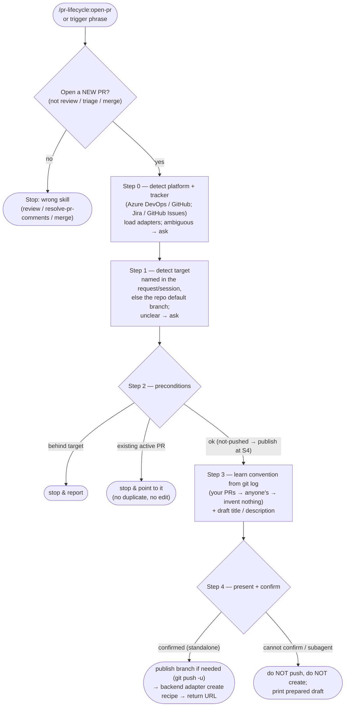

# open-pr

Open a pull request (Azure DevOps or GitHub) for the current branch, with a title and description that follow **the caller's own previous PRs** (learned at runtime from the repo's history, falling back to everyone's and then to no convention at all) instead of a fixed house style. Only the *form* is learned: what the description has to say is not up for a vote, so a repo whose PRs say nothing still gets one that does. The draft is always presented for confirmation, and the PR is never created without explicit approval.

Part of `pr-lifecycle`, the team-agnostic PR-lifecycle plugin. Sibling: `resolve-pr-comments` (triage and act on an existing PR's review comments behind a single confirmation gate).

## Multi-backend

The skill is backend-agnostic across two orthogonal axes, detected in Step 0:

- **PR platform** — **Azure DevOps** (`dev.azure.com` / `*.visualstudio.com` remote) or **GitHub** (`github.com` remote). Determines the create / dup-check / label / PR-cross-reference-link mechanics, and where the convention sample comes from — git on Azure DevOps, the PR list API on GitHub.
- **Issue tracker** — **Jira** (`ACME-123` keys, `https://<base>/browse/KEY` links) or **GitHub Issues** (`#123` refs, auto-linked). GitHub Issues is the zero-config default on a GitHub remote when there is no Jira configuration; a Jira base URL comes from `.claude/pr-lifecycle.json`, the Atlassian MCP, or a one-time prompt.

Platform-specific recipes live in `resources/backends/{azure-devops,github}.md`; tracker-specific id/link rules live in `resources/trackers/{jira,github-issues}.md`. The skill body holds no `az`/`gh` field parsing and no tracker id/URL parsing — it detects, loads the matching adapters, and follows their recipes. (The backend files cover both siblings — the open-pr operations and `resolve-pr-comments`'s thread operations.)

## Process flow

## Format — learned, not shipped

- **Nothing here is a default title or description shape.** The form comes from previous PRs — yours into this target, then anyone's, then repo-wide — and that includes the ticket-reference shape: bracketed, bare with a colon, prefixed by a Conventional Commits type, or absent altogether, whichever the sample uses. Where a repo's PRs carry no ticket reference, none is added.

- **What is fixed is the content, not the form.** A ticket link when a ticket exists (first line, because the platform auto-links it there), and a description of what changed and why, proportionate to the change. Form is learned; silence is not — a repo whose PRs say nothing still gets a PR that does, and the skill says so when it made that call.

- **Optional, and only where the sample or the caller calls for it**: a high-level ASCII diagram in a fenced code block (plain-ASCII glyphs so it survives encoding downgrades; split a complex view into several diagrams rather than one hard-to-align block), and a `🤖 Drafted with Claude Code` footer (off by default, opted-in only, and then the last line). The description is sent via a temp body-file, not an inline string — see the backend adapter for each platform's create recipe and encoding traps.
- Always English; no git `Co-Authored-By` trailer of its own (that is a commit rule, and whether the repo wants one is read off the repo's own history, not decided here). AI-provenance markers are **off by default**: neither the `🤖` footer nor the `ai-assisted` label is added unless the invoking request explicitly asks to mark the PR as AI-assisted. When opted in, the footer is the last line and the label is best-effort (see SKILL.md and the backend adapter). *(Changed: earlier versions always added both. Ask for them explicitly if you want them — e.g. an audit/disclosure workflow.)*

## Design notes

This is the **team-agnostic** PR-creation skill. Its mechanics (routed through the backend/tracker adapters) and safety rails — confirm before creating, never auto-resolve conflicts, never delete branches, never force-push — are deliberately scoped:

- learns the PR convention from the caller's own previous PRs, then anyone's, and imposes no format when there are none;
- opens a PR for the branch as-is (no bundled "merge the base branch in" step), publishing the branch to the remote if it is not there yet so you need not push first;
- has an unattended-safe path (never auto-creates without confirmation);
- checks for an existing PR first to avoid duplicates;
- learns the convention from the target branch's own previous PRs where it has enough of them, and says so when it had to fall back to the default branch's instead.
