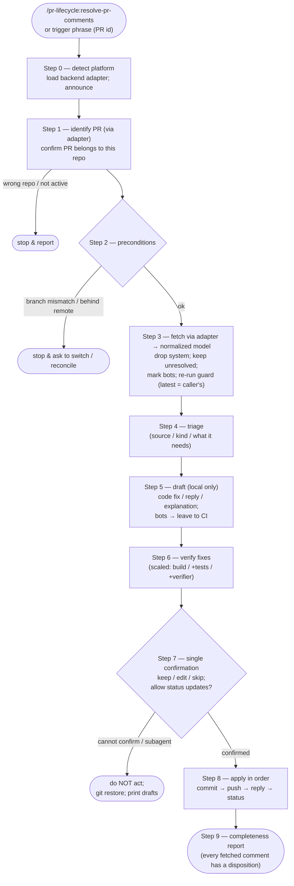

# resolve-pr-comments

Work through the review comments on an existing Azure DevOps or GitHub pull request. The skill fetches the PR's comment threads, triages each one, and drafts the code fixes and replies — then, after a single human confirmation, commits, pushes, replies, and (only where approved) updates thread status. Nothing outward happens before that gate.

Part of `pr-lifecycle`, the team-agnostic PR-lifecycle plugin. Sibling of `open-pr`: `open-pr` opens a PR, `resolve-pr-comments` closes out the review feedback on one.

## Multi-backend (Azure DevOps + GitHub)

The skill is backend-agnostic. It detects the PR platform from the git remote (Step 0) and loads the matching backend adapter under `resources/backends/` (`azure-devops.md` or `github.md`), which owns all platform-specific mechanics — the identity check, fetching and normalizing review threads, posting replies, and setting thread status. The skill body works only on a platform-agnostic normalized thread/comment model and holds no `az`/`gh` field parsing of its own.

**GitHub path is partly runtime-verified (2026-07-03)** — a real-PR smoke test verified platform detection, identity / belongs-to-repo, GraphQL fetch + normalize, triage, the gate, commit/push, REST inline reply (via `databaseId`), and the pending-review submit workaround. Still by-design only: `resolveReviewThread` (resolve), bot-thread handling, PR-level conversation comments, and multi-thread batches; the skill voices this partial-verification limit when running on GitHub. The Azure DevOps path is unchanged in behaviour (its recipes were relocated into the adapter).

## Process flow

## Behaviour (defaults and floors)

- Single human gate — no commit, push, reply, or thread-status change before it.
- Respects the reviewer — triages and drafts, never auto-dismisses a comment; a likely false positive gets a drafted explanation, not a unilateral dismissal.
- Bots (SonarCloud) — not replied to and not hand-resolved; the pushed fix triggers a CI re-run that closes the tool's own stale comments.
- Thread status — never closes a human reviewer's thread without explicit approval; bot threads are left to CI.
- Fix commits — follow the repo's own convention, **read off its own history** (`git log --format=%s` for the subject shape and length, `git log --format=%b` for whether it uses a `Co-Authored-By` trailer) rather than assumed. A ticket prefix is used only if the history uses one, in the form the history uses. Where there is no history to learn from, the fallback is a plain summary, ≤50 chars, English, no trailer. Only the changes made for the comments are committed.
- Tests — a fix needing tests is handed off to `test-authoring`, not written here.

## Design notes

This skill is **team-agnostic** and **acts on** the feedback (not just reads and summarizes it), working over a backend-agnostic normalized thread/comment model that each backend adapter produces:

- write paths (reply and set-status) go through the backend adapter, each behind the single confirmation gate;
- thread filtering (drop system, keep unresolved, bot detection) derived from the normalized model — on Azure DevOps `pending` as well as `active` counts as unresolved;
- not every comment is resolvable — a GitHub PR-level (conversation) comment is `resolvable: false, status: null` and gets a reply only, never a resolve; the re-run guard keys on "is the latest comment the caller's own" so it works even when there is no status to check;
- no keyword-based severity auto-disposition — triage informs the human, it is not an automatic decision;
- an ambiguous author is treated as human, so a bot heuristic never silences a real reviewer.
