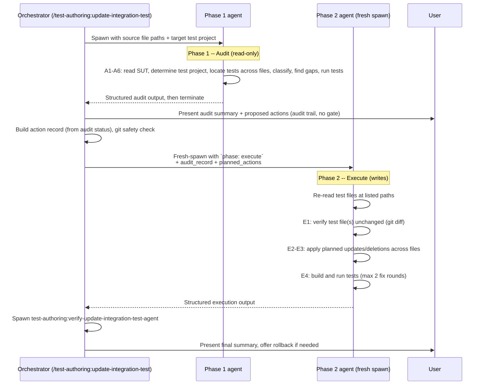

# test-authoring:update-integration-test-agent

The `test-authoring:update-integration-test-agent` is a Tier 3 subagent that audits and updates existing **integration tests** for specific source files. It is spawned by the [`/test-authoring:update-integration-test`](../commands/readme-update-integration-test.md) orchestrator and operates in a two-phase lifecycle, with each phase being a separate fresh-spawn invocation: Phase 1 performs a read-only audit, returns structured results, then terminates. The orchestrator presents the audit to the user as an audit trail, derives each item's action from its **audit status** (no confirmation gate), and **fresh-spawns** a Phase 2 instance with `phase: execute` in the prompt — the audit record is carried forward as data, not as live agent state. Phase 2 applies only the planned changes.

Unlike its unit-test sibling, this agent works at endpoint-level granularity: tests are keyed by endpoint route plus HTTP method (e.g., `GET v1/billing/journals/{id}`) rather than C# method name. Integration tests are often split across **multiple files** per source class (`Basic.cs`, `Create.cs`, `{Action}.cs`), so the agent must locate and audit all of them. It also detects auth policy drift by reading `[Authorize]` attributes on the controller.

See [readme-shared-update-patterns.md](../shared/readme-shared-update-patterns.md) for the cross-cutting mechanics shared with the unit-test update agent: two-phase lifecycle, action record, git rollback, and anti-gaming enforcement.

---

## Lifecycle Diagram

- For a deeper explanation of the two-phase lifecycle and why each phase is a separate fresh-spawn invocation (rather than a `SendMessage` continuation), see [readme-shared-update-patterns.md#two-phase-lifecycle](../shared/readme-shared-update-patterns.md#two-phase-lifecycle).

---

## Inputs / Outputs

### Phase 1 Input

| Field | Required | Description |
|-------|:--------:|-------------|
| Source file path(s) | Yes | One or more `src/` paths to audit integration tests for |
| Target test project | Yes | Which test project to search (`Api/`, `Worker/`, `Infrastructure/`, or sync project). The orchestrator determines this from the test project mapping (`.claude/conventions/tests/integration-test-conventions.md`). |
| Endpoint / method focus | No | Narrow the audit to specific endpoints or methods within the source file |
| Sibling context | No | Pre-identified sibling test files and their conventions |
| Convention spec | No | Pre-fetched sibling convention summary including **auth policy** detected from the controller's `[Authorize]` attribute |

### Phase 1 Output

Structured block containing: `test_project`, `test_files` (plural -- integration tests span multiple files), `sibling_conventions` (using the format from `.claude/conventions/tests/integration-test-conventions.md` (sibling-derived at runtime; or cached by a full setup-test-context run)), `test_audit` (per-test classification), `missing_coverage`, `auth_policy_findings`, and `pre_change_test_results`.

Key differences from the unit-test agent output:

- Each audit entry includes an **`endpoint`** field (HTTP method + route) and a **`file`** field (which of the multiple test files it lives in).
- **`auth_policy_findings`** section reports drift between the controller's `[Authorize]` attribute and what the tests assert.
- **`env_failures`** tracked separately (Testcontainers, Docker).

See the [agent source](../../agents/test-authoring:update-integration-test-agent.md) for the full output schema.

### Phase 2 Input

| Field | Required | Description |
|-------|:--------:|-------------|
| Action record | Yes | YAML list of per-test actions, each with the `audit_status` that justifies it |

The action record structure is documented in [readme-shared-update-patterns.md#action-record](../shared/readme-shared-update-patterns.md#action-record).

The agent processes only `action: update` and `action: delete` entries. Items with `action: add` are routed to `test-authoring:add-integration-test-agent` by the orchestrator.

### Phase 2 Output

Structured block containing: `changes_applied` (per-method with file, endpoint, action, and result), `deleted_tests_record` (exact signatures for verifier cross-check), `build_status`, `test_results`, `fix_rounds`, and `issues`. Each entry includes the **file path** since changes may span multiple test files. See the [agent source](../../agents/test-authoring:update-integration-test-agent.md) for the full output schema.

---

## Phase 1 -- Audit (read-only)

Phase 1 is strictly read-only. The agent must not create, modify, or delete any file during this phase.

### Steps

| Step | Action | Details |
|------|--------|---------|
| A1 | **Understand the SUT** | Follow the [SUT Analysis Procedure](../../resources/templates/rules/sut-analysis.md). Additionally identify integration-specific context: API endpoints (routes, HTTP methods, request/response types), MediatR command/query handlers, worker operations and their lifecycle, or sync consumers and the events they handle. |
| A2 | **Determine test project** | Use the test project mapping (`.claude/conventions/tests/integration-test-conventions.md`) to confirm which test project the source maps to. If the orchestrator specified a target test project, use that. |
| A3 | **Locate and read existing tests** | Search the feature directory in the mapped test project. Integration tests are often split across **multiple files** (e.g., `Basic.cs` covers standard CRUD, `Create.cs` covers custom create, `{Action}.cs` covers action endpoints, `{Feature}Helper.cs` provides shared builders). Read **every test method** across all files. Record sibling conventions using the integration test checklist (`.claude/conventions/tests/integration-test-conventions.md`). |
| A4 | **Classify each test** | Compare each test against the current SUT and assign one of five statuses plus a confidence level for non-valid items. Use **endpoint + HTTP method** as the classification key (see below). |
| A5 | **Identify missing coverage** | Compare the SUT's endpoints/methods against all test files. List every endpoint or method with no integration test coverage at all. Also flag auth policy drift (see below). |
| A6 | **Run existing tests** | Execute `dotnet test --filter "FullyQualifiedName~ClassName"` and record each test's result: `passed`, `failed (<reason>)`, or `env_failure (<reason>)`. |

### Five-status classification

The same five statuses as the unit-test agent, with integration-specific triggers:

| Status | Meaning | Integration example |
|--------|---------|---------------------|
| valid | Test correctly reflects current SUT logic | Endpoint route, request model, response model, auth policy, and assertions all match |
| outdated-minor | Assertions need a targeted tweak; test structure is correct | Expected status code changed (200 to 201), response body has a new field not yet asserted, expected error message changed |
| outdated-major | Setup or flow is fundamentally outdated; needs significant rewrite | Endpoint route changed, request model restructured, auth policy changed from `CLIENT_OR_OPERATIONS_POLICY` to `OPERATIONS_ONLY_POLICY`, data factory creates entities with old schema |
| wrong | Test logic is incorrect regardless of SUT changes | Tests wrong HTTP method, expects 200 for a create (should be 201), uses wrong account type for auth test, data setup creates invalid state |
| duplicated | Functionally identical or overlapping with another test | Same endpoint tested in both `Basic.cs` and a feature-specific file with identical data setup and assertions |

Each non-valid classification carries a **confidence level** (high, medium, low). See [readme-shared-update-patterns.md#confidence-levels](../shared/readme-shared-update-patterns.md#confidence-levels) for the definitions.

---

## Phase 2 -- Execute (derived from audit status)

Phase 2 is a **fresh-spawn** `Agent` invocation: the orchestrator spawns a new instance with `phase: execute` in the prompt, plus the full audit record from Phase 1, the planned action list, and the test file paths (potentially across multiple files). The agent does NOT inherit live state from Phase 1 — it re-reads the test/source files at the listed paths before applying changes.

### Steps

| Step | Action | Details |
|------|--------|---------|
| E1 | **Verify test files unchanged** | Run `git diff -- <test_file>` for **each test file** that will be modified. If any file was modified externally since Phase 1, stop and report the drift to the orchestrator. Multiple files must all be checked. |
| E2 | **Apply planned changes** | Process each action-record item in order. Changes may span multiple files (e.g., updating a test in `Basic.cs` and deleting a duplicate in `Create.cs`). For `outdated-minor`: targeted tweak only, preserve structure and method name. For `outdated-major` or `wrong`: rewrite preserving intent, following sibling conventions. For `duplicated` with `action: delete`: remove the method and any orphaned helpers. |
| E3 | **Enforce CRITICAL constraints** | Only process items in the action record. Never touch tests not in the action record. Never touch valid tests. Never process `action: add` items (those go to `test-authoring:add-integration-test-agent`). |
| E4 | **Build and verify** | Run build and tests per [test-rules.md](../../resources/templates/rules/test-rules.md) using the correct test project from Phase 1. Iterate up to 2 fix rounds on failures. After 2 failed attempts, report as `failed` -- do not weaken or skip. |

---

## Anti-Gaming & Safety Rules

The agent enforces strict constraints to prevent gaming test results:

- **Must NOT** modify or delete any test outside the action record.
- **Must NOT** weaken assertions to make a test pass.
- **Must NOT** delete valid tests or tests whose audit status does not justify deletion.
- **Must NOT** add `[Skip]` attributes or comment out failing tests.
- **Must NOT** change the SUT (source code) to make tests pass.
- **Max 2 fix attempts** per failing test; report as `failed` beyond that.
- **Detects git drift** between Phase 1 and Phase 2 (Step E1); aborts if any test file was modified externally.

For the full anti-gaming decision table and verifier-side checks, see [readme-shared-update-patterns.md#anti-gaming](../shared/readme-shared-update-patterns.md#anti-gaming).

---

## Integration-Specific Details

### Test project mapping

The orchestrator determines the test project before spawning this agent and passes it as input. The mapping follows `.claude/conventions/tests/integration-test-conventions.md` (sibling-derived at runtime; or cached by a full setup-test-context run):

| Source type | Test project |
|-------------|--------------|
| API endpoints, controllers, application commands/queries | `tests/Acme.Billing.Tests.Integration/Api/` |
| Worker operations, background processing, scheduling | `tests/Acme.Billing.Tests.Integration/Worker/` |
| Infrastructure (migrations, blob, exclusive writers) | `tests/Acme.Billing.Tests.Integration/Infrastructure/` |
| Sync consumers (MassTransit event handling) | `tests/Acme.Billing.Tests.Integration.Sync/` |

The agent trusts the orchestrator's mapping but verifies it in Step A2 and reports any mismatch.

### Multiple test files per source

Unlike unit tests (typically one `*Tests.cs` file or one per-method subfolder), integration tests for a single controller or feature are routinely split across multiple files by scenario type:

| File pattern | Covers |
|--------------|--------|
| `Basic.cs` | Standard CRUD inherited from `BillingStandardController<T>`: Get, GetList, Update, auth tests |
| `Create.cs` | Custom create endpoints (POST) |
| `Delete.cs` | Delete endpoint tests |
| `{Action}.cs` | Action endpoints (e.g., `Approve.cs`, `Submit.cs`, `Cancel.cs`) |
| `{Feature}Helper.cs` | Shared test data builders and request helpers |

The agent must search and read **all files** in the feature directory during Step A3. A test found in `Basic.cs` may duplicate or conflict with one in `Create.cs`. During Phase 2, edits may span multiple files in a single execution.

### Endpoint-level classification

Integration tests are classified by **endpoint + HTTP method** rather than C# method name. This is because:

- Inherited endpoints (from `BillingStandardController<T>`) have no explicit method in the controller source, so there is no C# method to reference.
- The same endpoint may be tested from multiple angles (happy path, auth, validation) across different test files.
- Staleness is detected at the endpoint level: a route change, request model restructuring, or auth policy change affects all tests for that endpoint.

Example keys: `GET v1/billing/journals/{id}`, `POST v1/billing/journals`, `POST v1/billing/journals/{id}/approve`.

A test is stale at the endpoint level when the **route**, **request model**, **response model**, or **auth policy** changed in the controller.

### Auth policy handling

The agent reads the controller's `[Authorize]` attribute during Step A1 and detects the active policy:

| Policy | Effect on Forbidden tests |
|--------|--------------------------|
| `OPERATIONS_ONLY_POLICY` | Client and Vendor are both Forbidden |
| `CLIENT_OR_OPERATIONS_POLICY` | Only Vendor is Forbidden |

Method-level `[Authorize]` attributes may override the class-level policy for specific endpoints. The agent checks both levels.

**Auth policy drift** is flagged when a test asserts Forbidden for an account type that the current policy allows, omits a Forbidden assertion for an account type that should be blocked, or the policy attribute itself changed since the test was written. Drift findings appear in the `auth_policy_findings` section of the audit output and are typically classified as `outdated-major`.

### Sibling convention inheritance

The agent identifies and adopts the exact conventions used by the nearest sibling test files. It never introduces a different pattern. The full checklist and learning procedure are documented in `.claude/conventions/tests/integration-test-conventions.md` (sibling-derived at runtime; or cached by a full setup-test-context run).

Key conventions that vary across test areas:

| Convention | Variant A | Variant B | Variant C |
|------------|-----------|-----------|-----------|
| Base class | `IntegrationTest` | `ApiActionTests<T>` | `OperationTests` / `SyncTests` |
| Data factory | `BillingDataFactory` | `AnalyticsDataFactory` | `PlatformObjects` (sync) |
| HTTP client | `StandardEndpointExtensions` (`Get<T>`, `Create<T>`) | Raw `HttpClient` | N/A (worker/sync) |
| Security context | `Fixture.UserContext.ChangeToOps()` | `.ChangeTo(UserAccountType.Vendor)` | N/A |
| Database verification | Re-query via API | Direct `DbContext` read | `ChangeTracker.Clear()` + query (sync) |

The agent records these in the `sibling_conventions` block of the audit output so the orchestrator can forward them to `test-authoring:add-integration-test-agent` if missing coverage needs to be filled.

### Paired with test-authoring:verify-update-integration-test-agent

After Phase 2 completes, the orchestrator spawns a [`test-authoring:verify-update-integration-test-agent`](readme-verify-update-integration-test-agent.md) (see the shared pattern doc) to independently verify that:

- Every deletion is justified by an `action: delete` entry whose `audit_status` is `wrong` or `duplicated` (outdated-major is rewritten, never deleted).
- No valid test was deleted or modified.
- No previously-failing test was silently removed.
- Test counts are consistent (pre-count minus deletions plus additions equals actual count).

The verifier is strictly read-only and diffs the `git show HEAD:<file>` baseline against the post-execute state. For integration tests, the verifier must check **all affected test files** (not just one), since changes may span `Basic.cs`, `Create.cs`, and action files.

### Missing coverage delegation

This agent does not add new tests. When Phase 1 identifies endpoints with no test coverage (Step A5), they are reported as `missing_coverage` in the audit output and classified 🟦 pending. Those `action: add` items are delegated by the orchestrator to `test-authoring:add-integration-test-agent` after Phase 2 completes, including the sibling conventions discovered during the audit.
