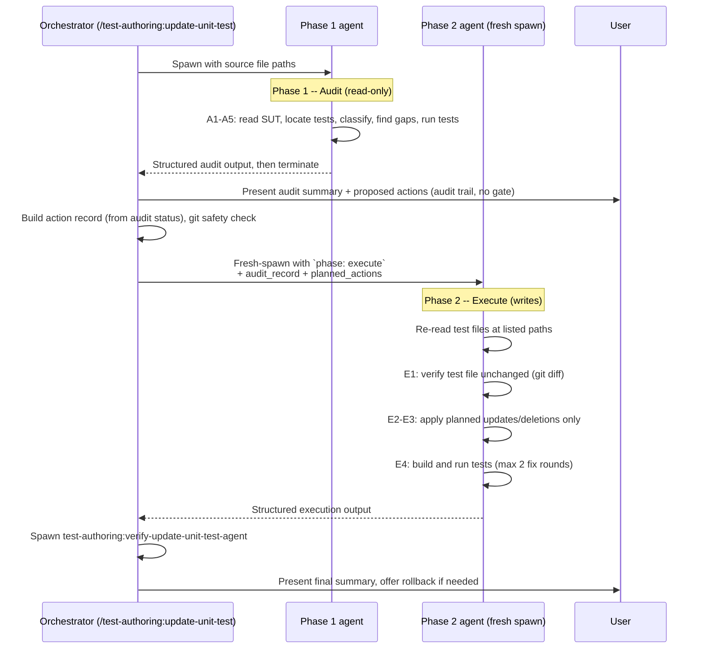

# test-authoring:update-unit-test-agent

The `test-authoring:update-unit-test-agent` is a subagent that audits and updates existing **unit tests** for specific source files. It is spawned by the [`/test-authoring:update-unit-test`](../skills/readme-update-unit-test.md) orchestrator and operates in a two-phase lifecycle, with each phase being a separate fresh-spawn invocation: Phase 1 performs a read-only audit, returns structured results, then terminates. The orchestrator presents the audit to the user as an audit trail, derives each item's action from its **audit status** (no confirmation gate), and **fresh-spawns** a Phase 2 instance with `phase: execute` in the prompt — the audit record is carried forward as data, not as live agent state. Phase 2 applies only the planned changes. Anti-gaming rules are enforced throughout to prevent silent deletion, assertion weakening, or source modification. See [readme-shared-update-patterns.md](../shared/readme-shared-update-patterns.md) for the cross-cutting mechanics shared with the integration-test update agent.

---

## Lifecycle Diagram



- For a deeper explanation of the two-phase lifecycle and why each phase is a separate fresh-spawn invocation (rather than a `SendMessage` continuation), see [readme-shared-update-patterns.md#two-phase-lifecycle](../shared/readme-shared-update-patterns.md#two-phase-lifecycle).

---

## Inputs / Outputs

### Phase 1 Input

| Field | Required | Description |
|-------|:--------:|-------------|
| Source file path(s) | Yes | One or more `src/` paths to audit unit tests for |
| Method name(s) | No | Narrow the audit to specific methods within the source file |
| Sibling context | No | Pre-identified sibling test files and their conventions |
| Convention spec | No | Pre-fetched sibling convention summary (acceleration hint; overridden by actual sibling observation) |

### Phase 1 Output

The agent returns a structured block with these sections:

```
mode: audit
source_file: <path>
test_file: <path or "none">

sibling_conventions:
  mocking: NSubstitute | Moq
  fixture: FixtureHelper.CreateN() | FixtureHelper.Create() | manual
  naming: Method_Condition_Expected | Method_ShouldX_WhenY | <other>
  base_class: <class name> | none
  aaa_comments: yes | no
  sut_construction: auto-wired (fixture.Create<T>) | manual (new T(...))

test_audit:
  - method: <TestMethodName>
    status: valid | outdated-minor | outdated-major | wrong | duplicated
    confidence: high | medium | low        # omitted for valid
    reason: <detailed explanation>
    overlaps_with: <other test>            # duplicated only

missing_coverage:
  - method: <MethodName>
    description: <what should be tested>

pre_change_test_results:
  total: N
  passed: N
  failed: N
  details:
    - <TestName>: passed | failed (<reason>)

issues:
  - <description or "none">
```

### Phase 2 Input

| Field | Required | Description |
|-------|:--------:|-------------|
| Action record | Yes | YAML list of per-test actions, each with the `audit_status` that justifies it |

The action record structure is documented in [readme-shared-update-patterns.md#action-record](../shared/readme-shared-update-patterns.md#action-record). A minimal excerpt relevant to this agent:

```yaml
action_record:
  - test: HandlerTests.Handle_WhenInvalid_ReturnsFailure
    audit_status: outdated-major
    confidence: high
    action: update
  - test: HandlerTests.Handle_Duplicate
    audit_status: duplicated
    confidence: low
    action: delete
```

The agent processes only `action: update` and `action: delete` entries. Items with `action: add` are routed to `test-authoring:add-unit-test-agent` by the orchestrator.

### Phase 2 Output

```
mode: execute
source_file: <path>
test_file: <path>

changes_applied:
  - method: <TestMethodName>
    file: <path — must be one the action record names>
    action: updated | deleted
    result: passed | failed (<reason>)
    notes: <brief description of what changed>

tests_updated: N
tests_deleted: N

deleted_tests_record:
  - method: <exact method signature>
    audit_status: <status>   # justifies the deletion (wrong | duplicated)

build_status: success | failed (<errors>)

test_results:
  - <TestName>: passed | failed (<reason>)

fix_rounds: N

issues:
  - <description or "none">
```

---

## Phase 1 -- Audit (read-only)

Phase 1 is strictly read-only. The agent must not create, modify, or delete any file during this phase.

### Steps

| Step | Action | Details |
|------|--------|---------|
| A1 | **Understand the SUT** | Follow the [SUT Analysis Procedure](../../resources/templates/rules/sut-analysis.md): read the source, check framework base classes, verify `[InternalsVisibleTo]`, note recent changes. |
| A2 | **Locate existing tests** | Mirror the source path into the test project to find `*Tests.cs` files — derived from the sibling tests, and from `project-architecture.md` when a prior setup cached it. Read every test method. Record sibling conventions (mocking library, fixture helper, base class, naming pattern, AAA comments, SUT construction). |
| A3 | **Classify each test** | Compare each test against the current SUT and assign one of five statuses (see below) plus a confidence level for non-valid items. |
| A4 | **Identify missing coverage** | List SUT public/internal methods with no test at all. Exclude trivial getters/setters and methods that have an outdated/wrong test (those are update candidates, not gaps). |
| A5 | **Run existing tests** | Execute `dotnet test --filter "FullyQualifiedName~ClassName"` and record each test's pass/fail baseline. This baseline is used later by the verifier to detect silent deletions. |

### Five-status classification

| Status | Meaning | Example trigger |
|--------|---------|-----------------|
| valid | Test correctly reflects the current SUT logic | Setup, act, and assertions all match current code |
| outdated-minor | Assertions or specific values need a targeted tweak; overall structure is correct | Expected value changed, new property not yet asserted |
| outdated-major | Fundamental setup, dependencies, or flow is outdated; needs significant rewrite | SUT returns `Result<T>` instead of throwing; constructor parameters changed |
| wrong | Test logic is incorrect regardless of SUT changes | Asserts wrong value; mock setup causes trivial pass; name/intent mismatch |
| duplicated | Functionally identical or largely overlapping with another test | Same arrange-act-assert with negligible differences |

Each non-valid classification also carries a **confidence level** (high, medium, low) that signals how much human scrutiny the classification warrants. See [readme-shared-update-patterns.md#confidence-levels](../shared/readme-shared-update-patterns.md#confidence-levels) for the definitions.

---

## Phase 2 -- Execute (derived from audit status)

Phase 2 is a **fresh-spawn** `Agent` invocation: the orchestrator spawns a new instance with `phase: execute` in the prompt, plus the full audit record from Phase 1, the planned action list, and the test file paths. The agent does NOT inherit live state from Phase 1 — it re-reads the test/source files at the listed paths before applying changes.

### Steps

| Step | Action | Details |
|------|--------|---------|
| E1 | **Verify test file unchanged** | Run `git diff -- <test_file>`. If the file was modified externally since Phase 1, stop and report the drift to the orchestrator. |
| E2 | **Apply planned changes** | Process each action-record item in order. For `outdated-minor`: targeted tweak only, preserve structure and method name. For `outdated-major` or `wrong`: rewrite preserving intent and following sibling conventions. For `duplicated` with `action: delete`: remove the method and any orphaned helpers. |
| E3 | **Enforce CRITICAL constraints** | Only process items in the action record. Never touch tests not in the action record. Never touch valid tests. Never process `action: add` items (those go to `test-authoring:add-unit-test-agent`). |
| E4 | **Build and verify** | Run build and tests per [test-rules.md](../../resources/templates/rules/test-rules.md). Iterate up to 2 fix rounds on failures. After 2 failed attempts, report as `failed` -- do not weaken or skip. |

---

## Anti-Gaming & Safety Rules

The agent enforces strict constraints to prevent gaming test results:

- **Must NOT** modify or delete any test outside the action record.
- **Must NOT** weaken assertions to make a test pass (e.g., `.Be(5)` to `.BeGreaterThan(0)`).
- **Must NOT** delete valid tests or tests whose audit status does not justify deletion.
- **Must NOT** add `[Skip]` attributes or comment out failing tests.
- **Must NOT** change the SUT (source code) to make tests pass.
- **Max 2 fix attempts** per failing test; report as `failed` beyond that.
- **Detects git drift** between Phase 1 and Phase 2 (Step E1); aborts if the test file was modified externally.

For the full anti-gaming decision table and verifier-side checks, see [readme-shared-update-patterns.md#anti-gaming](../shared/readme-shared-update-patterns.md#anti-gaming).

---

## Key Details Specific to This Agent

### Unit-test scope

This agent operates exclusively on the **unit test project** the orchestrator passes in. It does not touch integration tests, event-consumer tests, or any source code. The corresponding integration-test agent is `test-authoring:update-integration-test-agent`.

### Test file organisation

Unit tests typically follow one of two layouts:

- **Single file** -- `{ClassName}Tests.cs` in the mirrored test directory.
- **Per-method subfolder** -- `{ClassName}Tests/{MethodName}Test.cs` when a class has many methods with complex test scenarios.

The agent detects the layout by scanning the test directory and works within whichever convention is already in place.

### Sibling convention inheritance

The agent identifies and adopts the exact mocking library, fixture helper, base class, naming pattern, AAA comment style, and SUT construction approach used by the nearest sibling test files. It never introduces a different library or pattern. The dimension list lives in the plugin's `rules/common-writer-instructions.md` → "Style rules (inherit from sibling)"; the **values** come from the sibling itself. No per-type conventions file is generated or read.

Key conventions that vary across the codebase:

| Convention | Variant A | Variant B |
|------------|-----------|-----------|
| Mocking library | NSubstitute (`Substitute.For<T>()`) | Moq (`new Mock<T>()`) |
| Fixture helper | `FixtureHelper.CreateN()` (NSubstitute) | `FixtureHelper.Create()` (Moq) |
| SUT construction | Auto-wired via `fixture.Create<T>()` | Manual via `new T(dep1, dep2)` |
| Base class | `BaseCommandHandlerTests<T>` | None |

The agent records these in the `sibling_conventions` block of the audit output so the orchestrator can forward them to `test-authoring:add-unit-test-agent` if missing coverage needs to be filled.

### Paired with test-authoring:verify-update-unit-test-agent

After Phase 2 completes, the orchestrator spawns a [`test-authoring:verify-update-unit-test-agent`](readme-verify-update-test-agent.md) (see the shared pattern doc) to independently verify that:

- Every deletion is justified by an `action: delete` entry whose `audit_status` is `wrong` or `duplicated` (outdated-major is rewritten, never deleted).
- No valid test was deleted or modified.
- No previously-failing test was silently removed.
- A reported deletion actually removed the method, and a reported update actually changed a file that was confirmed clean. Those two are the only verdicts — a planned action nobody reported is reported, not judged, so it is the human who decides whether the work was declined or dropped.
- Test counts are consistent (pre-count minus deletions plus additions equals actual count).

The verifier is strictly read-only and diffs the `git show HEAD:<file>` baseline against the post-execute state.

### Missing coverage delegation

This agent does not add new tests. When Phase 1 identifies SUT methods with no test coverage (Step A4), they are reported as `missing_coverage` in the audit output and classified 🟦 pending. Those `action: add` items are delegated by the orchestrator to `test-authoring:add-unit-test-agent` after Phase 2 completes.
