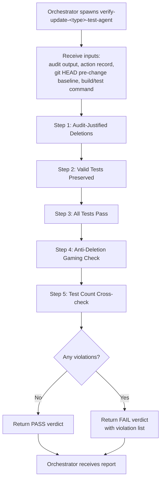
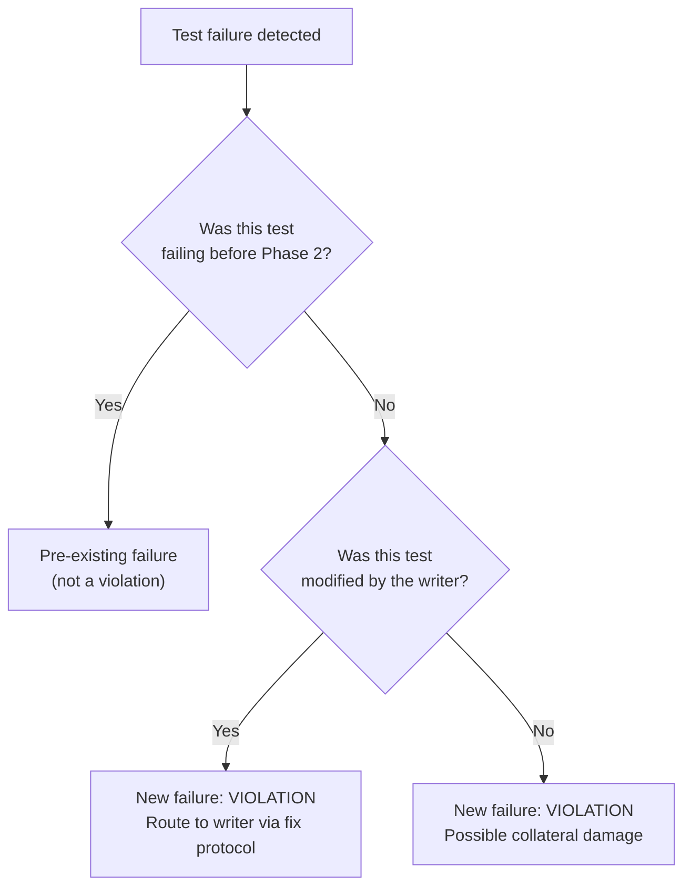

# verify-update-\<type\>-test-agent pattern

This doc describes the **per-type** `verify-update-<type>-test-agent` pattern — one agent per supported test type (`test-authoring:verify-update-unit-test-agent`, `test-authoring:verify-update-integration-test-agent`). The agents share the same five-step flow (below); type-specific extensions live in each per-type file — unit writers focus on deletion confirmations and build/run, integration adds `env_failure` distinction.

The `verify-update-<type>-test-agent` is a strictly **read-only** verification subagent spawned by the `update-<type>-test` orchestrator after the matching `update-<type>-test-agent` completes Phase 2 execution. Its purpose is to independently verify that deletions are justified by audit status, valid tests were preserved unmodified, all tests pass, and no anti-deletion gaming occurred. The verifier uses the `git show HEAD:<file>` committed state as its pre-change baseline. It never modifies any file -- it reports a structured pass/fail verdict to the orchestrator, which decides whether to offer rollback or proceed.

Template sources: [`test-authoring:verify-update-unit-test-agent.md`](../../agents/verify-update-unit-test-agent.md), [`test-authoring:verify-update-integration-test-agent.md`](../../agents/verify-update-integration-test-agent.md). Shared role boundary and output schema live in [`common-verifier-checks.md`](../../resources/templates/rules/common-verifier-checks.md).

---

## Lifecycle Diagram



The verifier is a **single-pass** agent. It runs five checks in sequence, collects all findings, and returns a structured report. It is never resumed across rounds — a fresh instance is spawned for each verification round (including [re-verification](../shared/readme-shared-orchestration.md#re-verification) after fix rounds). Writer agents now follow the same fresh-spawn pattern for fix invocations and update-flow Phase 2 — see [readme-shared-orchestration.md#fix-protocol](../shared/readme-shared-orchestration.md#fix-protocol) and [readme-shared-update-patterns.md#two-phase-lifecycle](../shared/readme-shared-update-patterns.md#two-phase-lifecycle).

---

## Inputs / Outputs

### Inputs

| Input | Source | Description |
|---|---|---|
| **Audit output** | Update agent (Phase 1) | Pre-change test list with pass/fail status for every method |
| **Action record** | Orchestrator (Step 4) | Per-test entries with `audit_status`, `action` (each action derived from audit status) |
| **git HEAD pre-change baseline** | Orchestrator (Step 4.5) | `git show HEAD:<file>` committed state, confirmed tracked & clean before Phase 2 |
| **Execution results** | Update agent (Phase 2) | Files modified, tests updated/deleted, build status (self-reported) |
| **Test type** | Orchestrator | `unit` or `integration` -- determines build/test commands |
| **Test project** | Orchestrator | Path to the test project under change |

### Output structure

The verifier returns a `verification_summary` with five sections (one per check), each containing a verdict and any violations, plus an overall verdict. PASS requires all five checks to pass with zero violations. Any single violation flips the overall verdict to FAIL.

---

## Verification Checks

All five checks always run -- the verifier does **not** short-circuit on the first violation, so the orchestrator receives a complete picture.

### Step 1 -- Audit-Justified Deletions

Every deleted test must have a corresponding action record entry with `action: delete` whose `audit_status` is `wrong` or `duplicated` (outdated-major is rewritten, never deleted).

1. Collect deleted test methods from the execution results.
2. Search the action record for a matching entry per deleted test.
3. **Independently verify** by diffing the committed baseline against the current file to catch deletions the writer failed to self-report:

   ```bash
   diff <(git show HEAD:tests/.../TestFile.cs) tests/.../TestFile.cs
   ```

**VIOLATION** if a deleted test has no `action: delete` entry, or its `audit_status` is anything other than `wrong` or `duplicated` (e.g. `valid`, `outdated-major`, or absent).

### Step 2 -- Valid Tests Preserved and Unmodified

Every test classified `valid` in the audit must still exist with content unchanged.

1. Find all action record entries with `audit_status: valid`.
2. Confirm each valid method is present in the current file.
3. Diff `git show HEAD:<file>` against the current file -- inspect for changes to valid test bodies, signatures, or attributes. Whitespace-only changes are ignored.

**VIOLATION** if a valid test was deleted or its content was modified.

### Step 3 -- All Tests Pass

All remaining tests must compile and pass.

1. Build the test project (`dotnet build <test_project>`).
2. Run tests filtered to the affected class (`dotnet test ... --filter`).
3. Classify failures using the pre-change pass/fail baseline (see [Failure Classification](#failure-classification)).

**VIOLATION** if the build fails due to the writer's changes, or any test updated by the writer now fails.

### Step 4 -- Anti-Deletion Gaming Check

Detect cases where a previously-failing test was silently removed to fake a passing suite. This is the most critical check -- see the full [decision table](#anti-deletion-gaming-decision-table) below.

1. From the audit output, collect all tests that were **failing** before Phase 2.
2. For each, check whether it still exists in the current file.
3. If missing, look up the action record (`action: delete`?) and the `audit_status`.
4. Apply the decision table to determine the verdict.

**VIOLATION** if a failing test disappeared without an audit-justified `action: delete` entry.

### Step 5 -- Test Count Cross-check

The final test count must match expectations.

```
expected = pre_change_count - planned_deletions + planned_additions
```

Count `[Fact]` and `[Theory]` attributes in the post-change file and compare. Any mismatch is a red flag for unauthorized additions or removals outside the action record.

---

## Anti-Deletion Gaming Decision Table

This table is the centrepiece of the verifier's anti-gaming enforcement. It determines whether a test that existed in the `git show HEAD:<file>` baseline but is missing from the current file is a legitimate audit-justified deletion or a suspicious silent removal.

| In `git show HEAD`? | In current? | Was failing? | Audit status (in action record) | Verdict |
|:---:|:---:|:---:|:---:|---|
| Yes | Yes | -- | -- | **Preserved** -- test still present, no deletion to verify |
| Yes | No | Any | `action: delete` + wrong / duplicated | **Legitimate deletion** -- justified by audit status |
| Yes | No | Yes | any other status, or no delete entry | **VIOLATION: silent deletion of failing test** (anti-gaming) |
| Yes | No | No | any other status, or no delete entry | **VIOLATION: unjustified deletion** -- removed without audit justification |
| Yes | No | Yes | `action: delete`, but `audit_status: valid` | **VIOLATION: contradictory state** -- a "valid" test should not be both failing and deleted |
| No | Yes | -- | -- | **New test** -- expected if add-agent ran in Step 5b |

### Interpreting the table

The verifier iterates over every test method found in the `git show HEAD:<file>` baseline. If the method still exists in the current file, it was preserved and no further check is needed. If it is missing, the verifier cross-references the action record and the pre-change pass/fail baseline.

**A failing test that disappears without an audit-justified `action: delete` entry is the clearest signal of gaming.** The writer agent's fix rules ([`test-rules.md`](../../resources/templates/rules/test-rules.md)) explicitly prohibit deleting a failing test -- doing so removes evidence of a bug or regression. If such a deletion slips past the writer, the verifier catches it here.

The contradictory-state row (valid + failing + deleted) addresses a subtler scenario: a test classified as `valid` during audit should not be failing, and certainly should not be deleted. This combination suggests the audit classification was incorrect or the agent manipulated the status to justify removal.

Tests that appear in the current file but not in the `git show HEAD:<file>` baseline are new additions, typically produced by add-agents in Step 5b. These are verified by a separate `verify-add-<type>-test-agent` instance running in parallel (Step 6b), not by this agent.

---

## Why git HEAD as the baseline

The verifier diffs against `git show HEAD:<file>` because the orchestrator's Step 4.5 guarantees that committed state is a faithful pre-change baseline:

1. **Step 4.5 gate** -- before Phase 2, the orchestrator only auto-proceeds on files that are git-tracked and clean. Untracked or dirty files are flagged and proceeded on only with explicit user consent.

2. **Faithful pre-change state** -- because clean-and-tracked is the default precondition, `git show HEAD:<file>` reflects exactly what the file contained before Phase 2 wrote anything, with no contamination from the agent's edits.

3. **No sidecar files to manage** -- using git as the baseline removes the need to create, track, and clean up `.bak` files; there is one source of truth for the pre-change state.

4. **Rollback** -- `git restore <file>` returns a file to its committed state, so a failed verification can be undone without bespoke backup handling.

For the full git-based rollback model, see [readme-shared-update-patterns.md#git-based-rollback](../shared/readme-shared-update-patterns.md#git-based-rollback).

---

## Read-Only Constraints

The verifier enforces a strict read-only contract:

- **Never modifies files in `src/` or `tests/`** -- all checks use `diff` and file reads, never edits.
- **Checks the writer did not modify source code** by running `git diff src/` and verifying no SUT files were changed. Source changes are reported as an anti-gaming violation.
- **Never creates `[Skip]` attributes** or comments out tests -- explicitly prohibited by the [fix rules](../../resources/templates/rules/test-rules.md).
- **Never deletes tests** -- even clearly wrong tests are reported, not removed.
- **Never attempts repair** -- all findings go to the orchestrator, which routes deterministic issues to the writer agent and presents non-deterministic issues to the user.

This independence is essential for trust. By restricting the verifier to observation and reporting, the orchestrator can rely on its findings as an unbiased audit.

---

## Failure Classification

The verifier distinguishes pre-existing failures from failures introduced by the writer agent, preventing false positives.

**Pre-existing failures**: the test was already failing in the audit output's pass/fail baseline (Phase 1). Noted in the report but **not** counted as violations.

**New failures introduced by Phase 2**: the test was passing before and now fails, or was updated by the writer and now fails, or the build fails due to the writer's changes. Reported as **violations** and routed to the original writer agent via the [fix protocol](../shared/readme-shared-orchestration.md#fix-protocol). The [circuit breaker](../shared/readme-shared-orchestration.md#circuit-breaker) limits how many fix-verify rounds can occur.

### Classification flow


