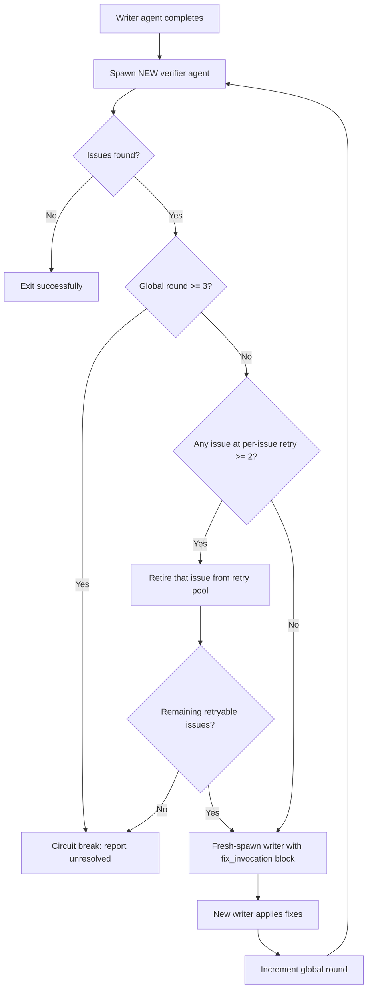
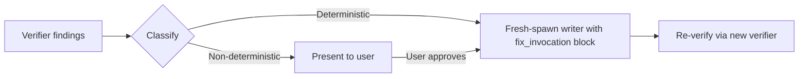

# Shared Primer — Orchestration Patterns

This primer documents the orchestration patterns that govern the fix-verify loop between writer agents and verifier agents in the test-generation and test-update skills. The patterns described here apply to **add-unit-test**, **add-integration-test**, **update-unit-test**, **update-integration-test**, and **scan-test-gaps**. All three patterns activate AFTER a writer agent has produced or modified tests and a verifier agent has reported issues.

---

## Circuit Breaker

The circuit breaker prevents infinite fix-verify loops. It uses two independent counters, tracked by the orchestrator. Either counter reaching its limit triggers a stop.

### Counters

| Counter | Limit | Scope | Purpose |
|---|---|---|---|
| **Global round count** | 3 | Per source-class fix lineage | Caps total fix-verify cycles for one source-class writer chain, regardless of which writer agent ID handled each round. Every fix round is a fresh-spawn writer; the counter accumulates across the lineage. Prevents cascading-fix loops (fixing A reveals B, fixing B reveals C, etc.). |
| **Per-issue retry** | 2 | Per individual issue | Caps retries for the same issue (same file, same violation type, same location). Issue identity is independent of writer agent ID. Prevents a stubborn issue from consuming all global rounds. |

### Tracking

Each round, the orchestrator fresh-spawns a writer with **all** outstanding issues passed in a `fix_invocation` block (per [`fix-protocol.md`](../../resources/templates/rules/fix-protocol.md)). After the writer returns and a fresh verifier verifies:

1. For each issue the new verifier reports, check whether it appeared in a previous round:
   - **Same issue** (same file + violation type + location) — increment its per-issue retry count.
   - **New issue** — initialise its per-issue retry count at 1.
2. Increment the global round count.

### Stop Conditions

The loop stops when **any** of the following is true:

| Condition | Effect |
|---|---|
| Global round count reaches **3** | Stop regardless of issue status. |
| A specific issue reaches per-issue retry **2** | Stop retrying that issue; other new issues may still be sent if the global count allows. |
| Verifier reports **zero issues** | All fixed — exit successfully. |

### Flow Diagram



### Worked Examples

**Normal — resolved within 3 rounds:**

```
Round 1: issues [A, B] -> writer fixes both -> verifier: A fixed, B fixed, new C found
Round 2: issues [C]    -> writer fixes C    -> verifier: C fixed, new D found
Round 3: issues [D]    -> writer fixes D    -> verifier: all clear
```

**Stubborn issue — per-issue limit hit:**

```
Round 1: issues [A] -> writer attempts fix -> verifier: A still present (retry 1)
Round 2: issues [A] -> writer attempts fix -> verifier: A still present (retry 2 = limit)
Stop: A reported as unresolved
```

**Cascading with no convergence — global limit hit:**

```
Round 1: issues [A] -> writer fixes A -> verifier: new B  (global 1)
Round 2: issues [B] -> writer fixes B -> verifier: new C  (global 2)
Round 3: issues [C] -> writer fixes C -> verifier: new D  (global 3 = limit)
Stop: D reported as unresolved
```

### On Circuit Break

When a stop condition is reached with issues still remaining:

- Remaining issues are marked as **unresolved** in the summary.
- Affected test files are reported with a Failed status.
- **No further fix rounds** are attempted.
- Problematic tests are **not deleted or skipped** — they stay in the file for the user to fix manually.
- The orchestrator presents the unresolved issues with full error details so the user can diagnose and resolve them.

> Authoritative specification: [`fix-protocol.md`](../../resources/templates/rules/fix-protocol.md)

---

## Fix Protocol

After a verifier agent reports findings, the orchestrator classifies each issue and routes it to the correct handler.

### Routing Decision



### Deterministic Issues

Convention violations and build/test failures have a correct fix. The orchestrator **fresh-spawns the writer** via the `Agent` tool, passing a structured `fix_invocation` block. Every fix round is a brand-new writer instance — the orchestrator does not depend on session-conditional subagent-control tooling (e.g. `SendMessage`) to continue a previous writer.

Template (full schema lives in [`fix-protocol.md`](../../resources/templates/rules/fix-protocol.md)):

```
Agent(subagent_type="<add-or-update>-<type>-test-agent"):
  fix_invocation: true

  original_scope: { ... }
  pre_fetch: { ... }
  previously_produced:
    files_created: [ ... ]
    files_modified: [ ... ]
    convention_spec_adopted: { ... }

  findings_to_fix:
    convention_violations:
    - <file>:<line>: <what was used> -> should be <correct convention>
    build_failures:
    - <test name>: <error message>
    test_failures:
    - <test name>: <reason>
    user_approved_actions: []   # populated when this round is triggered by a user-approved
                                # quality-flag / anti-gaming fix

  instructions: |
    Read previously_produced files, apply targeted fixes per findings_to_fix,
    return updated universal output schema.
```

Every input field is data the orchestrator already retains in working state (pre-fetched at Step 2; writer outputs returned via the universal schema; verifier findings via the verifier's structured return). The orchestrator MUST NOT invoke `Write` / `Edit` / `MultiEdit` directly — see [`common-orchestrator-flow.md`](../../resources/templates/rules/common-orchestrator-flow.md) → "Role boundary".

The circuit breaker (described above) governs how many times this loop can repeat.

Additionally, the writer-level fix rules in [`test-rules.md`](../../resources/templates/rules/test-rules.md) impose a hard limit of **2 fix attempts per individual test** before reporting it as `failed`. This is independent of the orchestrator-level circuit breaker and applies within a single writer agent's execution.

### Non-deterministic Issues

These require human judgement and are presented directly to the user without automated fix attempts.

**Anti-gaming violations:**

| Violation | User action |
|---|---|
| `[Skip]` attributes found | Ask user whether to remove and accept potential test failures |
| Commented-out tests | Ask user whether to uncomment |
| SUT modifications detected | Revert changes to `src/` and inform the user |
| Test count mismatch | Investigate and report discrepancy |
| Tautological / vacuous golden value | Ask user to re-derive the golden from an independent oracle, or confirm and record its provenance |

**Quality flags (subjective):**

Quality flags are observations, not errors. Each flag includes the test method name, the concern, and a suggested improvement. The user decides whether to act on them.

**Routing user-approved fixes:** if the user approves a fix for an anti-gaming or quality-flag finding, the orchestrator routes the approved instruction via the same fresh-spawn `fix_invocation` block (with `findings_to_fix.user_approved_actions` populated). The orchestrator NEVER applies the change itself — even if it looks small or the user is in a hurry — because doing so violates the orchestrator's role boundary and breaks the verifier's independence guarantee on the resulting changes.

> Authoritative specification: [`fix-protocol.md`](../../resources/templates/rules/fix-protocol.md)

---

## Re-verification

After each fix round, the orchestrator spawns a **new** verifier agent instance (`verify-add-<type>-test-agent` or `verify-update-<type>-test-agent`) to check whether the writer's fixes resolved the reported issues.

### Why a New Instance?

- **Independence**: reusing the same verifier instance risks state leakage — the agent may remember its prior findings and be biased toward confirming or repeating them.
- **Clean evaluation**: a fresh instance reads the current file state with no prior context, producing an unbiased assessment of remaining issues.

### Connection to Circuit Breaker

Each re-verification cycle increments the [circuit breaker](#circuit-breaker)'s global round counter. The re-verification loop terminates when any of the circuit breaker's stop conditions are met.

The typical sequence is:

1. Writer agent fixes issues.
2. Orchestrator increments global round count.
3. Orchestrator spawns a **new** verifier agent.
4. If verifier finds issues and stop conditions are not met, go to step 1.
5. If verifier finds no issues, or stop conditions are met, exit the loop.

> Authoritative specification: [`fix-protocol.md`](../../resources/templates/rules/fix-protocol.md)
