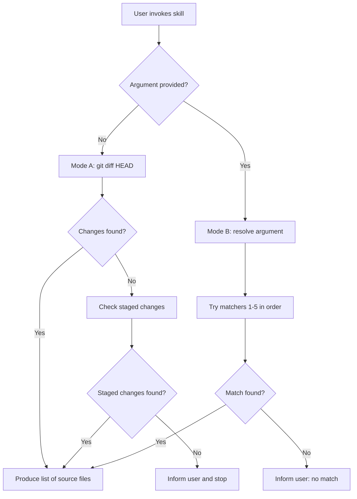

# Shared Primer -- Scope & Status

This primer documents cross-cutting concepts shared by all 6 test-automation skills (`setup-test-context`, `scan-test-gaps`, `add-{unit,integration}-test`, `update-{unit,integration}-test`) and their subagents. Other docs link to the anchors in this file rather than repeating these definitions.

## Scope Resolution

Every skill begins by deciding **which source files to process**. There are two modes, selected automatically based on whether the user passes an argument.

### Mode A -- Pending Changes (no argument)

When invoked without an argument (e.g., `/test-authoring:add-unit-test`), the skill runs `git diff HEAD --name-only --diff-filter=ACM -- 'src/**/*.cs'` to collect modified or added C# source files. If nothing is found it also checks `--cached` (staged changes). If there are still no changes, the skill informs the user and stops.

### Mode B -- Explicit Scope (argument provided)

When the user supplies an argument (e.g., `/test-authoring:add-unit-test Journals`), git diff is skipped entirely. The argument is resolved by trying the following matchers in order until one succeeds:

| # | Format | Example | Resolution strategy |
|---|--------|---------|---------------------|
| 1 | Directory path | `src/.../Journals/` | Use the path directly |
| 2 | Component name | `Journals` | Glob `src/**/Components/{arg}/**/*.cs` and `src/**/{arg}/**/*.cs` |
| 3 | Class name | `CreateJournalCommandHandler` | Grep for `class {arg}` under `src/` |
| 4 | `Class.Method` | `CreditMemoService.AggregatePrice` | Find the class file, pass both file and method |
| 5 | File name | `CreateJournalCommandHandler.cs` | Glob `src/**/{arg}` |

### Decision flowchart

Both modes produce a list of source files that the skill then delegates to its subagents.

> **Authoritative source:** [scope-resolution.md](../../resources/templates/shared/scope-resolution.md)

## Status Legend

All skills and agents use a shared set of status icons when reporting results. These icons appear in summary tables next to test files, audit items, and verification results.

| Icon | Status | Usage contexts |
|------|--------|----------------|
| 🟩 | Pass / Valid | Tests pass; coverage already exists; no action needed. Use "(already covered)" when flagging existing coverage during scans. |
| 🟨 | Warning | Non-fatal issue needing attention. Examples: outdated tests, environment failures, partial coverage, build OK but tests unverifiable. |
| 🟥 | Failed / Wrong | Error state requiring intervention. Examples: build failures, tests failed after max fix attempts, incorrect test logic, unresolved verifier violations. |
| 🟦 | Pending | Awaiting user confirmation or not yet processed by an agent. |
| 🟪 | Quality flag | Subjective improvement opportunity flagged by a verifier. Examples: trivial assertions, redundant tests, missing dependency verification. |

### When each status is assigned

- **Writer agents** assign 🟩 (pass) or 🟥 (failed after fix attempts) per test file.
- **Verifier agents** may downgrade a file to 🟥 (convention violation) or attach 🟪 flags.
- **Orchestrator skills** use 🟦 for items the user has not yet selected and 🟨 for environmental or partial issues.
- **Scan skill** uses 🟩 with "(already covered)" to mark methods that already have tests.

> **Authoritative source:** [status-legend.md](../../resources/static/status-legend.md)
