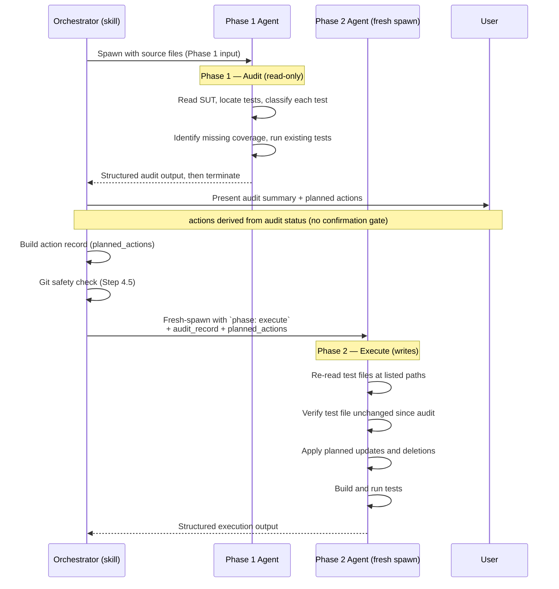
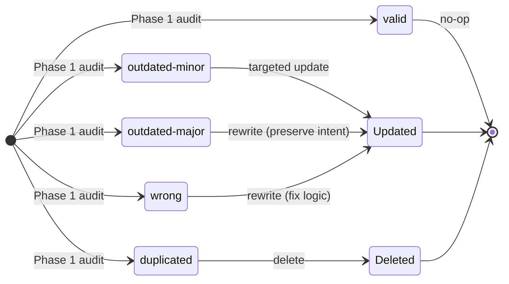
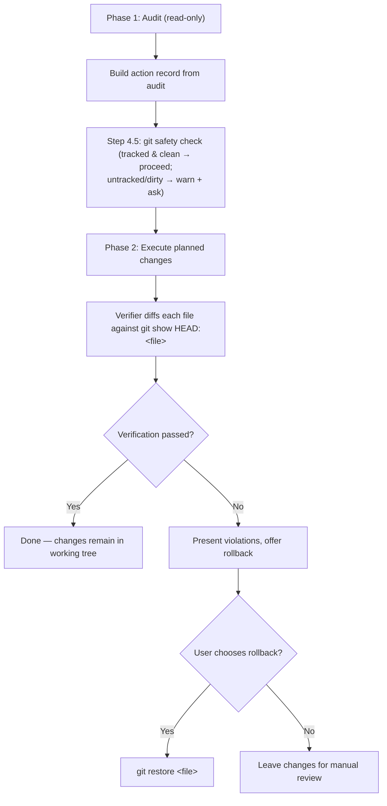

# Shared Primer — Update Patterns

This primer documents the internal mechanics that make the test-update workflow more complex than the test-add workflow. When updating existing tests, three constraints apply that do not exist when adding new tests: existing tests must be respected (not silently removed or weakened), every destructive change must be justified by the test's audit status, and rollback must be possible against a faithful pre-change baseline. The patterns described here — two-phase lifecycle, action record, git-based rollback, and anti-gaming enforcement — are the mechanisms that enforce those constraints.

**Dependent documents** (link here as single source of truth): `commands/readme-update-unit-test.md`, `commands/readme-update-integration-test.md`, `agents/readme-update-unit-test-agent.md`, `agents/readme-update-integration-test-agent.md`, `agents/readme-verify-update-<type>-test-agent.md`.

---

## Two-Phase Lifecycle

Update agents (`test-authoring:update-unit-test-agent`, `test-authoring:update-integration-test-agent`) run in **two phases as separate fresh-spawn invocations**: Phase 1 performs a read-only audit and terminates; Phase 2 is a brand-new `Agent` spawn with `phase: execute` in the prompt. The orchestrator carries the audit record forward inside Phase 2's prompt — there is no live agent state to preserve, so the orchestrator does not depend on session-conditional subagent-control tooling (e.g. `SendMessage`) for the handoff.

### Why two phases?

Unlike add agents (which generate new tests and finish), update agents must:

1. Analyse what already exists (read-only).
2. Derive the action plan from each test's audit status.
3. Apply only the planned actions, each justified by its audit status.

Splitting into two phases keeps the read-only audit fully separate from any write, so the action record the orchestrator carries into Phase 2 is the authoritative list of what may change.

### Sequence



### Phase 1 — Audit (read-only)

The agent performs these steps without modifying any file:

| Step | Action |
|------|--------|
| A1 | Analyse the SUT (source under test) following `sut-analysis.md` |
| A2 | Locate and read all existing test files for the SUT |
| A3 | Classify every test method (see status table below) |
| A4 | Identify SUT methods with no test coverage |
| A5 | Run existing tests, record pass/fail baseline |

After completing these steps the agent returns a structured audit and **terminates**. The audit output is the only handoff to Phase 2 — the orchestrator persists it and uses it to construct Phase 2's prompt.

### Phase 2 — Execute (writes, audit-driven)

Triggered by a fresh-spawn `Agent` invocation whose prompt contains `phase: execute`, the full audit record from Phase 1, the action record (`planned_actions`) derived from the audit, and the test file paths. The Phase 2 agent does NOT inherit live state from Phase 1 — it re-reads files at the paths in its prompt before applying changes. Steps:

| Step | Action |
|------|--------|
| E1 | Verify test file not modified externally since audit (`git diff`) |
| E2 | Apply planned updates and deletions in order |
| E3 | Enforce critical constraints (only planned items, never touch valid tests) |
| E4 | Build and run all tests, iterate up to 2 fix rounds |

### Five audit statuses

| Icon | Status | Meaning | Proposed action |
|------|--------|---------|-----------------|
| `valid` | Test correctly reflects current SUT logic | No change |
| `outdated-minor` | Assertions or details need a targeted tweak; test structure is correct | Targeted update (change specific values/assertions) |
| `outdated-major` | Setup, dependencies, or flow is fundamentally outdated | Significant rewrite preserving test intent |
| `wrong` | Test logic is incorrect regardless of SUT changes | Rewrite to fix the incorrect logic |
| `duplicated` | Functionally identical or largely overlapping with another test | Delete (justified by audit status) |

### Audit status state diagram

The diagram below visualises how each Phase 1 audit status flows into a Phase 2 outcome. The action is derived directly from the audit status — there is no per-test confirmation gate.



### Confidence levels

Each non-valid classification carries a confidence level that signals how much user scrutiny is warranted:

| Level | Evidence type | User review expectation |
|-------|---------------|------------------------|
| **high** | Clear structural evidence (signature changed, dependency removed, byte-identical tests) | Accept as-is |
| **medium** | Behavioural analysis required (control flow changed but test might still be valid) | Review the reasoning |
| **low** | Subjective assessment (tests seem to overlap but may test subtle differences) | Review carefully — agent is uncertain |

Valid tests do not carry a confidence level.

---

## Action Record

The action record (`planned_actions`) is the **authoritative input to Phase 2**. It is built by the orchestrator directly from the Phase 1 audit: each action is derived from the test's `audit_status`, not from a user choice. There is no `confirmed` field — the update agent processes every entry in the record and must not touch anything outside it.

### Structure

```yaml
planned_actions:
  # targeted tweak (outdated-minor)
  - test: ClassName.TestMethod_Condition_Expected
    audit_status: outdated-minor
    confidence: high
    action: update

  # significant rewrite (outdated-major)
  - test: ClassName.Handle_WhenAmountNegative_Throws
    audit_status: outdated-major
    confidence: high
    action: update

  # fix incorrect logic (wrong)
  - test: ClassName.Handle_WhenNull_ThrowsArgumentNull
    audit_status: wrong
    confidence: medium
    action: update

  # remove duplicate (duplicated)
  - test: ClassName.Handle_WhenValid_Success
    audit_status: duplicated
    confidence: low
    action: delete

  # add new coverage (missing)
  - test: (new) Validate
    audit_status: missing
    action: add

  # no change (valid) — included for completeness
  - test: ClassName.Handle_WhenValid_ReturnsSuccess
    audit_status: valid
    action: none
```

### Key properties

- **Per-test granularity** — every test method has its own entry, with the `action` derived from its `audit_status`.
- **Action types** — `update`, `delete`, `add`, `none`. Update agents only process `update` and `delete`; `add` items are routed to `add-*-test-agent`.
- **Audit-driven actions** — `action` is computed from `audit_status` (e.g. `outdated-major`/`wrong` → `update`, `duplicated` → `delete`, `valid` → `none`), not from a confirmation step.
- **Anti-gaming coupling** — the agent must not modify or delete any test outside the action record. The verifier cross-checks actual file changes against this record to detect unauthorized modifications.
- **Valid tests are protected** — entries with `audit_status: valid` always have `action: none`. Phase 2 must never touch them.

---

## Git-Based Rollback

Git is the backup and baseline for the update workflow — there are no `.bak` files. Before Phase 2 writes anything, the orchestrator's Step 4.5 runs a git safety check on each affected test file; the committed state (`git show HEAD:<file>`) is then the faithful pre-change baseline, and `git restore <file>` is the rollback.

### Why git HEAD as the baseline?

The orchestrator's Step 4.5 only auto-proceeds when a file is **git-tracked and clean**; an untracked or dirty file is flagged and proceeded on only with explicit user consent. Because of that gate, `git show HEAD:<file>` faithfully reflects the file's pre-change state, so it can serve as the diff baseline without contamination from uncommitted edits. Using git as the baseline also removes the need to create, track, and clean up `.bak` sidecar files.

### Lifecycle



### How each role uses the git baseline

| Role | Usage |
|------|-------|
| **Orchestrator** (skill) | Runs the Step 4.5 git safety check before Phase 2; offers `git restore` rollback in Step 7 |
| **Verifier** (`verify-update-<type>-test-agent`) | Diffs `git show HEAD:<file>` against the current file to independently detect deletions, modifications to valid tests, and unauthorized changes |
| **User** | Can manually inspect (`git diff HEAD -- FooTests.cs`) or roll back (`git restore FooTests.cs`) at any time |

### Uncommitted changes

If a test file is dirty or untracked when the update starts, `git show HEAD:<file>` would not reflect the user's work-in-progress, so the Step 4.5 safety check flags it and proceeds only with explicit consent. The recommended path is to **commit or stash** uncommitted work before Phase 2 so that the git baseline is coherent and `git restore` returns the file to a known state on rollback.

---

## Anti-Gaming

Anti-gaming enforcement prevents writer and update agents from silently bypassing test failures. Without these checks, an agent could make the test suite "pass" by deleting failing tests, weakening assertions, adding `[Skip]` attributes, or modifying source code — none of which constitute a legitimate fix.

### Writer-side prohibitions

Enforced by fix rules in [`test-rules.md`](../../resources/templates/rules/test-rules.md):

| Prohibited action | Why it is prohibited |
|-------------------|---------------------|
| Weaken an assertion (e.g., `.Be(5)` to `.BeGreaterThan(0)`) | Hides a real discrepancy between expected and actual behaviour |
| Delete a failing test | Removes evidence of a bug or regression |
| Add `[Skip]` or `Skip = "..."` | Silently disables the test without fixing the underlying issue |
| Comment out a test | Same as deletion but harder to detect |
| Modify the SUT (source code) | Tests must adapt to the SUT, not the other way around |

After 2 fix attempts on the same test, the agent must report it as `failed` and stop trying rather than resort to any of the above.

### Verifier-side checks

Implemented by the per-type `verify-update-<type>-test-agent` pair ([unit](../../agents/verify-update-unit-test-agent.md) / [integration](../../agents/verify-update-integration-test-agent.md)), which are strictly read-only and independent of the writer:

| Check | What it verifies |
|-------|-----------------|
| **Audit-justified deletion** | Every deleted test has a matching entry in the action record with `action: delete` whose `audit_status` is `wrong` or `duplicated` (outdated-major is rewritten, never deleted) |
| **Valid-test protection** | No test classified `valid` in the audit was deleted or had its content modified (diff against `git show HEAD`) |
| **Anti-deletion gaming** | No previously-failing test was silently removed to make the suite pass (see decision table below) |
| **Test count cross-check** | `actual_count == pre_count - deleted + added`; any drift is a red flag for unauthorized additions or removals |
| **Build failure classification** | Distinguish pre-existing failures (not caused by the agent) from newly introduced failures (must be reported as violations) |

### Anti-deletion decision table

This table determines whether a missing test is a legitimate audit-justified deletion or a suspicious silent removal. A deletion is legitimate only if the action record gives it an `action: delete` whose `audit_status` is `wrong` or `duplicated`:

| In `git show HEAD`? | In file now? | Was failing? | Audit status (in action record) | Verdict |
|:-------------------:|:------------:|:------------:|:-------------------------------:|---------|
| Yes | No | Yes | wrong / duplicated | OK — broken test removed, justified by audit |
| Yes | No | Yes | any other status, or no delete entry | **VIOLATION** — failed test silently removed |
| Yes | No | Yes | Yes delete entry, but `audit_status: valid` | **VIOLATION** — a "valid" test should not be both failing and deleted |
| Yes | No | No | wrong / duplicated | OK — removal justified by audit |
| Yes | No | No | any other status, or no delete entry | **VIOLATION** — passing test removed without justification |
| Yes | Yes | — | — | OK — test still present, no deletion to verify |

### What happens when a violation is detected

The verifier reports violations to the orchestrator. The orchestrator:

1. Presents violations prominently to the user.
2. Offers rollback via `git restore <file>`.
3. Does **not** attempt automated fixes for anti-gaming violations — these require human judgement.

If the user confirms rollback, test files are restored with `git restore <file>`. If the user declines, the changes remain in the working tree for manual review.
