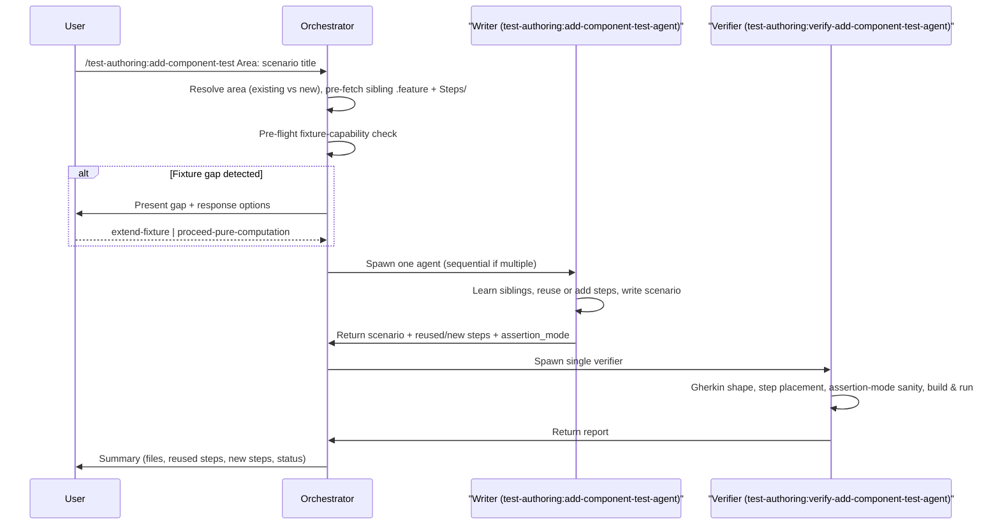

# add-component-test

The `add-component-test` skill generates a single Gherkin/Reqnroll component test scenario by learning conventions from existing `.feature` files and the matching `Steps/<Area>/` folder. It resolves scope (**Mode B only** — explicit area + scenario title), pre-fetches sibling context, runs a pre-flight fixture-capability check, delegates scenario writing to `test-authoring:add-component-test-agent`, then runs independent verification via `test-authoring:verify-add-component-test-agent`. Use it when you have a specific Gherkin scenario to add to an existing feature area or a new feature area altogether.

---

## Invocation

```
/test-authoring:add-component-test <Area>: <Scenario title>
/test-authoring:add-component-test <Area>
/test-authoring:add-component-test
```

- `<Area>: <Scenario title>` — area and scenario title together. Preferred.
- `<Area>` only — orchestrator will ask for the scenario title.
- No argument — orchestrator will ask for both area and scenario title.

**Mode A (git diff) is NOT supported** — source-to-feature mapping is intentionally fuzzy for Gherkin scenarios: a single source change can map to many scenarios, none, or live in any of several `.feature` areas. The user must name the area and scenario explicitly.

---

## High-Level Overview

1. **Scope identification** — accept explicit area + scenario from user; ask if either is missing.
2. **Area resolution** — grep `.claude/conventions/tests/component-test-conventions.md` mapping rules to decide whether the area is existing (append) or new (create both `.feature` + `Steps/<Area>/`).
3. **Context pre-fetch** — read the nearest `.feature` sibling, the nearest `Steps/<Area>/` sibling, inventory existing step phrasings for reuse.
4. **Pre-flight fixture-capability check** — consult `fixture-capabilities.md` (if generated) to judge whether the scenario can be verified with real-behaviour assertions or requires a fixture-gap response; surface the gap to the user before spawning the writer.
5. **Writer delegation** — spawn one `test-authoring:add-component-test-agent` for the scenario. Multi-scenario invocations spawn sequentially (container startup is slow; concurrency not useful here).
6. **Build verification** — run the target feature (not just the new scenario) via a feature-scoped filter to catch cross-scenario isolation bugs.
7. **Verification** — spawn one `test-authoring:verify-add-component-test-agent` to independently review the generated scenario.
8. **Fix loop** — route deterministic issues back to the writer; surface non-deterministic to the user.
9. **Summary** — report area, plan (append vs new), siblings referenced, step phrasings reused vs new step methods added, assertion mode declared, pass/fail of the new scenario.

---

## Sequence Overview



---

## Key Details

### Subagents Spawned

| Agent | Role | Count | Model |
|---|---|---|---|
| `test-authoring:add-component-test-agent` | Generates a single component scenario (Gherkin + step code) | 1 per scenario (sequential when multiple) | Inherits session |
| `test-authoring:verify-add-component-test-agent` | Reviews the scenario for Gherkin shape, step placement, step reuse, assertion-mode sanity, anti-gaming, build/test | 1 (always) | Inherits session |

### Mode B Only (No Git Diff)

Unlike `add-unit-test` / `add-integration-test`, there is no Mode A. The source-to-feature mapping for Gherkin scenarios is deliberately not automated because a single source change can correspond to multiple scenarios, no scenario at all, or scenarios in several feature areas. Requiring explicit scope forces a deliberate authoring decision per scenario.

### Two Sibling Sources

Unlike code-driven writers (one sibling: the nearest test file), the component writer learns from **two** sibling sources:

1. A nearest `.feature` file — scenario shape (header, rule, background, variable naming, tag usage, data tables).
2. A nearest `Steps/<Area>/` folder — binding shape (class split, constructor injection, step-attribute form, DTO location, state-setup style).

Sibling conflicts: the actual sibling file always wins over the orchestrator's pre-fetched acceleration spec. See `.claude/rules/tests/test-writer-rules.md` → context priority.

### Pre-flight Fixture-Capability Check

Before spawning the writer, the orchestrator reads `.claude/conventions/tests/fixture-capabilities.md` (when present) and reasons about the action under test:

| Action | Observable via |
|---|---|
| HTTP endpoint | API response (always observable) |
| Consumer writing to DB | DB context (always observable) |
| Consumer publishing via test-harnessed bus | Harness with scenario-scoped filter |
| Consumer dispatching to external service (email, push, webhook) | Wired fake listed in `fixture-capabilities.md`; flag gap if not listed |
| External HTTP API call | HTTP mock observability (always available) |

If a fixture gap is detected, the orchestrator presents response options (`extend-fixture` / `proceed-pure-computation` — the `skip` option is batch-only and does not apply here) and waits for the user's decision before spawning the writer.

When `fixture-capabilities.md` was NOT generated at bootstrap (no fixture class detected), this pre-flight step is skipped and the writer falls back to a no-fixture path.

### Step Reuse Before New Step

The writer MUST grep `{{STEPS_DIR}}/` (entire Steps tree, not just the target area) for existing `[Given/When/Then]` phrasings before writing a new step method. Reuse beats duplication. New step methods land in the matching class within `Steps/<Area>/` per the verb-to-class mapping observed in siblings (commonly Setup / Request / Response / Assertion four-class split, but bootstrap detects the repo's actual pattern).

### Assertion Mode Declaration

The writer MUST label the scenario as:

- `real-behaviour` — at least one `[Then]` observes a substitute's captured state, DB state, harness state (scenario-scoped filter), or the HTTP response.
- `pure-computation-only` — `[Then]`s only assert on pure-computation helpers because the needed substitute is not wired; MUST include a `fixture-gap` entry in `issues:` naming the missing substitute, the DI descriptor to replace, and the fake class needed.

Hedging without a label is a deterministic violation.

### Iteration Rule

The writer and verifier both run the target **feature** (not just the new scenario) via a feature-scoped filter. Running only the new scenario would miss cross-scenario isolation bugs (shared harness state, cumulative accumulators) — especially for append-to-existing plans. See `.claude/rules/tests/test-component-rules.md` → "Iteration rule".

### Env_failure Handling

Component tests depend on real infrastructure (containers, Docker, image pulls). When a scenario fails because infrastructure is unavailable, both the writer and verifier report `env_failure (<reason>)` rather than retry. Env failures go directly to the user — the writer cannot fix infrastructure.

### Circuit Breaker

The fix-verify loop uses the same circuit breaker as other add flows: global round limit 3, per-issue retry limit 2. Full specification: [readme-shared-orchestration.md#circuit-breaker](../shared/readme-shared-orchestration.md#circuit-breaker).

### Fix Protocol

Deterministic findings (Gherkin-shape violations, step placement, step reuse violations, assertion-mode mismatches, build failures, test failures) → **fresh-spawn** the writer with a `fix_invocation` block. Non-deterministic (anti-gaming, quality flags, env_failure) → present to user; user-approved fixes are routed via the same fresh-spawn `fix_invocation` block. Full specification: [readme-shared-orchestration.md#fix-protocol](../shared/readme-shared-orchestration.md#fix-protocol).

### Status Icons in Output

Each feature/step file in the summary is tagged with a status icon. Full legend: [readme-shared-scope-and-status.md#status-legend](../shared/readme-shared-scope-and-status.md#status-legend).

---

## Summary Output

The final summary includes:

- Area and plan (append vs new)
- Feature/steps siblings referenced (and what style was adopted)
- Files created / modified
- Scenario name added
- Step phrasings reused vs new step methods added (per class)
- Assertion mode declared (`real-behaviour` / `pure-computation-only` + fixture-gap if applicable)
- Convention violations found and fixes applied (if any)
- Anti-gaming violations (if any) — presented to user
- Quality flags (if any) — presented for user judgement
- Pass/fail of the new scenario (and of co-located scenarios in the target feature)

---

## Out of Scope

- **Mode A (git diff)** — not supported.
- **Updating existing scenarios** — covered by `update-component-test`.
- **Multi-scenario parallelism** — multiple scenarios in one invocation are spawned sequentially, not in parallel.
