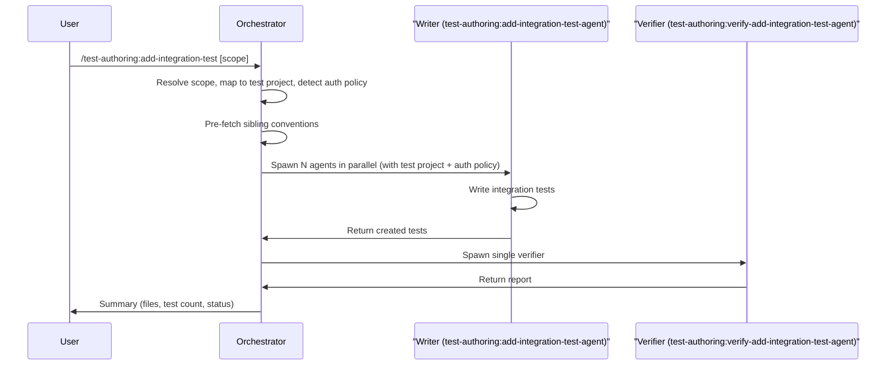

# add-integration-test

The `add-integration-test` skill analyses source code changes and generates integration tests that follow the conventions of existing sibling test files. It resolves scope, determines which test project each source file maps to, pre-fetches context including authorization policies, and delegates test writing to one or more `test-authoring:add-integration-test-agent` instances in parallel. A `test-authoring:verify-add-integration-test-agent` then independently reviews all generated tests.

---

## Invocation

```
/test-authoring:add-integration-test [scope]
```

- **Mode A** (no argument) -- uses `git diff` to find new or modified source files (controllers, handlers, worker operations, sync consumers, persistence logic) and generates integration tests for them.
- **Mode B** (argument provided) -- resolves the argument as a directory, component, class, `Class.Method`, endpoint, or file name and generates tests for the matched files.

Endpoint-scoped invocation narrows the agent to a single endpoint:

```
/test-authoring:add-integration-test JournalsController POST v1/billing/journals
```

For full details on how scope is resolved, including the matcher priority and decision flowchart, see [readme-shared-scope-and-status.md#scope-resolution](../shared/readme-shared-scope-and-status.md#scope-resolution).

---

## High-Level Overview

1. **Scope resolution** -- determine which source files need integration tests (Mode A or B).
2. **Test project mapping** -- classify each source file into the correct test project (Api, Worker, Infrastructure, or Sync).
3. **Context pre-fetch** -- read sibling tests, extract convention specs, and detect authorization policies from controller `[Authorize]` attributes.
4. **Writer agent delegation** -- spawn one `test-authoring:add-integration-test-agent` per (source, project) pair (the mapping step splits multi-project sources), all in parallel, with pre-fetched context attached.
5. **Multi-agent build check** -- if 2+ agents were spawned, run a combined build to catch cross-file issues.
6. **Verification** -- spawn one `test-authoring:verify-add-integration-test-agent` to independently review all generated tests.
7. **Fix loop** -- route deterministic issues back to writers; surface non-deterministic issues to the user.
8. **Summary** -- report created files, test counts, convention adherence, and per-file status.

---

## Sequence Overview

The diagram below shows the happy-path actor interactions. Error handling and decision branches are described in the Key Details section below.



## Key Details

### Subagents Spawned

| Agent | Role | Count | Model |
|---|---|---|---|
| `test-authoring:add-integration-test-agent` | Generates integration tests for a single source class | 1 per (source, project) pair (parallel) | Inherits session |
| `test-authoring:verify-add-integration-test-agent` | Reviews all generated tests for conventions, anti-gaming, and quality | 1 (always) | Inherits session |

The verifier is always spawned, even when only one writer agent was used.

### Test Project Mapping

Before delegating to agents, the orchestrator classifies each source file into the correct integration test project:

| Source type | Test project |
|---|---|
| API endpoints, controllers, application commands/queries | `tests/Acme.Billing.Tests.Integration/Api/` |
| Worker operations, background processing, scheduling | `tests/Acme.Billing.Tests.Integration/Worker/` |
| Infrastructure (migrations, blob, exclusive writers) | `tests/Acme.Billing.Tests.Integration/Infrastructure/` |
| Sync consumers (MassTransit event handling) | `tests/Acme.Billing.Tests.Integration.Sync/` |

### Auth Policy Detection

The orchestrator reads the controller's `[Authorize]` attribute to identify which authorization policy applies, then passes this to the writer agent. This determines which account types should receive `Forbidden` responses in auth tests:

| Policy | Forbidden account types |
|---|---|
| `OPERATIONS_ONLY_POLICY` | Client and Vendor |
| `CLIENT_OR_OPERATIONS_POLICY` | Vendor only |

Method-level `[Authorize]` attributes may override the class-level policy. The orchestrator checks both levels and includes per-endpoint policy information in the agent prompt.

### Context Pre-fetch

Before spawning writer agents, the orchestrator reads sibling test files in the target directory and extracts a **convention spec**. This spec covers:

| Field | Example values |
|---|---|
| Base class | `IntegrationTest`, `ApiActionTests<T>`, `OperationTests`, `SyncTests` |
| Data factory | `BillingDataFactory`, `AnalyticsDataFactory`, `PlatformObjects`, or manual |
| HTTP client | `StandardEndpointExtensions` helpers or raw `HttpClient` |
| Security context | `Fixture.UserContext.ChangeToOps()`, `.ChangeTo(UserAccountType.Vendor)` |
| Naming pattern | `Action_Condition_Expected`, `OnCondition_Expected` |
| AAA comments | yes or no |

The convention spec, auth policy, and list of already-tested endpoints are passed to each writer agent to reduce exploration time and avoid duplicating existing coverage. If the writer observes a discrepancy between the pre-fetched spec and the actual sibling file, the sibling file takes priority (see [test-writer-rules.md](../../resources/templates/rules/test-writer-rules.md) context priority).

### Multi-agent Build Check

When **2 or more** writer agents are spawned, the orchestrator runs a combined build after all agents complete:

```bash
dotnet build tests/Acme.Billing.Tests.Integration
```

This catches cross-file issues (e.g., duplicate class names, conflicting usings). When only a single agent was spawned this step is skipped because the agent already verifies its own build.

### Circuit Breaker

The fix-verify loop is governed by a circuit breaker with two independent counters: a global round limit (max 3) and a per-issue retry limit (max 2). When either counter is reached, remaining issues are reported as unresolved rather than retried indefinitely.

Full specification: [readme-shared-orchestration.md#circuit-breaker](../shared/readme-shared-orchestration.md#circuit-breaker).

### Fix Protocol

Verifier findings are classified as deterministic or non-deterministic. Deterministic issues (convention violations, build failures) trigger a **fresh-spawn** of the writer agent with a `fix_invocation` block — every fix round is a new `Agent` invocation, not a continuation. Non-deterministic issues (anti-gaming violations, quality flags, env_failure) are surfaced directly to the user; if the user approves a fix, it is routed via the same fresh-spawn `fix_invocation` block. The orchestrator never edits files itself.

Full specification: [readme-shared-orchestration.md#fix-protocol](../shared/readme-shared-orchestration.md#fix-protocol).

### Status Icons in Output

Each test file in the summary is tagged with a status icon indicating its outcome (pass, warning, failed, pending, or quality flag).

Full legend: [readme-shared-scope-and-status.md#status-legend](../shared/readme-shared-scope-and-status.md#status-legend).

---

## Summary Output

The final summary includes source files analysed, sibling tests referenced, convention spec adopted per test area, test project targeted, test files created or modified (with per-file status icon), total test methods added, convention violations and fixes applied, anti-gaming violations (presented to user), quality flags (presented for user judgement), and any areas that could not be covered.
