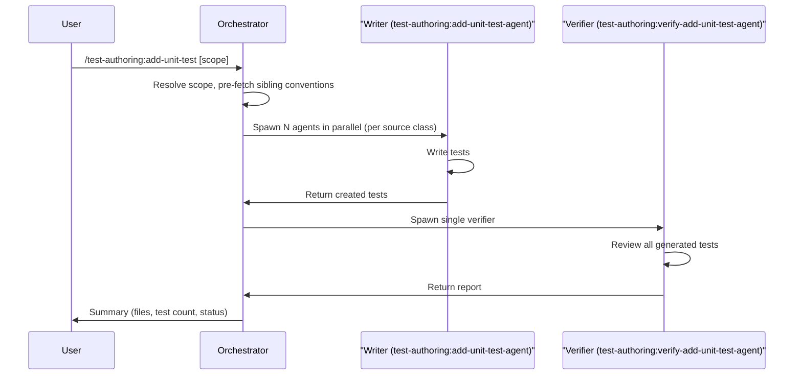

# add-unit-test

The `add-unit-test` skill analyses source code changes and generates unit tests that follow the conventions of existing sibling test files. It resolves scope, pre-fetches context, delegates test writing to one or more `test-authoring:add-unit-test-agent` instances in parallel, and runs independent verification via `test-authoring:verify-add-unit-test-agent`. Use it when you have new or modified source code that needs unit test coverage.

---

## Invocation

```
/test-authoring:add-unit-test [scope]
```

- **Mode A** (no argument) -- uses `git diff` to find new or modified source files and generates tests for them.
- **Mode B** (argument provided) -- resolves the argument as a directory, component, class, `Class.Method`, or file name and generates tests for the matched files.

When a `Class.Method` scope is provided, the writer agent focuses only on that method rather than the entire class.

For full details on how scope is resolved, including the matcher priority and decision flowchart, see [readme-shared-scope-and-status.md#scope-resolution](../shared/readme-shared-scope-and-status.md#scope-resolution).

---

## High-Level Overview

1. **Scope resolution** -- determine which source files need tests (Mode A or B).
2. **Context pre-fetch** -- read sibling tests and extract convention specs before spawning agents.
3. **Writer agent delegation** -- spawn one `test-authoring:add-unit-test-agent` per source class, all in parallel, with pre-fetched context attached.
4. **Multi-agent build check** -- if 2+ agents were spawned, run a combined build to catch cross-file issues.
5. **Verification** -- spawn one `test-authoring:verify-add-unit-test-agent` to independently review all generated tests.
6. **Fix loop** -- route deterministic issues back to writers; surface non-deterministic issues to the user.
7. **Summary** -- report created files, test counts, convention adherence, and per-file status.

---

## Sequence Overview

The diagram below shows the happy-path actor interactions. Error handling and decision branches are described in the Key Details section below.



## Key Details

### Subagents Spawned

| Agent | Role | Count | Model |
|---|---|---|---|
| `test-authoring:add-unit-test-agent` | Generates unit tests for a single source class | 1 per source class (parallel) | Inherits session |
| `test-authoring:verify-add-unit-test-agent` | Reviews all generated tests for conventions, anti-gaming, and quality | 1 (always) | Inherits session |

The verifier is always spawned, even when only one writer agent was used.

### Context Pre-fetch

Before spawning writer agents, the orchestrator reads sibling test files and extracts a **convention spec** for each target test directory. This spec covers:

| Field | Example values |
|---|---|
| Mocking library | NSubstitute or Moq |
| Fixture helper | `FixtureHelper.CreateN()`, `FixtureHelper.Create()`, or manual |
| Base class | `BaseCommandHandlerTests<T>` or none |
| SUT construction | auto-wired (`fixture.Create<T>`) or manual (`new T(...)`) |
| Naming pattern | `Method_Condition_Expected`, `Method_ShouldX_WhenY` |
| AAA comments | yes or no |

The convention spec is passed to each writer agent so it does not need to independently discover conventions. This reduces agent exploration time and ensures consistency across parallel agents targeting the same test area.

If the writer observes a discrepancy between the pre-fetched spec and the actual sibling file, the sibling file takes priority (see [test-writer-rules.md](../../resources/templates/rules/test-writer-rules.md) context priority).

### Multi-agent Build Check

When **2 or more** writer agents are spawned, the orchestrator runs a combined build after all agents complete:

```bash
dotnet build tests/Acme.Billing.Tests.Unit
```

This catches cross-file issues (e.g., duplicate class names, conflicting usings). When only a single agent was spawned this step is skipped because the agent already verifies its own build.

### Circuit Breaker

The fix-verify loop is governed by a circuit breaker with two independent counters: a global round limit (max 3) and a per-issue retry limit (max 2). When either counter is reached, remaining issues are reported as unresolved rather than retried indefinitely.

Full specification: [readme-shared-orchestration.md#circuit-breaker](../shared/readme-shared-orchestration.md#circuit-breaker).

### Fix Protocol

Verifier findings are classified as deterministic or non-deterministic. Deterministic issues (convention violations, build failures) trigger a **fresh-spawn** of the writer agent with a `fix_invocation` block — every fix round is a new `Agent` invocation, not a continuation. Non-deterministic issues (anti-gaming violations, quality flags) are surfaced directly to the user; if the user approves a fix, it is routed via the same fresh-spawn `fix_invocation` block. The orchestrator never edits files itself.

Full specification: [readme-shared-orchestration.md#fix-protocol](../shared/readme-shared-orchestration.md#fix-protocol).

### Status Icons in Output

Each test file in the summary is tagged with a status icon indicating its outcome (pass, warning, failed, pending, or quality flag).

Full legend: [readme-shared-scope-and-status.md#status-legend](../shared/readme-shared-scope-and-status.md#status-legend).

---

## Summary Output

The final summary includes:

- Source files analysed and sibling tests referenced
- Convention spec adopted per test area
- Test files created or modified, with per-file status icon
- Total test methods added
- Convention violations found and fixes applied (if any)
- Anti-gaming violations (if any) -- presented to user
- Quality flags (if any) -- presented for user judgement
- Areas that could not be covered and why
