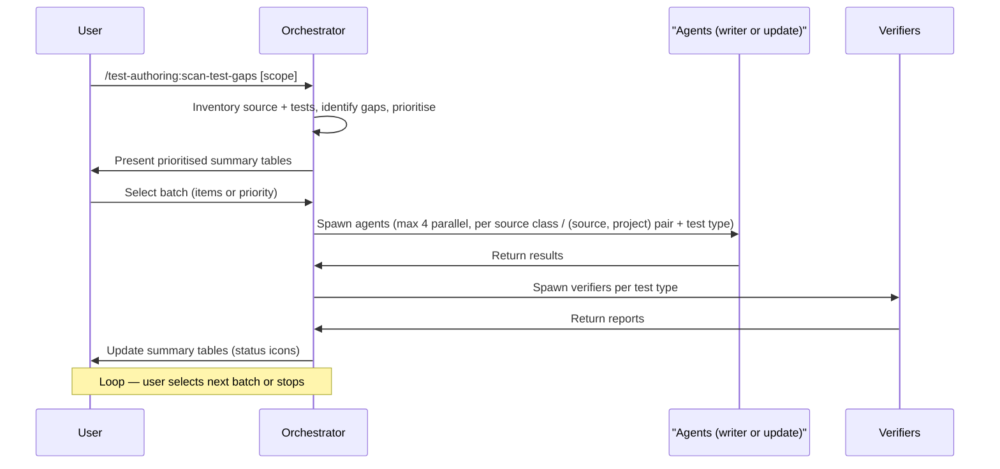

# scan-test-gaps

The `scan-test-gaps` skill performs a repo-wide coverage gap analysis across all source projects and test projects. It inventories production source files, cross-references them against existing unit and integration tests, identifies untested code and stale tests, and prioritises gaps by business criticality (handlers, calculations, and state transitions first). Work is delegated to writer and update agents in iterative, user-selected batches.

---

## Invocation

```
/test-authoring:scan-test-gaps [scope]
```

- **No argument** -- scans the entire `src/` folder.
- **Argument provided** -- narrows the scan to matched files using Mode B scope resolution (component name, class name, directory path, `Class.Method`, or file name).

For full details on how scope is resolved, including the matcher priority and decision flowchart, see [readme-shared-scope-and-status.md#scope-resolution](../shared/readme-shared-scope-and-status.md#scope-resolution).

---

## High-Level Overview

| Step | Action |
|------|--------|
| 1 | **Inventory source files** -- collect production C# files within scope; exclude auto-generated files, migrations, DTOs without logic, and `Program.cs`/`Startup.cs`. Track `[ExcludeFromCodeCoverage]` items separately. |
| 2 | **Inventory existing tests** -- scan all test projects (`Tests.Unit`, `Tests.Integration`, `Tests.Integration.Sync`) without pre-filtering by component. |
| 3 | **Identify gaps** -- cross-reference source against tests; detect missing unit tests, missing integration tests, and stale tests. Both unit and integration coverage count (cross-coverage exclusion). |
| 4 | **Prioritise** -- assign High / Medium / Low priority; present three numbered tables plus an Excluded table for `[ExcludeFromCodeCoverage]` items. |
| 5 | **User selects a batch** -- user picks items by number, priority, or area. |
| 6 | **Delegate** -- spawn writer agents (add) or update agents (stale) grouped by source class and test type, max 4 in parallel, max 5--8 items per batch. |
| 7 | **Verify** -- spawn `verify-add-<type>-test-agent` per test type to independently review generated tests. |
| 8 | **Handle verifier findings** -- route deterministic issues to writers; surface non-deterministic issues to user. |
| 9 | **Update summary tables** -- add Status and Note columns with result icons. |
| 10 | **Loop** -- return to Step 5 for the next batch, or stop when the user says "done". |

---

## Sequence Overview

The diagram below shows one batch cycle of the happy-path actor interactions. Error handling and decision branches are described in the Key Details section below.



## Key Details

### Scope Narrowing

The optional keyword argument narrows Steps 1--3 to only the matched files and their corresponding tests. If no match is found, the skill informs the user and falls back to the full scan.

Full specification: [readme-shared-scope-and-status.md#scope-resolution](../shared/readme-shared-scope-and-status.md#scope-resolution).

### Exclusions

Files decorated with `[ExcludeFromCodeCoverage]` are **not treated as gaps**. They appear in a separate Excluded table (one row per method) so the user has full visibility but they are never delegated to agents.

### Prioritisation Heuristics

| Priority | Signals |
|----------|---------|
| **High** | Command handlers, billing calculations, state transitions, financial operations, sync consumers |
| **Medium** | Query handlers, validation logic, infrastructure services, data transformations |
| **Low** | Utilities, extensions, configuration, simple CRUD without business rules, mappers, formatters |

### Batch Size

- **5--8 items** per batch to keep feedback loops tight and avoid rate limiting.
- If the user selects more, the orchestrator splits into sub-batches and confirms before starting each one.

### Parallelism

- One agent per (source class, test type) pair.
- Methods of the same class and type stay in the same agent.
- **Max 4 agents in parallel.** Additional agents queue in rounds of 4.

### Delegation Routing

| Gap type | Agent |
|----------|-------|
| Missing coverage, unit test needed | `test-authoring:add-unit-test-agent` |
| Missing coverage, integration test needed | `test-authoring:add-integration-test-agent` |
| Stale tests, unit test file | `test-authoring:update-unit-test-agent` |
| Stale tests, integration test file | `test-authoring:update-integration-test-agent` |

When the same source class has both a missing unit gap and a missing integration gap, separate agents are spawned for each type -- they produce different test files in different projects, so there is no conflict.

### Two-Phase Lifecycle for Updates

Stale-test items (Type = Update) are delegated to update agents, which follow a two-phase lifecycle: Phase 1 audits read-only and returns findings; actions derive from each item's audit status (no per-item confirmation gate), then Phase 2 executes the audit-derived changes.

Full specification: [readme-shared-update-patterns.md#two-phase-lifecycle](../shared/readme-shared-update-patterns.md#two-phase-lifecycle).

### Circuit Breaker

The fix-verify loop between writers and verifiers is governed by a circuit breaker with a global round limit (max 3) and a per-issue retry limit (max 2). When either counter is reached, remaining issues are reported as unresolved.

Full specification: [readme-shared-orchestration.md#circuit-breaker](../shared/readme-shared-orchestration.md#circuit-breaker).

### Verification

After all writer agents in a batch complete, verifier agents are spawned **per test type** (not per batch):

| Batch contains | Verifier spawned |
|----------------|------------------|
| Unit test output only | 1 `verify-add-<type>-test-agent` for unit |
| Integration test output only | 1 `verify-add-<type>-test-agent` for integration |
| Both unit and integration output | 2 `verify-add-<type>-test-agent` instances in parallel |
| Update agent output | Corresponding `verify-update-<type>-test-agent` per type |

### Status Icons in Output

Each item in the updated summary tables is tagged with a status icon indicating its outcome (pass, warning, failed, pending, or quality flag).

Full legend: [readme-shared-scope-and-status.md#status-legend](../shared/readme-shared-scope-and-status.md#status-legend).

### Cross-Coverage Exclusion

A method is excluded from the gap list when it is already exercised by a **unit or integration** test, whether directly or indirectly. Gherkin scenarios are not considered here — scan operates on code-driven test types only. Partially covered classes list only the uncovered methods. When in doubt, the scan errs on the side of excluding -- a false negative is less costly than recommending unnecessary tests that duplicate existing coverage.

---

## Summary Tables

### Initial Scan (Step 4)

Three tables (High / Medium / Low) with continuous sequential numbering:

| # | Source/Class | Method | Gap Description | Type |
|---|---|---|---|---|
| 1 | `FooHandler` | `Handle` | No tests at all | Unit |
| 2 | `BazController` | `POST v1/billing/baz` | No integration test | Integration |
| 3 | `ChargeService` | (class) | Tests have build errors | Update |

Plus an Excluded table for `[ExcludeFromCodeCoverage]` items (no status column).

### After Batch Completes (Step 9)

Two additional columns are added to the selected tables:

| # | Source/Class | Method | Gap Description | Type | Status | Note |
|---|---|---|---|---|---|---|
| 1 | `FooHandler` | `Handle` | No tests at all | Unit | Pass | 6 tests added |
| 2 | `BazController` | `POST ...` | No integration test | Integration | Warning | Docker unavailable |
| 3 | `ChargeService` | (class) | Build errors | Update | Failed | build failed after 2 fix rounds |
