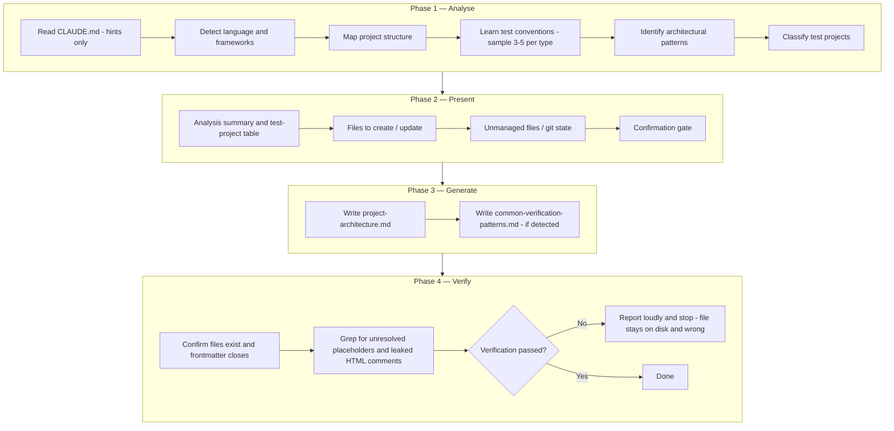

# setup-test-context

The `setup-test-context` skill is the **optional** profiler that caches this repo's **cross-layer test map** for the rest of the `test-authoring` plugin. It analyses the repository's language, test frameworks, project structure, and test conventions, then writes one or two files under `.claude/conventions/tests/` — `project-architecture.md` and, when the analysis found one, `common-verification-patterns.md`. Those are the parts a single sibling test cannot reconstruct, and they are the only thing it writes. Every add/update/scan skill runs **with or without** them.

Beyond those one or two files it writes nothing. The rule books those skills obey live in the plugin at `resources/templates/{rules,shared}/` and are read from there at runtime; nothing copies them into a repo, so there is no second copy to fall out of date. Per-type (`unit` / `integration`) conventions are not cached either — writers derive those from the nearest sibling, which is more current than any cache could be.

It is re-runnable, and re-running **is** the refresh: managed files are generated artifacts, not user documents. The skill keeps **no state between runs** — no manifest, no recorded hashes, no per-file version. It knows only the fixed set of paths the current version writes: an existing file at one of those paths is **overwritten with no undo**, and anything else under the managed directories is reported and left untouched. One confirmation gate lists both sets before anything is written — that gate is where a hand-edit is protected, so copy one out there or answer No.

Unlike the runtime test skills (add/update/scan), this skill spawns **no subagents** during its own execution — everything runs linearly (Analyse → Present → Generate → Verify) within the orchestrator process. Consequently there is **no circuit breaker** or fix-loop machinery here.

---

## When to use

- **One-time cross-layer map** — cache the project architecture and the cross-layer verification patterns that a single sibling cannot reconstruct. The add/update/scan skills run without setup and derive per-type conventions from siblings either way; setup is not a prerequisite.
- **Re-baseline after architectural change** — added a new test project, switched test frameworks, or restructured source directories.
- **Re-sync after plugin upgrade** — rule-book changes reach you automatically now (they are read from the plugin), but a new version can change how the conventions are generated. Nothing detects that for you, so re-run deliberately after upgrading.
- **NOT for routine test generation** — for day-to-day work use `/test-authoring:add-unit-test`, `/test-authoring:update-unit-test`, `/test-authoring:scan-test-gaps`, etc. directly (they run with or without setup).

---

## Clean re-setup after a plugin upgrade

Nothing tells a repo its cached files are stale — that detection was removed along with the manifest.
After upgrading the plugin, the reliable move is to delete and regenerate rather than overwrite:

```
rm -rf .claude/conventions/tests .claude/rules/tests .claude/shared/tests
```

Only the first is still written to. The other two hold what older versions left — rule-book copies,
`scope-resolution.md`, a `README.md`, and the `.setup-manifest.json` dotfile — and clearing them is the
point. Then run the skill: with the managed directories empty, nothing is reported as unmanaged and every
target is `NEW`.

Overwriting in place also works, but it leaves any file the current version no longer writes sitting on
disk, because the skill will not delete what it cannot prove it wrote. It is also not safer for a
hand-edit: there is no backup. Copy the edit out first — the confirmation gate tells you which files
are about to be overwritten.

---

## Invocation

```
/test-authoring:setup-test-context              # install or re-sync
```

No arguments. The skill always analyses the entire repository. To remove what it wrote, delete
`.claude/conventions/tests/` and the line it added to the repo's `.gitignore`. An upgraded repo may
also hold `.claude/rules/tests/`, `.claude/shared/tests/` and `.claude/backup/` from earlier
versions — safe to delete too.

---

## High-Level Overview

| Phase | Action |
|-------|--------|
| 1. Analyse | Read CLAUDE.md hints, detect language/frameworks, map project structure, learn test conventions, identify architectural patterns, classify test projects |
| 2. Present | Show analysis summary, test-project table, files to create/overwrite (**overwrite has no undo** — copy out a hand-edit here), unmanaged files that will be left alone, git working-tree state; ask for confirmation |
| 3. Generate | Write the cross-layer conventions (`project-architecture.md`, and `common-verification-patterns.md` when one was detected) directly from the analysis. No templates are filled and no rule book is copied. Per-type `{type}-test-conventions.md` are **not** generated — sibling-derived at runtime |
| 4. Verify | Confirm the written files exist and their frontmatter closes; grep for unresolved placeholders and leaked HTML comments; on failure, report loudly and stop — the file stays on disk and wrong, and re-running is the fix |

---

## Phase / Step diagram



---

## Key details

### Defensive CLAUDE.md handling

`CLAUDE.md` is read for **hints only** (build commands, project descriptions, framework references). It is **never modified** — that's the responsibility of `/init` or manual edits. Drift between CLAUDE.md claims and actual codebase findings is reported, not auto-corrected.

### Confirmation gate

After presenting the analysis and the write list, the user gives a single yes/no for the whole set.
Per-file selective acceptance is not supported — with one or two files it would only ask the same
question twice. The gate carries real weight now that there is no backup: each target is labelled `NEW`
or `OVERWRITE`, and an `OVERWRITE` is the only warning that content is about to be lost.

### Overwrite-safe flow

For each path the skill plans to write:

| State | Condition | Action |
|---|---|---|
| **fresh** | path does not exist | write new file |
| **existing** | path exists | overwrite — no undo, so the confirmation gate is where you intervene |

Both are listed in the confirmation block. There is no pristine / user-modified distinction and no
per-file prompt — both needed recorded hashes, and the skill records none, so the untouched case and
the hand-edited case get the same treatment.

A file under a managed directory that is **not** among this run's write targets is reported and left
alone — never deleted. Without recorded state, a retired template's leftover and a file you wrote
yourself are indistinguishable, and deleting the wrong one is unrecoverable. This is why the guidance
is to copy a hand-edit out before re-running — committing it does not work, because `.gitignore` covers that path.

### Re-run, refresh & legacy per-type conventions

Re-running setup **is** the refresh: both conventions files are re-generated from the current repo
state, and the previous content is gone. Nothing signals *when* a re-run is
due — the analysis-derived cross-layer map (`project-architecture.md` / `common-*`) goes stale as the
repo evolves, and only you know that has happened.

**Leftovers in an upgraded repo:** a repo set up by an older plugin version may still have files this
version no longer writes — the whole of `.claude/rules/tests/` plus `scope-resolution.md` from before the rule
books became plugin-read, `unit-test-conventions.md` / `integration-test-conventions.md` from before
per-type conventions became sibling-derived, `test-component-rules.md` /
`component-test-conventions.md` / `fixture-capabilities.md` from before component support was removed,
and a `.setup-manifest.json` from before the manifest was removed (a dotfile, so list it explicitly —
a plain directory listing will hide it). None are regenerated and none are
deleted — they all fall under the report-and-leave-alone rule above. Harmless at runtime: nothing reads
the manifest any more, and siblings are the authoritative source for per-type conventions, so a stale
per-type doc is overridden rather than obeyed. Delete them by hand if you want them gone.

### Placeholder substitution

Setup fills no templates — the rule books under `<plugin-root>/resources/templates/` carry no placeholders and are read as-is. The only substitution left is in the **generated** conventions' frontmatter: `{{SRC_GLOB}}` and `{{TEST_GLOB}}` resolve to what Step 1.3 observed. No value is ever filled from a shipped language baseline.

### No test-agent delegation during setup

Setup spawns **no subagents at all**. It writes its one or two files itself — the analysis they come from is already in the orchestrator's context, so a subagent would copy that context rather than save it, and two files offer no parallelism to win. It also never delegates to the plugin's test writer, update, or verifier agents. Consequently no circuit breaker, no fix loop, no `fix_invocation` routing. Verification is mechanical (file existence, frontmatter, placeholder grep) rather than an independent agent review.

### Status icons

Skill output uses status icons from `<plugin-root>/resources/static/status-legend.md` (plugin-internal — see [readme-shared-scope-and-status.md](../shared/readme-shared-scope-and-status.md)). The legend is **not** scaffolded per-repo; user attempts to extend the per-repo copy are not honoured.

### Mermaid syntax

All diagrams use GitHub fenced code blocks tagged `mermaid` (not Azure DevOps `::: mermaid` colon-fences), so they render on GitHub.

---

## Generated output

Setup-test-context writes 1–2 files per consumer repo, both in one directory. The set does not vary by test type — only the conditional `common-verification-patterns.md` moves the count:

| Category | Files | Source |
|---|---|---|
| Conventions (`.claude/conventions/tests/`) | `project-architecture.md`, plus the conditional `common-verification-patterns.md`. Per-type conventions are **not** written — writers derive them from the nearest sibling at runtime | generated from analysis |

**Not written per-repo** (lives in plugin):
- the 9 rule books — at `<plugin-root>/resources/templates/{rules,shared}/`, read directly by skills and agents
- `status-legend.md` — at `<plugin-root>/resources/static/status-legend.md`
- 8 subagents — at `<plugin-root>/agents/`, invoked via `Agent(subagent_type="test-authoring:<name>")`
- 6 user-invocable skills (this `setup-test-context` + `scan-test-gaps` + 4 add/update workflows) — at `<plugin-root>/skills/`
- Guarded hook block templates — for plugin authors only
