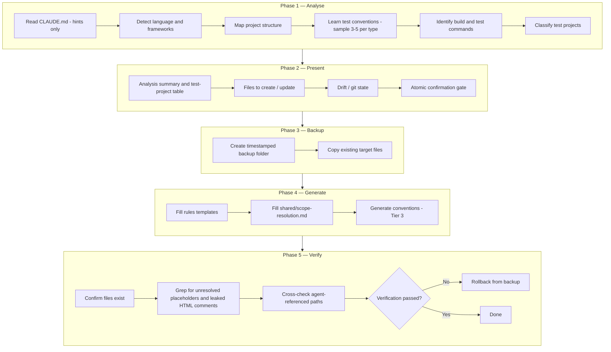

# setup-test-context

The `setup-test-context` skill is the **optional** profiler that caches per-repo test conventions for the rest of the `test-authoring` plugin. It analyses the repository's language, test frameworks, project structure, and coding conventions, then writes per-repo conventions/rules/shared files under `.claude/{conventions,rules,shared}/tests/` — putting the runtime skills on the **fast path** (they read those cached files instead of discovering per-invocation). The add/update/scan skills also run **without** it, in **cacheless mode**: rules come from the plugin's bundled `resources/templates/`, conventions from the nearest sibling tests. Under the **Slim default**, setup caches the repo's **cross-layer / global map** — project architecture, cross-layer verification patterns, and the shared-utility catalog — the parts a single sibling test cannot reconstruct. It does **not** cache per-type (`unit` / `integration`) conventions: writers derive those from the nearest sibling at runtime, so caching them would only duplicate what siblings already provide (and add a stale-able surface). Setup is therefore a one-time **cross-layer map**, not a per-type convention baseline.

It is re-runnable, and re-running **is** the refresh: managed files are generated artifacts, not user documents. The skill keeps **no state between runs** — no manifest, no recorded hashes, no per-file version. It knows only the fixed set of paths the current version writes: an existing file at one of those paths is backed up into the run's backup folder and rewritten, and anything else under the managed directories is reported and left untouched. All proposed changes are presented as a single atomic confirmation gate — the user accepts or rejects everything.

Unlike the runtime test skills (add/update/scan), this skill spawns **no subagents** during its own execution — everything runs linearly (Schema check → Analyse → Present → Backup → Generate → Verify) within the orchestrator process. Consequently there is **no circuit breaker** or fix-loop machinery here.

---

## When to use

- **One-time cross-layer map** — cache the repo's cross-layer / global test map (project architecture, cross-layer verification patterns, the shared-utility catalog) that a single sibling cannot reconstruct. The add/update/scan skills run without setup (cacheless, sibling-driven) and derive per-type conventions from siblings either way; setup is not a prerequisite and no longer caches per-type conventions.
- **Re-baseline after architectural change** — added a new test project, switched test frameworks, or restructured source directories.
- **Re-sync after plugin upgrade** — a new plugin version may have updated template content; re-running picks it up. Nothing detects the staleness for you, so re-run deliberately after upgrading.
- **NOT for routine test generation** — for day-to-day work use `/test-authoring:add-unit-test`, `/test-authoring:update-unit-test`, `/test-authoring:scan-test-gaps`, etc. directly (they run with or without setup).

---

## Invocation

```
/test-authoring:setup-test-context              # install or re-sync
```

No arguments. The skill always analyses the entire repository. To remove what it wrote, delete
`.claude/{conventions,rules,shared}/tests/` — it writes nothing outside those three directories.

---

## High-Level Overview

| Phase | Action |
|-------|--------|
| 1. Analyse | Read CLAUDE.md hints, detect language/frameworks, map project structure, learn test conventions, identify build/test commands and architectural patterns, classify test projects |
| 2. Present | Show analysis summary, test-project table, files to create/overwrite, drift report, git working-tree state; ask for atomic confirmation |
| 3. Backup | Create timestamped `.claude/backup/setup-{timestamp}/` (skipped on fresh install); deleted on success unless it holds user-modified overwrites, stale deletions, or user-requested backups (then kept + path reported) |
| 4. Generate | Fill plugin templates (`resources/templates/{rules,shared}/`) with placeholders from analysis; generate Tier 3 cross-layer conventions (`project-architecture.md`, `common-*`) directly from analysis. **Slim default: per-type `{type}-test-conventions.md` are NOT generated** (sibling-derived at runtime) |
| 5. Verify | Confirm all written files exist; grep for unresolved placeholders and leaked HTML comments; cross-check agent-referenced paths; rollback on failure |

---

## Phase / Step diagram



---

## Key details

### Defensive CLAUDE.md handling

`CLAUDE.md` is read for **hints only** (build commands, project descriptions, framework references). It is **never modified** — that's the responsibility of `/init` or manual edits. Drift between CLAUDE.md claims and actual codebase findings is reported, not auto-corrected.

### Atomic confirmation

After presenting the full analysis and file plan, the user gives a single yes/no decision for the entire batch. Per-file selective acceptance is not supported because partial updates leave the system inconsistent (e.g., conventions updated but matching rules untouched).

### Overwrite-safe flow

For each path the skill plans to write:

| State | Condition | Action |
|---|---|---|
| **fresh** | path does not exist | write new file |
| **existing** | path exists | back up into the run's backup folder, then overwrite |

Both are listed in the confirmation block. There is no pristine / user-modified distinction and no
per-file prompt — both needed recorded hashes, and the skill records none. Every existing file is
backed up before it is touched, so the untouched case and the hand-edited case get the same treatment.

A file under a managed directory that is **not** among this run's write targets is reported and left
alone — never deleted. Without recorded state, a retired template's leftover and a file you wrote
yourself are indistinguishable, and deleting the wrong one is unrecoverable. This is why the guidance
is to commit a hand-edit before re-running.

### Re-run, refresh & legacy per-type conventions

Re-running setup **is** the refresh: every managed file is re-generated from current templates and the
current repo state, with the previous copy in the backup folder. Nothing signals *when* a re-run is
due — the analysis-derived cross-layer map (`project-architecture.md` / `common-*`) goes stale as the
repo evolves, and only you know that has happened.

**Legacy per-type conventions (upgraded repos):** a repo set up before the Slim default may still have
`unit-test-conventions.md` / `integration-test-conventions.md` on disk. They are not regenerated and
not deleted — they fall under the report-and-leave-alone rule above. Harmless at runtime: siblings are
the authoritative source for per-type conventions, so a stale per-type doc is overridden rather than
obeyed. Delete them by hand if you want them gone.

### Backup strategy

Setup does not rely on git for rollback (`.claude/` may be gitignored or uncommitted). It creates a timestamped folder at `.claude/backup/setup-{timestamp}/` mirroring the target directory structure and copies every file that will be overwritten before any write begins. On success the folder is **kept** whenever anything was overwritten, and its path reported — the skill cannot tell which of those files you had edited, so this is your only route back. It is deleted only when the run wrote nothing but new files. On verification failure, files are restored from it.

### Placeholder substitution

Templates under `<plugin-root>/resources/templates/` contain `{{PLACEHOLDER}}` markers. Standard placeholders include `{{LANGUAGE}}`, `{{PROJECT_DESCRIPTION}}`, `{{SRC_DIR}}`, `{{TEST_DIR}}`, `{{SRC_GLOB}}`, `{{TEST_GLOB}}`. File-specific placeholders (e.g., `{{BUILD_AND_TEST_COMMANDS}}`, `{{KNOWN_PACKAGES_TABLE}}`) come from analysis — from what Step 1 observed in this repo, never from a shipped language baseline. HTML comments in templates serve as fill guidance and are stripped from output.

### Classification-aware filling

Each test project is classified along two dimensions — infrastructure (unit-like / integration-like / hybrid) and authoring model (code-driven / config-driven). Classification affects template filling:

| Classification | Behaviour |
|---|---|
| Unit-like | Omit test-project-selection step; omit `env_failure` references; single `test_file:` output |
| Integration-like | Include test-project-selection step; include `env_failure` references; `test_files:` (plural) output |
| Hybrid | Document both; runtime detection via siblings |

### No test-agent delegation during setup

Step 3 file generation fans out to internal parallel subagents (shared-tier2 / shared-tier3 — see [`subagent-contract.md`](../../skills/setup-test-context/references/subagent-contract.md)), but setup never delegates to the plugin's test writer, update, or verifier agents. Consequently no circuit breaker, no fix loop, no `fix_invocation` routing. Verification is mechanical (file existence, placeholder grep, agent cross-reference) rather than an independent agent review.

### Status icons

Skill output uses status icons from `<plugin-root>/resources/static/status-legend.md` (plugin-internal — see [readme-shared-scope-and-status.md](../shared/readme-shared-scope-and-status.md)). The legend is **not** scaffolded per-repo; user attempts to extend the per-repo copy are not honoured.

### Mermaid syntax

All diagrams use GitHub fenced code blocks tagged `mermaid` (not Azure DevOps `::: mermaid` colon-fences), so they render on GitHub.

---

## Generated output

Setup-test-context writes 12–14 files per consumer repo. Under the **Slim default** the set does not vary by test type — per-type `{type}-test-conventions.md` are no longer written, and only the conditional `common-*` conventions move the count:

| Category | Files | Source |
|---|---|---|
| Shared (`.claude/shared/tests/`) | `scope-resolution.md`, `README.md` | `resources/templates/shared/scope-resolution.md` + README generated |
| Rules (`.claude/rules/tests/`) | `test-rules.md`, `test-writer-rules.md`, `fix-protocol.md`, `sut-analysis.md`, `common-orchestrator-flow.md`, `common-writer-instructions.md`, `common-update-instructions.md`, `common-verifier-checks.md` | `resources/templates/rules/*.md` (placeholder-filled) |
| Conventions (`.claude/conventions/tests/`) | `project-architecture.md`, plus conditional `common-test-utilities.md` / `common-verification-patterns.md`. **Slim default: per-type conventions are NOT written** — writers derive them from the nearest sibling at runtime | Tier 3 generated from analysis |

**Not written per-repo** (lives in plugin):
- `status-legend.md` — at `<plugin-root>/resources/static/status-legend.md`
- 8 subagents — at `<plugin-root>/agents/`, invoked via `Agent(subagent_type="test-authoring:<name>")`
- 6 user-invocable skills (this `setup-test-context` + `scan-test-gaps` + 4 add/update workflows) — at `<plugin-root>/skills/`
- Guarded hook block templates — for plugin authors only
