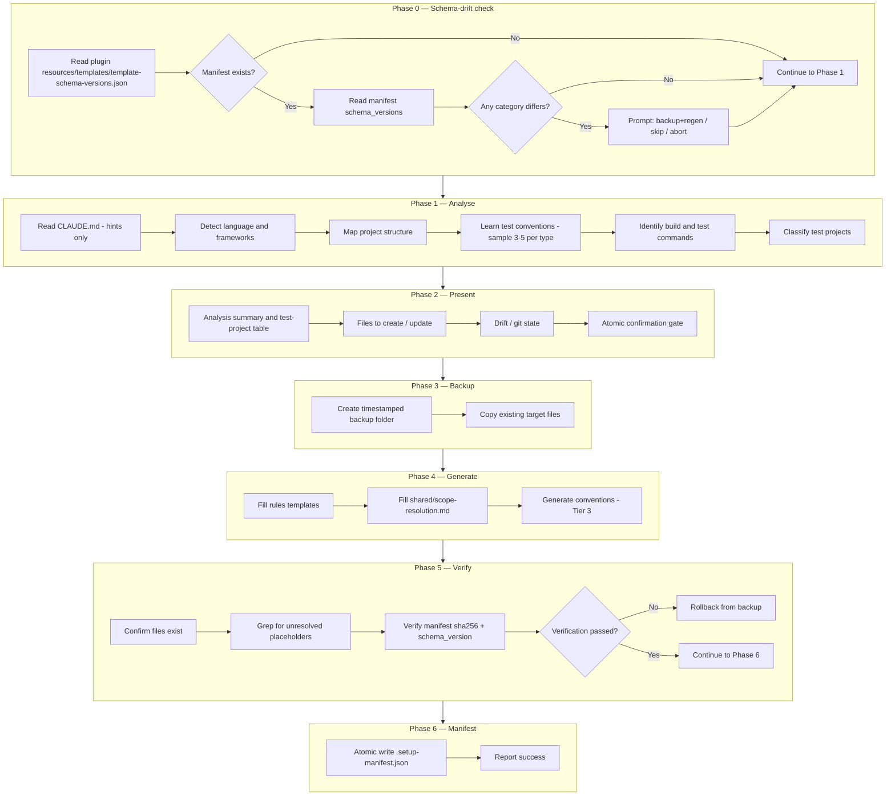

# setup-test-context

The `setup-test-context` skill is the **optional** profiler that caches per-repo test conventions for the rest of the `test-authoring` plugin. It analyses the repository's language, test frameworks, project structure, and coding conventions, then writes per-repo conventions/rules/shared files under `.claude/{conventions,rules,shared}/tests/` — putting the runtime skills on the **fast path** (they read those cached files instead of discovering per-invocation). The add/update/scan skills also run **without** it, in **cacheless mode**: rules come from the plugin's bundled `resources/templates/`, conventions from the nearest sibling tests. Under the **Slim default**, setup caches the repo's **cross-layer / global map** — project architecture, cross-layer verification patterns, and the shared-utility catalog — the parts a single sibling test cannot reconstruct. It does **not** cache per-type (`unit` / `integration`) conventions: writers derive those from the nearest sibling at runtime, so caching them would only duplicate what siblings already provide (and add a stale-able surface). Setup is therefore a one-time **cross-layer map**, not a per-type convention baseline.

It is re-runnable, and re-running **is** the refresh: managed files are generated artifacts, not user documents. Existing files are detected via the `.setup-manifest.json` and classified pristine vs user-modified; both are refreshed from current templates — user-modified files are backed up into the run's backup folder first and flagged in the confirmation block. Manifest-listed files no longer produced by current templates (renames / retirements) are backed up and deleted as stale. A schema-drift check at the start prompts the user when plugin templates have evolved since the last run. All proposed changes are presented as a single atomic confirmation gate — the user accepts or rejects everything.

Unlike the runtime test skills (add/update/scan), this skill spawns **no subagents** during its own execution — everything runs linearly (Schema check → Analyse → Present → Backup → Generate → Verify) within the orchestrator process. Consequently there is **no circuit breaker** or fix-loop machinery here.

---

## When to use

- **One-time cross-layer map** — cache the repo's cross-layer / global test map (project architecture, cross-layer verification patterns, the shared-utility catalog) that a single sibling cannot reconstruct. The add/update/scan skills run without setup (cacheless, sibling-driven) and derive per-type conventions from siblings either way; setup is not a prerequisite and no longer caches per-type conventions.
- **Re-baseline after architectural change** — added a new test project, switched test frameworks, or restructured source directories.
- **Re-sync after plugin upgrade** — new plugin version may have updated template content; re-running picks up the new templates (subject to schema-drift confirmation).
- **NOT for routine test generation** — for day-to-day work use `/test-authoring:add-unit-test`, `/test-authoring:update-unit-test`, `/test-authoring:scan-test-gaps`, etc. directly (they run with or without setup).

---

## Invocation

```
/test-authoring:setup-test-context              # install or re-sync
/test-authoring:setup-test-context uninstall    # remove per-repo files this skill wrote
```

No other arguments. The skill always analyses the entire repository.

---

## High-Level Overview

| Phase | Action |
|-------|--------|
| 0. Schema-drift check | Compare plugin's `resources/templates/template-schema-versions.json` per-category fields with manifest's `schema_versions.{category}` (if a manifest exists). Prompt user when versions differ |
| 1. Analyse | Read CLAUDE.md hints, detect language/frameworks, map project structure, learn test conventions, identify build/test commands and architectural patterns, classify test projects |
| 2. Present | Show analysis summary, test-project table, files to create/overwrite, drift report, git working-tree state; ask for atomic confirmation |
| 3. Backup | Create timestamped `.claude/backup/setup-{timestamp}/` (skipped on fresh install); deleted on success unless it holds user-modified overwrites, stale deletions, or user-requested backups (then kept + path reported) |
| 4. Generate | Fill plugin templates (`resources/templates/{rules,shared}/`) with placeholders from analysis; generate Tier 3 cross-layer conventions (`project-architecture.md`, `common-*`) directly from analysis. **Slim default: per-type `{type}-test-conventions.md` are NOT generated** (sibling-derived at runtime) |
| 5. Verify | Confirm all written files exist; grep for unresolved placeholders; verify manifest sha256 / schema_version integrity; rollback on failure |
| 6. Manifest | Write `.claude/shared/tests/.setup-manifest.json` with sha256 / schema_version / plugin_version per file |

---

## Phase / Step diagram



---

## Key details

### Schema-drift check (Phase 0)

`resources/templates/template-schema-versions.json` carries per-category schema versions (`conventions`, `rules`, `shared`). The manifest records the schema_version per category at install time. On re-run:

- **No manifest** → fresh install; proceed.
- **All categories match** → ask user "all current; refresh anyway? [y/N]".
- **Any category differs** → warn, present three-way prompt:
  - (a) Back up affected files into the run's backup folder (`.claude/backup/setup-{timestamp}/`), regenerate from new templates (recommended)
  - (b) Skip that category, leave existing files unchanged (risky — schema mismatch)
  - (c) Abort

See [readme-schema-versioning.md](../shared/readme-schema-versioning.md) for the full schema-drift design (Layer 1/2/3 mechanism + 7 drift scenarios).

### Defensive CLAUDE.md handling

`CLAUDE.md` is read for **hints only** (build commands, project descriptions, framework references). It is **never modified** — that's the responsibility of `/init` or manual edits. Drift between CLAUDE.md claims and actual codebase findings is reported, not auto-corrected.

### Atomic confirmation

After presenting the full analysis and file plan, the user gives a single yes/no decision for the entire batch. Per-file selective acceptance is not supported because partial updates leave the system inconsistent (e.g., conventions updated but matching rules untouched).

### Idempotent overwrite-safe flow

For each path the skill plans to write, classify against `.setup-manifest.json`:

| State | Condition | Default action |
|---|---|---|
| **fresh** | path does not exist | write new file |
| **pristine** | path in manifest, sha256 matches manifest entry | overwrite (refresh from current template + analysis) |
| **user-modified** | path in manifest, sha256 differs | **back up into the run's backup folder, then overwrite**; flag in confirmation block |
| **legacy** | path exists, NOT in manifest | three-way prompt: keep / overwrite / backup-and-overwrite |

The "legacy" state covers files at managed paths that this skill did not write (no manifest entry). Without intervention, setup-test-context preserves them; with explicit user confirmation, they can be overwritten or backed up into the run's backup folder first.

Sha256 comparisons normalise line endings (CRLF→LF) before hashing, so a git `autocrlf` checkout does not mis-classify pristine files as user-modified.

A manifest-listed path that current templates no longer produce (template rename / retirement) is **stale**: backed up, deleted, and dropped from the manifest — listed in the confirmation block. Excluded from stale semantics: categories the user chose to skip at the drift prompt, and the Slim-default `{type}-test-conventions.md` carve-out (below).

### Re-run, refresh & legacy per-type conventions

Re-running setup **is** the refresh: managed files — pristine and user-modified alike (the latter backed up first) — are re-generated from current templates and the current repo state. Schema-currency is **not** content-currency — the cross-layer map (`project-architecture.md` / `common-*`) can drift as the repo evolves even when the schema matches, so the no-drift prompt notes the map may be stale and offers a re-write.

**Legacy per-type conventions (upgraded repos):** a repo set up before the Slim default may still have `unit-test-conventions.md` / `integration-test-conventions.md` on disk. The Slim default does **not** regenerate them, so they are no longer refreshed; they are **left in place** (siblings are the authoritative source for per-type conventions at runtime, so a stale per-type doc is overridden rather than obeyed) and kept tracked in the manifest for uninstall/drift. They are not auto-deleted.

### Backup strategy

Setup does not rely on git for rollback (`.claude/` may be gitignored or uncommitted). It creates a timestamped folder at `.claude/backup/setup-{timestamp}/` mirroring the target directory structure, copies every file that will be overwritten or deleted, then deletes the folder on success — unless it holds user-modified files that were overwritten, stale files that were deleted, or backups the user explicitly requested (drift option (a) / legacy backup-and-overwrite), in which case it is kept and its path reported. On verification failure, files are restored from backup.

### Placeholder substitution

Templates under `<plugin-root>/resources/templates/` contain `{{PLACEHOLDER}}` markers. Standard placeholders include `{{LANGUAGE}}`, `{{PROJECT_DESCRIPTION}}`, `{{SRC_DIR}}`, `{{TEST_DIR}}`, `{{SRC_GLOB}}`, `{{TEST_GLOB}}`. File-specific placeholders (e.g., `{{PROJECT_WIDE_RULES}}`, `{{BUILD_AND_TEST_COMMANDS}}`, `{{KNOWN_PACKAGES_TABLE}}`) come from analysis. HTML comments in templates serve as fill guidance and are stripped from output.

### Classification-aware filling

Each test project is classified along two dimensions — infrastructure (unit-like / integration-like / hybrid) and authoring model (code-driven / config-driven). Classification affects template filling:

| Classification | Behaviour |
|---|---|
| Unit-like | Omit test-project-selection step; omit `env_failure` references; single `test_file:` output |
| Integration-like | Include test-project-selection step; include `env_failure` references; `test_files:` (plural) output |
| Hybrid | Document both; runtime detection via siblings |

### No test-agent delegation during setup

Step 3 file generation fans out to internal parallel subagents (shared-tier2 / shared-tier3 — see [`subagent-contract.md`](../../skills/setup-test-context/references/subagent-contract.md)), but setup never delegates to the plugin's test writer, update, or verifier agents. Consequently no circuit breaker, no fix loop, no `fix_invocation` routing. Verification is mechanical (file existence, placeholder grep, manifest hash check) rather than an independent agent review.

### Manifest

The `.claude/shared/tests/.setup-manifest.json` is the single source of truth for what setup-test-context wrote. Its schema is documented in [`skills/setup-test-context/references/manifest.md`](../../skills/setup-test-context/references/manifest.md) and includes:

- `manifest_schema_version` — version of the manifest format
- `plugin_version` — test-authoring version at write time
- `schema_versions.{category}` — per-category template schema version
- `files[]` — every per-repo file with `path`, `sha256`, `category`, `schema_version`, `test_type`

Used by uninstall mode (classify pristine vs user-modified, delete only pristine) and by re-install (drift detection + overwrite-safe routing).

### Uninstall mode

Triggered by `/test-authoring:setup-test-context uninstall`:

1. Read manifest. If absent → print message, exit.
2. For each `files[]` entry: pristine → delete; user-modified → keep + warn; missing → silently skip.
3. Delete the manifest itself.
4. `rmdir` empty `.claude/{conventions,rules,shared}/tests/` (do not rmdir parent — other plugins may have sibling subdirs).
5. Print final report (deleted files + kept user-modified files + orphans).

### Status icons

Skill output uses status icons from `<plugin-root>/resources/static/status-legend.md` (plugin-internal — see [readme-shared-scope-and-status.md](../shared/readme-shared-scope-and-status.md)). The legend is **not** scaffolded per-repo; user attempts to extend the per-repo copy are not honoured.

### Mermaid syntax

All diagrams use GitHub fenced code blocks tagged `mermaid` (not Azure DevOps `::: mermaid` colon-fences), so they render on GitHub.

---

## Generated output

Setup-test-context writes 12–14 files per consumer repo. Under the **Slim default** the set does not vary by test type — per-type `{type}-test-conventions.md` are no longer written, and only the conditional `common-*` conventions move the count:

| Category | Files | Source |
|---|---|---|
| Shared (`.claude/shared/tests/`) | `scope-resolution.md`, `.setup-manifest.json` | `resources/templates/shared/scope-resolution.md` + manifest generated |
| Rules (`.claude/rules/tests/`) | `test-rules.md`, `test-writer-rules.md`, `fix-protocol.md`, `sut-analysis.md`, `common-orchestrator-flow.md`, `common-writer-instructions.md`, `common-update-instructions.md`, `common-verifier-checks.md` | `resources/templates/rules/*.md` (placeholder-filled) |
| Conventions (`.claude/conventions/tests/`) | `project-architecture.md`, plus conditional `common-test-utilities.md` / `common-verification-patterns.md`. **Slim default: per-type conventions are NOT written** — writers derive them from the nearest sibling at runtime | Tier 3 generated from analysis |

**Not written per-repo** (lives in plugin):
- `status-legend.md` — at `<plugin-root>/resources/static/status-legend.md`
- 8 subagents — at `<plugin-root>/agents/`, invoked via `Agent(subagent_type="test-authoring:<name>")`
- 6 user-invocable skills (this `setup-test-context` + `scan-test-gaps` + 4 add/update workflows) — at `<plugin-root>/skills/`
- Guarded hook block templates — for plugin authors only
