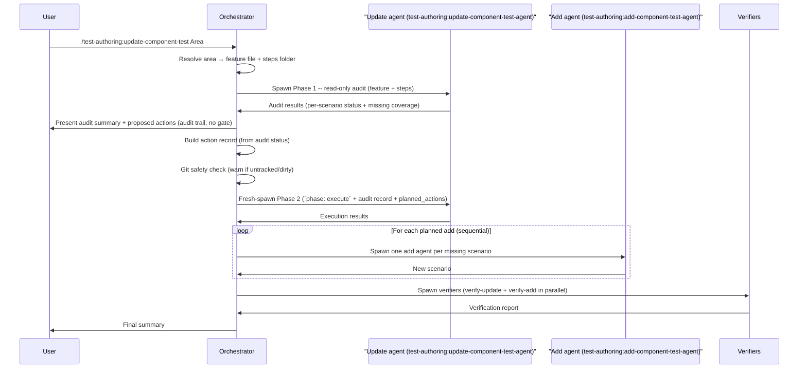

# update-component-test

The `update-component-test` skill audits existing Gherkin/BDD component test scenarios for a given feature area, classifies each scenario as valid, outdated, wrong, or duplicated, and presents a structured summary for user review. Actions are **derived automatically from each scenario's audit status** — there is no confirmation gate: outdated scenarios are updated, wrong/duplicated scenarios are updated or deleted, and missing coverage is added. Git is the backup: before any write the orchestrator runs a safety check on each target file (tracked & clean → proceed; untracked or dirty → warn and ask), and any change can be undone with `git restore`.

---

## Invocation

```
/test-authoring:update-component-test <Area>
/test-authoring:update-component-test <Area>: <Scenario title>
/test-authoring:update-component-test <path-to-feature-file>
/test-authoring:update-component-test
```

- `<Area>` — audit every scenario in the matching `.feature` file.
- `<Area>: <Scenario title>` — audit only the named scenario within the area.
- `<path-to-feature-file>` — target a `.feature` file directly by path.
- No argument — orchestrator will ask for the area or feature path before proceeding.

**Mode A (git diff) is NOT supported** — source-to-feature mapping for Gherkin is intentionally fuzzy: a single source change can correspond to many scenarios, no scenarios, or scenarios spread across multiple feature areas. The user must name the feature or area explicitly.

---

## High-Level Overview

1. **Scope identification** — accept explicit area / scenario / feature path; ask if missing.
2. **Area resolution** — glob `{{FEATURES_DIR}}/<Area>.feature` and `{{STEPS_DIR}}/<Area>/`; decide both-found / one-found / neither-found.
3. **Phase 1 audit** — spawn one `test-authoring:update-component-test-agent` per feature file; the agent reads the `.feature` and all step classes, identifies the SUT per scenario, and runs three drift-cause checks.
4. **Present summary** — display a numbered table with status, confidence, drift cause, and proposed actions for each scenario, plus a missing-coverage table for uncovered SUT entry points.
5. **Determine actions from audit status (no gate)** — each scenario's action is derived automatically from its audit status (outdated-major/minor → update; wrong → update or delete; duplicated → delete; valid → no change; pending → add). A structured **action record** capturing the `audit_status` and `action` per item is built and becomes the input to Phase 2. The Proposed Actions table is shown as an audit trail, not a confirmation prompt.
6. **Git safety check** — before any write, the orchestrator runs a git status check on each target `.feature` file and step class: tracked & clean → proceed; untracked or dirty → warn that there is no reliable committed baseline and ask whether to proceed or skip that file.
7. **Phase 2 update/delete** — fresh-spawn an `test-authoring:update-component-test-agent` with `phase: execute` in the prompt, plus the audit record from Phase 1 and the planned actions; it re-reads the feature file and step classes at the listed paths and applies the derived updates and deletions.
8. **Phase 2 add** — spawn one `test-authoring:add-component-test-agent` **per scenario**, **sequentially**, for missing-coverage items (runs after update/delete to avoid file conflicts; sequential because container startup makes concurrency wasteful).
9. **Build** — run a build on the component test project to catch cross-file issues when both 7 and 8 ran.
10. **Verify** — spawn `test-authoring:verify-update-component-test-agent` and `test-authoring:verify-add-component-test-agent` in parallel to independently check the changes.
11. **Optional rollback** — if verification fails, offer to undo each affected tracked file with `git restore <file>`.
12. **Summary** — report per-file status, verification results, and unresolved issues.

---

## Sequence Overview



---

## Key Details

### Audit Scope

The audit scope is a **feature file + steps folder pair**, not a source file. The orchestrator resolves the area name to `{{FEATURES_DIR}}/<Area>.feature` and `{{STEPS_DIR}}/<Area>/` before spawning the audit agent. If only one of the two is found, the orchestrator asks the user to clarify — both are required to audit step-phrase binding correctly.

### Drift-Cause Taxonomy

Each non-valid scenario is assigned exactly one primary drift cause. When multiple causes apply, the most severe is primary and the rest are noted in the `reason` field.

| Cause | Label | Description | Default severity |
|---|---|---|---|
| **a** | SUT drift | The SUT's behaviour diverged from the scenario's `Then` assertions (status code, response shape, side-effect, DTO field) | outdated-minor or outdated-major depending on scope of change |
| **b** | Step-phrase binding | A `Given/When/Then` phrase in the scenario has no matching `[Given/When/Then]` attribute regex in the steps tree | outdated-major |
| **c** | Fixture drift | A fake/observable referenced in the step code has changed API in the fixture class or has been de-wired | outdated-major |

Severity ordering when causes conflict: `a > c > b`.

### Two-Phase Pattern

The update agent runs in two phases as separate fresh-spawn invocations. Phase 1 performs a read-only audit of the feature file and step classes, then terminates. Phase 2 is a brand-new `Agent` spawn with `phase: execute` in the prompt, plus the full audit record and the planned actions. The Phase 2 agent re-reads the feature file and step classes at the paths in its prompt — no live state is inherited from Phase 1. The orchestrator does not depend on session-conditional subagent-control tooling for this handoff.

See [Two-Phase Lifecycle](../shared/readme-shared-update-patterns.md#two-phase-lifecycle) for the full sequence, phase steps, audit statuses, and confidence levels.

### Determine Actions From Audit Status (No Gate)

The orchestrator presents every scenario in a single **Proposed Actions** table with columns `# / Scenario or SUT / Action / Audit Status / Confidence / Notes`. Action verbs are plain text and audit status uses the icons defined in [`status-legend.md`](../../resources/static/status-legend.md):

| Action verb | Used when |
|---|---|
| Update (rewrite) | outdated-major / wrong |
| Update (tweak) | outdated-minor |
| Delete | duplicated |
| Add | missing coverage (🟦 pending) |
| — | no change (🟩 valid) |

Each scenario's action is derived automatically from its audit status (outdated-major/minor → update; wrong → update or delete; duplicated → delete; valid → no change; pending → add) — there is no confirmation prompt and no per-item selection. The table is an audit trail so the user can spot a mis-classification post-run and `git restore` it. A structured **action record** is built from these derived actions and becomes the sole input to Phase 2.

See [Action Record](../shared/readme-shared-update-patterns.md#action-record) for the record structure and key properties.

### Git Safety Check and Rollback

Git is the backup — there are no `.bak` files. Before Phase 2 writes to any file, the orchestrator runs `git status --porcelain -- <file>` on each affected `.feature` file and step class: tracked and clean → proceed (`git show HEAD:<file>` is the faithful pre-change baseline the verifier diffs against, and `git restore <file>` undoes the change); untracked or dirty → warn that there is no reliable committed baseline and ask whether to proceed or skip that file. If verification fails, the user can undo each affected tracked file with `git restore <file>`.

See [Git Rollback](../shared/readme-shared-update-patterns.md#git-based-rollback) for the lifecycle diagram, interrupted-run recovery, and how each role uses git.

### Add Delegation (Sequential)

When the audit identifies missing scenario coverage, planned add items (those classified 🟦 pending) are delegated to `test-authoring:add-component-test-agent` **one scenario at a time, sequentially**. Component tests depend on real container infrastructure; spawning multiple agents in parallel would stall them all waiting for the same container and produce misleading results. Each add agent runs to completion (write + build + feature-scoped test run) before the next is spawned.

### Phase 2 Constraints

The update agent applies **only** what is in the action record. It will never:

- Create a new `Scenario:` block (that is `test-authoring:add-component-test-agent` territory)
- Create a new step class file
- Modify a scenario not in the action record
- Process `action: add` items (those are routed to `test-authoring:add-component-test-agent` by the orchestrator)

### Verifier False-Positive Guard

The verifier diffs against the `git show HEAD:<file>` baseline, which is captured before both Phase 2 update/delete and Phase 2 add. When the add agent appends new scenarios to the same `.feature` file, the `test-authoring:verify-update-component-test-agent` would otherwise see those new `Scenario:` blocks in the diff and flag them as unjustified additions. To prevent this, the orchestrator passes the full `test-authoring:add-component-test-agent` execution results to the update verifier; the verifier excludes add-agent additions from its diff analysis and scenario-count check.

### Anti-Gaming

The update verifier independently checks that no scenario was silently deleted, no valid scenario was modified, no failing scenario was removed to make the suite pass, no step method was orphaned, and no `@pending` / `@ignore` tags were introduced. Violations are presented to the user, not auto-fixed.

See [Anti-Gaming](../shared/readme-shared-update-patterns.md#anti-gaming) for the full decision table and prohibited actions.

### Env_failure Handling

Component tests depend on real infrastructure (containers, Docker, image pulls). When the test infrastructure is unavailable, both the update agent and the verifier report `env_failure (<reason>)` rather than attempting a fix. Env failures are never routed to the writer — they go directly to the user.

### Subagents Spawned

| Agent | Role | Phase | Writes? |
|---|---|---|---|
| `test-authoring:update-component-test-agent` | Audit existing scenarios, then apply the derived updates and deletions | 1 + 2 | Phase 2 only |
| `test-authoring:add-component-test-agent` | Generate a scenario for each missing-coverage item (one per scenario, sequential) | 2 (after update/delete) | Yes |
| `test-authoring:verify-update-component-test-agent` | Verify updates and deletions against the action record and `git show HEAD` baseline; checks deletion justification by audit status, valid-scenario preservation, anti-deletion gaming | Post-execution | Read-only |
| `test-authoring:verify-add-component-test-agent` | Verify newly added scenarios for Gherkin shape, step placement, assertion-mode sanity, and quality | Post-execution | Read-only |

### Status Icons

All summary tables use the shared status icon set. See [Status Legend](../shared/readme-shared-scope-and-status.md#status-legend) for icon definitions and assignment rules.

### Circuit Breaker

When `test-authoring:verify-add-component-test-agent` reports deterministic issues (Gherkin-shape violations, step placement, build failures), they are routed back to `test-authoring:add-component-test-agent` for fixing via the circuit breaker (global round limit 3, per-issue retry limit 2). Unresolved issues after the limit are reported to the user.

Note: update-side violations from `test-authoring:verify-update-component-test-agent` are **not** routed through the circuit breaker loop. They are presented directly to the user with a `git restore` rollback offer, because update violations typically indicate audit-status mismatches or anti-gaming issues that require human judgement.

See [Circuit Breaker](../shared/readme-shared-orchestration.md#circuit-breaker) for counter mechanics, stop conditions, and worked examples.

---

## Summary Output

The final summary includes:

- Scenarios updated / deleted / added, grouped by feature file
- Verification results from both verifiers (deletion justification by audit status, valid-scenario protection, test pass/fail, anti-gaming)
- Env_failure count (if any) — noted but not violations
- Rollback status (if triggered)
- Per-file status icons

---

## Out of Scope

- **Mode A (git-diff)** — not supported. Source-to-feature mapping is fuzzy.
- **Source-file scope** — reverse lookup from SUT file to scenarios is unreliable.
- **Full-suite audit** — audit one feature at a time; `/test-authoring:update-component-test all` is not supported.
- **Integration-test support** — scoped to component tests only.
- **Creating new scenarios directly** — always delegated to `test-authoring:add-component-test-agent`.
- **Restructuring step-class split** — that is refactoring, not test maintenance.
