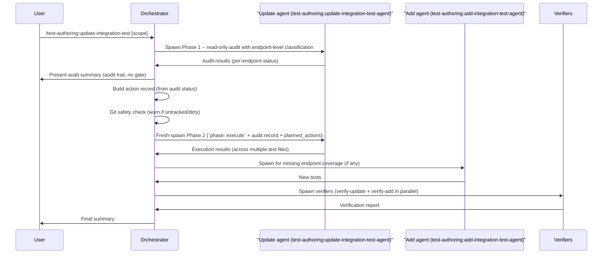

# update-integration-test

The `update-integration-test` skill audits existing integration tests against the current source code, classifies each test as valid, outdated, wrong, or duplicated, and presents a structured summary for user review. Actions are **derived automatically from each test's audit status** -- there is no confirmation gate: outdated tests are updated, wrong/duplicated tests are updated or deleted, and missing coverage is added. Git is the backup: before any write the orchestrator runs a safety check on each target file (tracked & clean → proceed; untracked or dirty → warn and ask), and any change can be undone with `git restore`.

## Invocation

```
/test-authoring:update-integration-test [scope]
```

- **No argument** -- Mode A: uses `git diff` to find changed source files. Focuses on modified API endpoints, MediatR handlers, worker operations, event consumers, sync consumers, and persistence logic.
- **Argument provided** -- Mode B: resolves by directory, component, class, method/endpoint, or file name.

See [Scope Resolution](../shared/readme-shared-scope-and-status.md#scope-resolution) for the full matching algorithm and decision flowchart.

## High-Level Overview

1. **Scope resolution** -- determine which source files to audit (Mode A or Mode B).
2. **Test project mapping** -- map each source file to the correct integration test project (Api, Worker, Infrastructure, or Sync).
3. **Phase 1 audit** -- spawn one `test-authoring:update-integration-test-agent` per (source, project) pair from the test-project mapping (all in parallel); each performs a read-only analysis and returns structured findings.
4. **Present summary** -- collect audit results and display a numbered table with status, confidence, and proposed actions for every test method, grouped by source class.
5. **Determine actions from audit status (no gate)** -- each test's action is derived automatically from its audit status (outdated-major/minor → update; wrong → update or delete; duplicated → delete; valid → no change; pending → add). A structured **action record** capturing the `audit_status` and `action` per item is built and becomes the input to Phase 2. The Proposed Actions table is shown as an audit trail, not a confirmation prompt.
6. **Git safety check** -- before any write, the orchestrator runs a git status check on each target test file: tracked & clean → proceed; untracked or dirty → warn that there is no reliable committed baseline and ask whether to proceed or skip that file.
7. **Phase 2 update/delete** -- fresh-spawn `test-authoring:update-integration-test-agent` instances with `phase: execute` in the prompt, plus the audit record from Phase 1 and the planned actions; they re-read files at the listed paths and apply the derived updates and deletions.
8. **Phase 2 add** -- spawn `test-authoring:add-integration-test-agent` instances for missing-coverage items (runs after update/delete completes to avoid file conflicts).
9. **Build** -- run `dotnet build` on the relevant test project(s) to catch cross-file issues.
10. **Verify** -- spawn `test-authoring:verify-update-integration-test-agent` and `test-authoring:verify-add-integration-test-agent` in parallel to independently check the changes.
11. **Optional rollback** -- if verification fails, offer to undo each affected tracked file with `git restore <file>`.
12. **Summary** -- report per-file status, verification results, and unresolved issues.

## Sequence Overview

The diagram below shows the happy-path actor interactions. Error handling and decision branches are described in the Key Details section below.



## Key Details

### Test project mapping

Each source file is mapped to the correct integration test project before audit agents are spawned. The test project tag is included in every agent prompt so the agent searches the right directory.

**The mapping is repo-specific and derived at runtime — this plugin does not prescribe one.** The orchestrator locates the existing integration test project whose tests mirror the source area. Repos commonly separate concerns such as API endpoints, worker or background operations, infrastructure, and event-consumer flows across different projects or directories, so more than one candidate is normal; when none clearly mirrors the source, the orchestrator states the candidates and asks rather than guessing.

### Auth policy detection

The audit agent reads each controller's `[Authorize]` attribute to identify the policy (`OPERATIONS_ONLY_POLICY` vs `CLIENT_OR_OPERATIONS_POLICY`). It then checks whether existing auth tests use the correct forbidden account types. A policy change in the controller that is not reflected in the test's account type selection surfaces as an `outdated-minor` or `outdated-major` finding, depending on how many tests are affected. Method-level overrides are also considered.

### Two-phase pattern

Update agents run in two phases as separate fresh-spawn invocations. Phase 1 performs a read-only audit and terminates; Phase 2 is a brand-new `Agent` spawn with `phase: execute` in the prompt, plus the full audit record and the planned actions. The Phase 2 agent re-reads source/test files at the paths in its prompt — no live state is inherited from Phase 1. The orchestrator does not depend on session-conditional subagent-control tooling for this handoff.

See [Two-Phase Lifecycle](../shared/readme-shared-update-patterns.md#two-phase-lifecycle) for the full sequence diagram, phase steps, audit statuses, and confidence levels.

### Determine actions from audit status (no gate)

The orchestrator presents every test method in a single **Proposed Actions** table with columns `# / Item / Action / Audit Status / Confidence / Notes`. Action verbs are plain text (Update / Tweak / Delete / Add / —) and audit status uses the icons defined in [`status-legend.md`](../../resources/static/status-legend.md) (🟩 valid, 🟨 outdated-*, 🟥 wrong, 🟪 duplicated, 🟦 pending). Each item's action is derived automatically from its audit status (outdated-major/minor → update; wrong → update or delete; duplicated → delete; valid → no change; pending → add) — there is no confirmation prompt and no per-item selection. The table is an audit trail so the user can spot a mis-classification post-run and `git restore` it. A structured **action record** is built from these derived actions and becomes the sole input to Phase 2.

See [Action Record](../shared/readme-shared-update-patterns.md#action-record) for the record structure and key properties.

### Git safety check and rollback

Git is the backup — there are no `.bak` files. Before Phase 2 writes to any test file, the orchestrator runs `git status --porcelain -- <file>` on each affected file: tracked and clean → proceed (`git show HEAD:<file>` is the faithful pre-change baseline the verifier diffs against, and `git restore <file>` undoes the change); untracked or dirty → warn that there is no reliable committed baseline and ask whether to proceed or skip that file. If verification fails, the user can undo each affected tracked file with `git restore <file>`.

See [Git Rollback](../shared/readme-shared-update-patterns.md#git-based-rollback) for the lifecycle, interrupted-run recovery, and how each role (orchestrator, verifier, user) uses git.

### Anti-gaming

The verifier independently checks that no test was silently deleted, no valid test was modified, no failing test was removed to make the suite pass, and no `[Skip]` attributes or assertion weakening were introduced. Violations are presented to the user, not auto-fixed.

See [Anti-Gaming](../shared/readme-shared-update-patterns.md#anti-gaming) for the full decision table and prohibited actions.

### Endpoint-level classification

Unlike unit test audits which classify by method name, integration test audits group findings by **endpoint + HTTP method** combinations (e.g., `GET v1/billing/journals`, `POST v1/billing/journals`). This ensures that stale tests for a renamed or restructured endpoint are detected even when the test method name still looks plausible. Missing coverage is also reported at the endpoint level, making it straightforward to identify which HTTP operations lack tests.

### Subagents spawned

| Agent | Role | Phase | Writes? |
|-------|------|-------|---------|
| `test-authoring:update-integration-test-agent` | Audit existing tests, then apply the derived updates and deletions | 1 + 2 | Phase 2 only |
| `test-authoring:add-integration-test-agent` | Generate tests for missing-endpoint-coverage items | 2 (after update/delete) | Yes |
| `test-authoring:verify-update-integration-test-agent` | Verify updates and deletions against the action record and `git show HEAD` baseline | Post-execution | Read-only |
| `test-authoring:verify-add-integration-test-agent` | Verify newly added tests for convention compliance, anti-gaming, and quality | Post-execution | Read-only |

### Status icons

All summary tables use the shared status icon set. See [Status Legend](../shared/readme-shared-scope-and-status.md#status-legend) for icon definitions and assignment rules.

### Circuit breaker

When `test-authoring:verify-add-integration-test-agent` reports deterministic issues (convention violations, build failures), they are routed back to the `test-authoring:add-integration-test-agent` for fixing. A circuit breaker with a global round limit of 3 and a per-issue retry limit of 2 prevents infinite loops. Unresolved issues after the limit are reported to the user.

See [Circuit Breaker](../shared/readme-shared-orchestration.md#circuit-breaker) for counter mechanics, stop conditions, and worked examples.

Note: update-side violations from `test-authoring:verify-update-integration-test-agent` are **not** sent through the circuit breaker loop. They are presented directly to the user with a `git restore` rollback offer, because update violations typically indicate audit-status mismatches or anti-gaming issues that require human judgement.
